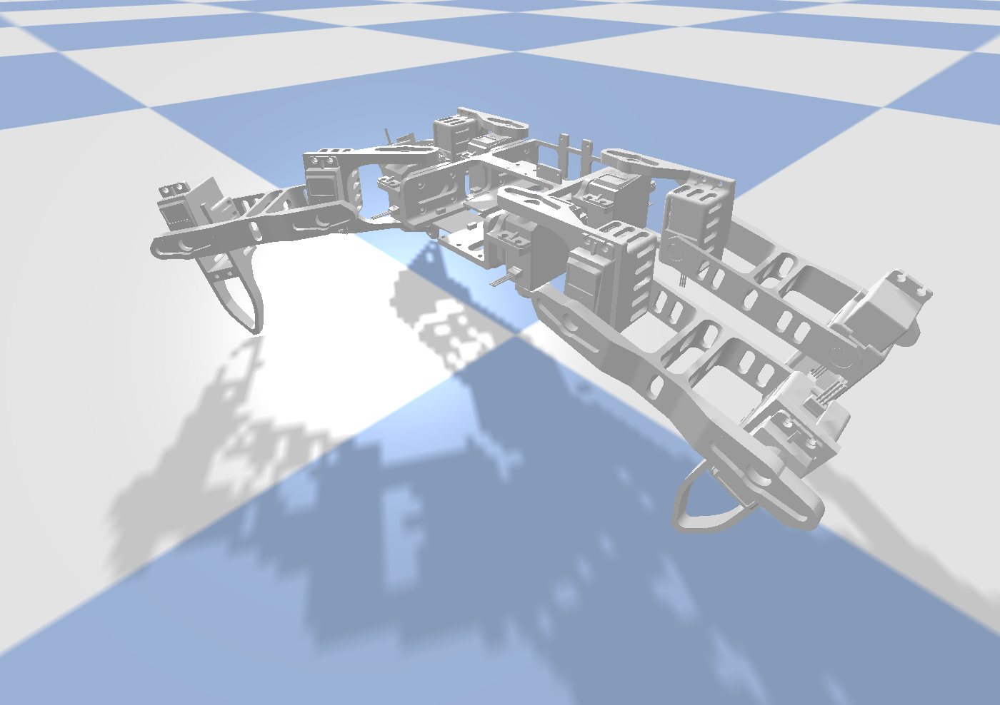
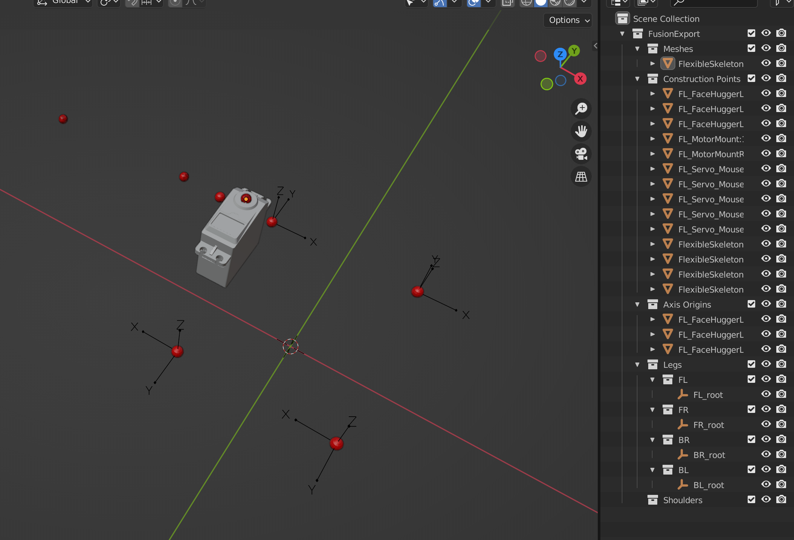

# `feat/urdf-pipeline` validation report

Run each step in order from `code/simulation/`.
For each step, paste your terminal output and (where noted) attach screenshots / videos.
Drop notes in the **Comments** sub-section — that's where you flag things that look off, or confirm things look right.
The next session reads this file to know what to fix.

> **Branch / commit at the time of this run**: <!-- e.g. `276da29 feat(sim): facehugger blender …` -->
>
> **Date**: <!-- 2026-05-XX -->
>
> **Python env**: <!-- e.g. `/opt/homebrew/Caskroom/miniforge/base/envs/facehugger` -->

---

## 0. Sanity setup

```bash
cd code/simulation
git log --oneline -3
```

**Expect**: top commit is `276da29` (multi-version Blender flag + plan refresh) or newer.

### Output

```
73fa2a0 (HEAD -> feat/urdf-pipeline, origin/feat/urdf-pipeline) chore: cleanup stale files before animation branch
276da29 feat(sim): facehugger blender --blender-version + refresh PIPELINE_PLAN
354f2ee refactor(sim): drop yaml leg_template.joints (Transition T)
```

### Comments

<!-- anything weird here, or "OK" -->
It's fine, I committed the gitignore and stuff, so we're cool.

---

## 1. URDF re-generation

```bash
python facehugger.py urdf
```

**Expect**: prints `=== Shoulder axis world positions (mm) ===` with 4 corners (`fl: -41.5, +49, +26`; `fr: +41.5, +49, +26`; `br: +41.5, -49, +26`; `bl: -41.5, -49, +26`).
Exits 0.
Re-running it should produce the same URDF (byte-equivalent).

### Output

```
$ /opt/homebrew/Caskroom/miniforge/base/envs/facehugger/bin/python /Users/marcushamelink/Documents/EPFL-projects/projects-ba6/Making-Intelligent-Things/2026sp-FaceHugger/code/simulation/generate_urdf.py
Loading export : /Users/marcushamelink/Documents/EPFL-projects/projects-ba6/Making-Intelligent-Things/2026sp-FaceHugger/code/simulation/generated/fusion_export.json
Loading config : /Users/marcushamelink/Documents/EPFL-projects/projects-ba6/Making-Intelligent-Things/2026sp-FaceHugger/code/simulation/facehugger_config.yaml
Written: /Users/marcushamelink/Documents/EPFL-projects/projects-ba6/Making-Intelligent-Things/2026sp-FaceHugger/code/simulation/generated/facehugger.urdf

=== Shoulder axis world positions (mm) ===
  fl: ( -41.50,  +49.00,  +26.00)
  br: ( +41.50,  -49.00,  +26.00)
  fr: ( +41.50,  +49.00,  +26.00)
  bl: ( -41.50,  -49.00,  +26.00)
```

### Comments

<!-- any traceback? any "missing landmark" warning? -->

---

## 2. URDF visual — `view_urdf` (no physics)

```bash
python facehugger.py view
```

**Expect**: PyBullet GUI opens.
Robot fixed in the air, gravity off, in standing pose.
Body sits ~110 mm above the ground plane (85.9 mm body_height + 20 mm spawn margin).
Mouse: left-drag orbit, ctrl+left-drag pan, scroll zoom.

**Capture 4 screenshots**:

1. **Top-down** (camera straight down): 4 legs splayed into FL/FR/BR/BL corners; 4 brackets visible on chassis corners.
2. **Front view** (camera along body +Y): L pair on the left, R pair on the right, mirror-symmetric.
3. **Side view** (camera along body +X): legs bent in stance — upper leg angled down-back, lower leg angled down-forward.
4. **Close-up of one leg's three servos**: shoulder servo on the bracket (chassis-fixed), hip on link1, knee on link3 — all three present, shafts pointing in plausible directions.

### Screenshots

<!-- attach or describe each: top, front, side, close-up -->
I just have `/img/view-fixed-stance.png` because the controls are complicated to use but here it is:



### Comments

<!-- legs piled up? servo shaft pointing into the leg? mesh penetrating chassis? chassis upside-down? Any of these = bug.
     Also note positives: "legs match Fusion view", "servos look right", etc. -->
Everything matches perfectly!

---

## 3. Stance hold (gravity on, no gait)

```bash
python facehugger.py sim
```

**Expect**: prints banner with `body_height: 85.9 mm`, per-leg foot positions `(±176.0, ±55.8, -85.9) mm`, and 4 lines of `IK[fl/br/fr/bl]: ds=+0.00 dh=+0.02 dk=+0.09 [OK]`.
Robot drops, settles for 0.5s, then **holds standing pose stably**.

**Capture**: terminal banner (text below) + a video clip ~5s showing the robot stable on the ground.

### Output (banner)

```
$ /opt/homebrew/Caskroom/miniforge/base/envs/facehugger/bin/python /Users/marcushamelink/Documents/EPFL-projects/projects-ba6/Making-Intelligent-Things/2026sp-FaceHugger/code/simulation/simulate.py
pybullet build time: Oct 21 2025 17:04:55
[sim] foot tip from URDF metadata (link3 frame, mm): (-30.946, -13.0, 0.024)
Version = 4.1 Metal - 89.4
Vendor = Apple
Renderer = Apple M3
b3Printf: Selected demo: Physics Server
startThreads creating 1 threads.
starting thread 0
started thread 0 
MotionThreadFunc thread started

=== FaceHugger sim ===
  URDF: facehugger.urdf
  legs: ['fl', 'br', 'fr', 'bl']
  servo: force=2.94 N*m  vel=5.0 rad/s
  body_height: 85.9 mm
  stance (deg, per leg):
    fl: shoulder=+0.0  hip=-40.0  knee=-60.0
    br: shoulder=+0.0  hip=-40.0  knee=-60.0
    fr: shoulder=+0.0  hip=-40.0  knee=-60.0
    bl: shoulder=+0.0  hip=-40.0  knee=-60.0
    fl: foot = (-176.0,  +55.8,  -85.9) mm
    br: foot = (+176.0,  -55.8,  -85.9) mm
    fr: foot = (+176.0,  +55.8,  -85.9) mm
    bl: foot = (-176.0,  -55.8,  -85.9) mm
    IK[fl]: ds=+0.00 dh=+0.02 dk=+0.09 [OK]
    IK[br]: ds=+0.00 dh=+0.02 dk=+0.09 [OK]
    IK[fr]: ds=+0.00 dh=+0.02 dk=+0.09 [OK]
    IK[bl]: ds=+0.00 dh=+0.02 dk=+0.09 [OK]

[settle] holding stance for 0.50s before idle loop

Standing - Ctrl+C to exit.
numActiveThreads = 0
stopping threads
destroy semaphore
semaphore destroyed
Thread with taskId 0 exiting
Thread TERMINATED
destroy main semaphore
main semaphore destroyed
```

### Video / screenshot

<!-- attach or link -->

### Comments

This is perfect too, staying still. No video.
<!-- Did any IK row print [FAIL]? Did the robot hold pose, collapse, tip over, slide?
     Body Z drift after settling? Feet penetrating floor? -->

---

## 4. Walk gait

```bash
python facehugger.py sim --walk
```

**Expect**: banner + `Static walk: period=2.40s len=40mm h=20mm duty=0.25`.
One leg at a time swings (FL → BR → FR → BL phase offsets).
Robot moves slowly forward (+Y direction).
Foot trajectories drawn as colored dotted loops in GUI.

**Capture**: video ~15s.

### Output (banner + first few seconds of console, if anything's printed)

```
$ /opt/homebrew/Caskroom/miniforge/base/envs/facehugger/bin/python /Users/marcushamelink/Documents/EPFL-projects/projects-ba6/Making-Intelligent-Things/2026sp-FaceHugger/code/simulation/simulate.py --walk
pybullet build time: Oct 21 2025 17:04:55
[sim] foot tip from URDF metadata (link3 frame, mm): (-30.946, -13.0, 0.024)
Version = 4.1 Metal - 89.4
Vendor = Apple
Renderer = Apple M3
b3Printf: Selected demo: Physics Server
startThreads creating 1 threads.
starting thread 0
started thread 0 
MotionThreadFunc thread started

=== FaceHugger sim ===
  URDF: facehugger.urdf
  legs: ['fl', 'br', 'fr', 'bl']
  servo: force=2.94 N*m  vel=5.0 rad/s
  body_height: 85.9 mm
  stance (deg, per leg):
    fl: shoulder=+0.0  hip=-40.0  knee=-60.0
    br: shoulder=+0.0  hip=-40.0  knee=-60.0
    fr: shoulder=+0.0  hip=-40.0  knee=-60.0
    bl: shoulder=+0.0  hip=-40.0  knee=-60.0
    fl: foot = (-176.0,  +55.8,  -85.9) mm
    br: foot = (+176.0,  -55.8,  -85.9) mm
    fr: foot = (+176.0,  +55.8,  -85.9) mm
    bl: foot = (-176.0,  -55.8,  -85.9) mm
    IK[fl]: ds=+0.00 dh=+0.02 dk=+0.09 [OK]
    IK[br]: ds=+0.00 dh=+0.02 dk=+0.09 [OK]
    IK[fr]: ds=+0.00 dh=+0.02 dk=+0.09 [OK]
    IK[bl]: ds=+0.00 dh=+0.02 dk=+0.09 [OK]

[settle] holding stance for 0.50s before gait

Static walk: period=2.40s  len=40mm  h=20mm  duty=0.25
```

### Video

<!-- attach or link -->

### Comments

It falls off, but the legs move correctly following the pattern, so we're good.
<!-- Does it actually move forward? How fast (eyeball, mm/s)?
     Drift sideways? Pitch / yaw / tip? Stay upright the whole time?
     Anything weird with how the legs sequence — wrong order, double-stepping, hesitation? -->

---

## 5. Trot gait

```bash
python facehugger.py sim --trot
```

**Expect**: banner + `Trot (diagonal pairs): period=0.80s len=50mm h=25mm duty=0.50`.
Diagonal pairs (FL+BR / FR+BL) swing together, faster than walk.
**Note**: at the swing apex the knee clamps against the URDF's ±90° limit (~4 mm short of commanded).
Expected — not a bug.

**Capture**: video ~15s.

### Output

```
[sim] foot tip from URDF metadata (link3 frame, mm): (-30.946, -13.0, 0.024)
Version = 4.1 Metal - 89.4
Vendor = Apple
Renderer = Apple M3
b3Printf: Selected demo: Physics Server
startThreads creating 1 threads.
starting thread 0
started thread 0 
MotionThreadFunc thread started

=== FaceHugger sim ===
  URDF: facehugger.urdf
  legs: ['fl', 'br', 'fr', 'bl']
  servo: force=2.94 N*m  vel=5.0 rad/s
  body_height: 85.9 mm
  stance (deg, per leg):
    fl: shoulder=+0.0  hip=-40.0  knee=-60.0
    br: shoulder=+0.0  hip=-40.0  knee=-60.0
    fr: shoulder=+0.0  hip=-40.0  knee=-60.0
    bl: shoulder=+0.0  hip=-40.0  knee=-60.0
    fl: foot = (-176.0,  +55.8,  -85.9) mm
    br: foot = (+176.0,  -55.8,  -85.9) mm
    fr: foot = (+176.0,  +55.8,  -85.9) mm
    bl: foot = (-176.0,  -55.8,  -85.9) mm
    IK[fl]: ds=+0.00 dh=+0.02 dk=+0.09 [OK]
    IK[br]: ds=+0.00 dh=+0.02 dk=+0.09 [OK]
    IK[fr]: ds=+0.00 dh=+0.02 dk=+0.09 [OK]
    IK[bl]: ds=+0.00 dh=+0.02 dk=+0.09 [OK]

[settle] holding stance for 0.50s before gait

Trot (diagonal pairs): period=0.80s  len=50mm  h=25mm  duty=0.50
```

### Video

<!-- attach or link -->

### Comments

It also falls because its forward/backward legs collide, but that's because the base stance changed and that's okay.
<!-- Forward progress? Excessive bounce? Stay upright?
     Visible "stuttering" from knee clamping? -->

---

## 6. Blender visualizer + multi-version flag

```bash
python facehugger.py blender                          # default Blender 3.3 LTS
python facehugger.py blender --blender-version 4.2    # if installed
python facehugger.py blender --blender-version 5.1    # if installed
BLENDER_BIN=/wherever python facehugger.py blender    # override
```

**Expect**: Blender opens with the FusionExport scene.
Console prints `[instance_legs] per-corner rotation — FR=Rz(+0°), BR=Rz(+180°), BL=Rz(+180°)`.
4 legs at the 4 chassis corners.

**Known visual quirk** (not a bug; correct per the URDF generator's diagonal-pair mesh-share): FR/BL legs render with L-handed `leg_upper`/`leg_lower` meshes flipped via `<visual><origin rpy="0 π 0"/>` — the URDF visualizer (`visualize_urdf.py`) replicates this faithfully. Slight visual asymmetry vs FL/BR is expected.

**Red flag**: "Could not locate Blender" with the candidate paths printed → your install path doesn't match the four `/Applications` patterns; set `BLENDER_BIN` directly.

### Versions tested

<!-- which `--blender-version` values did you try? -->

- [x] default (3.3)
- [x] 4.2
- [x] 5.1
- [x] BLENDER_BIN override

### Output (per version)

```
$ /Applications/Blender-3.3-LTS.app/Contents/MacOS/Blender --python /Users/marcushamelink/Documents/EPFL-projects/projects-ba6/Making-Intelligent-Things/2026sp-FaceHugger/animation/scripts/visualize_fusion_export.py
Read prefs: /Users/marcushamelink/Library/Application Support/Blender/3.3/config/userpref.blend
[visualize] export : /Users/marcushamelink/Documents/EPFL-projects/projects-ba6/Making-Intelligent-Things/2026sp-FaceHugger/code/simulation/generated/fusion_export.json
[visualize] meshes : /Users/marcushamelink/Documents/EPFL-projects/projects-ba6/Making-Intelligent-Things/2026sp-FaceHugger/code/simulation/generated/exported_meshes
Import finished in 0.0058 sec.
[instance_legs] Legs/FL has 0 source leg objects; duplicated to 0 objects each in FR/BR/BL; Shoulders/ has 0 shoulder servos (chassis-fixed)
[instance_legs] per-corner rotation — FR=Rz(+0°), BR=Rz(+180°), BL=Rz(+180°); each leg parented to a {FL,FR,BR,BL}_root Empty at LegMountPointXX
[visualize] imported 1 meshes, placed 14 points, 3 axis origins
```

### Screenshots (Blender viewport)

<!-- attach: 1 screenshot per version is enough -->


### Comments

<!-- Did each version launch?
     Did the right Blender open (check the title bar)?
     Did the per-corner rotation message print correctly?
     Anything visually wrong beyond the known FR/BL handedness quirk? -->
The body is not showing, just the dots, a servo and the construction points, some. Only left leg points.
Only tested 3.3, only relevant right now I believe.

---

## 7. Headless smoke (CI-style)

```bash
python facehugger.py all --headless
```

**Expect**: regenerates URDF, then runs sim in headless mode.
Both exit 0.

### Output (last 20 lines)

```
$ /opt/homebrew/Caskroom/miniforge/base/envs/facehugger/bin/python /Users/marcushamelink/Documents/EPFL-projects/projects-ba6/Making-Intelligent-Things/2026sp-FaceHugger/code/simulation/generate_urdf.py
Loading export : /Users/marcushamelink/Documents/EPFL-projects/projects-ba6/Making-Intelligent-Things/2026sp-FaceHugger/code/simulation/generated/fusion_export.json
Loading config : /Users/marcushamelink/Documents/EPFL-projects/projects-ba6/Making-Intelligent-Things/2026sp-FaceHugger/code/simulation/facehugger_config.yaml
Written: /Users/marcushamelink/Documents/EPFL-projects/projects-ba6/Making-Intelligent-Things/2026sp-FaceHugger/code/simulation/generated/facehugger.urdf

=== Shoulder axis world positions (mm) ===
  fl: ( -41.50,  +49.00,  +26.00)
  br: ( +41.50,  -49.00,  +26.00)
  fr: ( +41.50,  +49.00,  +26.00)
  bl: ( -41.50,  -49.00,  +26.00)
$ /opt/homebrew/Caskroom/miniforge/base/envs/facehugger/bin/python /Users/marcushamelink/Documents/EPFL-projects/projects-ba6/Making-Intelligent-Things/2026sp-FaceHugger/code/simulation/simulate.py --headless
pybullet build time: Oct 21 2025 17:04:55
[sim] foot tip from URDF metadata (link3 frame, mm): (-30.946, -13.0, 0.024)

=== FaceHugger sim ===
  URDF: facehugger.urdf
  legs: ['fl', 'br', 'fr', 'bl']
  servo: force=2.94 N*m  vel=5.0 rad/s
  body_height: 85.9 mm
  stance (deg, per leg):
    fl: shoulder=+0.0  hip=-40.0  knee=-60.0
    br: shoulder=+0.0  hip=-40.0  knee=-60.0
    fr: shoulder=+0.0  hip=-40.0  knee=-60.0
    bl: shoulder=+0.0  hip=-40.0  knee=-60.0
    fl: foot = (-176.0,  +55.8,  -85.9) mm
    br: foot = (+176.0,  -55.8,  -85.9) mm
    fr: foot = (+176.0,  +55.8,  -85.9) mm
    bl: foot = (-176.0,  -55.8,  -85.9) mm
    IK[fl]: ds=+0.00 dh=+0.02 dk=+0.09 [OK]
    IK[br]: ds=+0.00 dh=+0.02 dk=+0.09 [OK]
    IK[fr]: ds=+0.00 dh=+0.02 dk=+0.09 [OK]
    IK[bl]: ds=+0.00 dh=+0.02 dk=+0.09 [OK]

[settle] holding stance for 0.50s before idle loop

Standing - Ctrl+C to exit.
```

### Comments

<!-- exit code? any errors during the headless sim? -->

---

## Open issues / questions for next session

<!-- Use this section to flag anything you want me (Claude) to look at next session.
     Examples:
     - "trot tips over after 3s — investigate"
     - "view_urdf top-down screenshot shows BR leg facing wrong way"
     - "Blender 5.1 didn't launch — found path is `/Applications/Blender.app`, no version suffix"
     - "all is fine, ready to merge feat/urdf-pipeline → main"
-->
