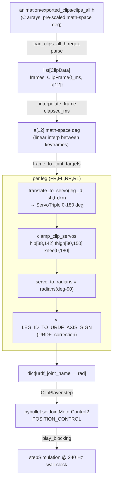

# pybullet_interpreter — Architecture & Data Flow

A technical study of `code/simulation/pybullet_interpreter/`, the clip/animation
interpreter that plays baked FaceHugger animation clips through PyBullet. The
package's stated mission (README §Purpose) is to **mirror the firmware clip
pipeline exactly** so a clip can be validated visually in sim before flashing:

> The firmware plays clips via `tickClip()` in `spinal_cord.cpp`, which calls
> `translateToServo()` and `clampClipServos()` from `motion_math.cpp`. This module
> ports that exact math to Python … EMA smoothing (`CLIP_EMA_ALPHA=0.75`) is
> intentionally **not** reproduced here — the goal is validating clip geometry.

---

## Data-flow overview



The README's own ASCII pipeline (`README.md:52-64`) describes the same chain.
Note one discrepancy worth flagging: the README's final step says
`apply_joint_targets(...)` and `helpers.apply_joint_targets`, but the **actual
implemented `ClipPlayer.step` calls `pybullet.setJointMotorControl2` directly** —
the `helpers.apply_joint_targets` path from the plan was dropped.

---

## 1. Package purpose & public API

`__init__.py` re-exports the full surface from the three real modules (the
`gait_interpreter` stub is deliberately **not** exported):

```python
# __init__.py:1-16
from .servo_convention import (
    LEG_FR, LEG_FL, LEG_RR, LEG_RL,
    LEG_ID_TO_SIM_NAME,
    NEUTRAL, NeutralPose, ServoTriple,
    translate_to_servo, clamp_clip_servos, servo_to_radians,
)
from .clip_loader import ClipFrame, ClipData, load_clips_all_h, get_clip_by_name
from .clip_player import frame_to_joint_targets, ClipPlayer
```

Three layers: **convention math** (`servo_convention`), **parsing**
(`clip_loader`), **playback/driver** (`clip_player`). The first two are pure and
PyBullet-free (testable without a sim connection); only `clip_player` touches
PyBullet, and even then lazily.

---

## 2. clip_loader.py — clip format & data structures

**Format read:** the C header `animation/exported_clips/clips_all.h`, generated by
the Blender add-on `fh_clip_panel.py` (`to_clips_header`). It is **not** `.fhc`
or JSON. The default path is resolved relative to the repo root:

```python
# clip_loader.py:21-22
_REPO_ROOT = Path(__file__).resolve().parents[3]
DEFAULT_CLIPS_H = _REPO_ROOT / "animation" / "exported_clips" / "clips_all.h"
```

**Critical semantic note** (module docstring, `clip_loader.py:7-14`): the `a[12]`
values are *already* pre-scaled math-space degrees — the 2/3 scale-from-NEUTRAL
is baked in by the exporter, and **only `translateToServo()` runs at playback**:

```python
# clip_loader.py:7-14
# Frame data in clips_all.h:
#   a[12] = PRE-SCALED math-space joint degrees.
#   The 2/3 scale-from-NEUTRAL is already applied.
#   Firmware LegId order: FR(sh,th,kn), FL(sh,th,kn), RR(sh,th,kn), RL(sh,th,kn).
#   Firmware applies ONLY translateToServo() at runtime — not this module.
# Do NOT re-apply scale-from-NEUTRAL here ...
```

**Dataclasses** — two, both plain:

```python
# clip_loader.py:25-38
@dataclass
class ClipFrame:
    t_ms: int                                 # timestamp, ms (uint16 in firmware)
    a: list[float] = field(default_factory=list)  # 12 pre-scaled math-space deg
```

`a` layout: `a[0..2]=FR(sh,th,kn)`, `a[3..5]=FL`, `a[6..8]=RR`, `a[9..11]=RL`.

```python
# clip_loader.py:41-54
@dataclass
class ClipData:
    name: str
    frames: list[ClipFrame] = field(default_factory=list)
    frame_count: int = 0
    duration_ms: int = 0
```

**Parsing** is two-pass regex over the file text (`clip_loader.py:74-119`). First
pass captures each per-clip frame array block; second pass captures the
`FH_CLIPS[]` metadata table, then joins them by the C variable name:

```python
# clip_loader.py:74-80 — frame arrays
frame_block_re = re.compile(
    r"static const FhClipFrame (\w+)\[\] = \{(.*?)\};", re.DOTALL)
frame_re = re.compile(r"\{\s*(\d+)\s*,\s*\{([^}]+)\}\s*\}")
```

```python
# clip_loader.py:89 — float trailing-f stripped
floats = [float(v.strip().rstrip("f")) for v in fm.group(2).split(",")]
```

```python
# clip_loader.py:95-101 — metadata table
clips_table_re = re.compile(
    r"static const FhClip FH_CLIPS\[[^\]]*\] = \{(.*?)\};", re.DOTALL)
entry_re = re.compile(
    r'\{\s*"([^"]+)"\s*,\s*(\w+)\s*,\s*(\d+)\s*,\s*(\d+)\s*\}')
```

**Validation / errors:** `path.read_text()` raises `FileNotFoundError`
implicitly; if the table yields nothing the loader raises `ValueError("No clips
found …")` (`clip_loader.py:121-124`). `frame_count`/`duration_ms` are read from
the C table — **not** recomputed from the parsed frames, so a mismatch between
table and arrays would pass silently (the tests catch this against the manifest).

`get_clip_by_name` is a case-insensitive linear lookup that raises `KeyError`
with the available names on miss (`clip_loader.py:128-140`).

---

## 3. servo_convention.py — the convention conversion (crown jewel)

This file is the single Python source of truth for the
`math-space → servo-space → PyBullet-radian` pipeline, ported line-for-line from
firmware `motion_math.cpp` and `neutral_pose.h` (docstring `servo_convention.py:8-12`).

### 3a. Leg identity & naming bridge

```python
# servo_convention.py:18-30
LEG_FR = 0
LEG_FL = 1
LEG_RR = 2  # also called BR in simulation / Blender
LEG_RL = 3  # also called BL in simulation / Blender

LEG_ID_TO_SIM_NAME: dict[int, str] = {
    LEG_FR: "fr", LEG_FL: "fl", LEG_RR: "br", LEG_RL: "bl",
}
```

So firmware `RR→br`, `RL→bl`. This is the canonical translation table also
documented in `MERGE_AND_CONVENTION.md §5`.

### 3b. NEUTRAL standing pose (math-space degrees)

```python
# servo_convention.py:61-66
NEUTRAL: list[NeutralPose] = [
    NeutralPose(sh=45.0,   th=-60.0, kn=-37.0),  # LEG_FR (0)
    NeutralPose(sh=135.0,  th=-60.0, kn=-40.0),  # LEG_FL (1) Change B
    NeutralPose(sh=-45.0,  th=-50.0, kn=-50.0),  # LEG_RR / BR (2)
    NeutralPose(sh=-135.0, th=-60.0, kn=-35.0),  # LEG_RL / BL (3)
]
```

The `# Change B` comment marks FL shoulder = 135 so its "outward" direction
matches the other three legs — this is the convention fix referenced in the
project memory note "Clip shoulder rest convention bug".

### 3c. translate_to_servo — per-leg axis sign + zero offset

This is the core. Each leg has its own formula encoding **physical servo mounting
direction (sign)** and **zero-offset (the ±45/±135 constant = that leg's shoulder
rest yaw)** so that **servo 90° = the joint's math-space neutral**:

```python
# servo_convention.py:98-120
out = ServoTriple(hip=90.0, thigh=90.0, knee=90.0)
if leg_id == LEG_FR:
    out.hip   = 90.0 + (sh - 45.0)
    out.thigh = 90.0 - th
    out.knee  = 90.0 + kn
elif leg_id == LEG_FL:
    out.hip   = 90.0 + (sh - 135.0)
    out.thigh = 90.0 + th
    out.knee  = 90.0 - kn
elif leg_id == LEG_RR:
    # BR shoulder un-mirrored (2026-05-25): +sh = +servo like fr/fl/bl
    # (identical motor, yaw shaft on the same vertical axis). Byte-identical
    # to firmware translateToServo / exporter _frame_to_servo.
    out.hip   = 90.0 + (sh + 45.0)
    out.thigh = 90.0 + th
    out.knee  = 90.0 - kn
elif leg_id == LEG_RL:
    out.hip   = 90.0 + (sh + 135.0)
    out.thigh = 90.0 - th
    out.knee  = 90.0 + kn
else:
    raise ValueError(f"unknown leg_id {leg_id!r}")
return out
```

How the conventions are "understood":

- **Shoulder/hip (yaw):** `90 + (sh ± offset)`. The offset is the leg's rest yaw
  (FR −45, FL −135, RR +45, RL +135) so that feeding the NEUTRAL `sh` yields
  exactly servo 90. The `+sh` sign is **uniform across all four legs** — there is
  no per-leg sign flip on the shoulder. This matches the project memory note
  "Yaw/shoulder convention: math-space +sh=CCW uniform all legs".
- **Thigh:** sign alternates per diagonal pair — FR/RL use `90 − th`, FL/RR use
  `90 + th`. This encodes the mirrored servo mounting of the left/right body sides.
- **Knee:** opposite alternation — FR/RL use `90 + kn`, FL/RR use `90 − kn`.

#### The BR hardware-mirror change (load-bearing for the report)

The most important convention detail: **BR's shoulder was *un-mirrored* on
2026-05-25.** The original plan (and an earlier firmware revision) had
`hip = 90 − (sh + 45)` for RR (see plan doc line 35 / 306). The shipped code
flips this to `hip = 90 + (sh + 45)`. The inline comment
(`servo_convention.py:108-110`) and the test's ground-truth copy both record the
reason: the BR motor is an identical part with its yaw shaft on the same vertical
axis, so `+sh = +servo` like every other leg. The test file makes the divergence
explicit by carrying a verbatim copy of the *new* firmware formula:

```python
# tests/test_servo_convention.py:43-45
if leg_id == 2:  # LEG_RR / BR
    # BR shoulder un-mirrored (2026-05-25): +sh = +servo like the others.
    return (90.0 + (sh + 45.0), 90.0 + th, 90.0 - kn)
```

### 3d. clamp_clip_servos — keep joints off mechanical stops

```python
# servo_convention.py:135-142
def cl(v, lo, hi): return lo if v < lo else (hi if v > hi else v)
return ServoTriple(
    hip=cl(s.hip, 38.0, 142.0),    # 90 ± 52 (tightest side)
    thigh=cl(s.thigh, 30.0, 150.0),# 90 ± 60
    knee=cl(s.knee, 0.0, 180.0),   # full travel
)
```

### 3e. servo_to_radians — servo deg → PyBullet rad

```python
# servo_convention.py:158
return math.radians(servo_deg - 90.0)
```

So servo 90→0 rad, 0→−π/2, 180→+π/2. The URDF joint zero is defined to coincide
with servo-90 neutral, which is what makes this a pure offset+scale.

### 3f. URDF axis-sign table (sim-only correction)

A subtlety **not in the firmware** at all (firmware drives physical motors, which
don't care about URDF `<axis>` orientation). The URDF emits `<axis xyz="0 ±1 0">`
on link2/link3, with the diagonal pairs flipped:

```python
# servo_convention.py:38-43
LEG_ID_TO_URDF_AXIS_SIGN: dict[int, int] = {
    LEG_FR: -1,  # fr link2/3: axis "0 -1 0"
    LEG_FL: +1,  # fl link2/3: axis "0  1 0"
    LEG_RR: +1,  # br link2/3: axis "0  1 0"
    LEG_RL: -1,  # bl link2/3: axis "0 -1 0"
}
```

This table is consumed only in `clip_player.frame_to_joint_targets`, not in the
servo math itself — keeping the firmware-parity math byte-identical while still
rendering correctly in sim.

---

## 4. clip_player.py — stepping, interpolation, joint mapping, actuation

### 4a. frame_to_joint_targets — the full per-frame conversion

```python
# clip_player.py:54-69
targets: dict[str, float] = {}
for leg_id in _LEG_IDS:                       # _LEG_IDS = (FR, FL, RR, RL)
    sh = a[leg_id * 3]
    th = a[leg_id * 3 + 1]
    kn = a[leg_id * 3 + 2]
    servo = clamp_clip_servos(translate_to_servo(leg_id, sh, th, kn))
    urdf_name = LEG_ID_TO_SIM_NAME[leg_id]
    axis = LEG_ID_TO_URDF_AXIS_SIGN[leg_id]
    targets[f"{urdf_name}_link1_joint"] = axis * servo_to_radians(servo.hip)
    targets[f"{urdf_name}_link2_joint"] = axis * servo_to_radians(servo.thigh)
    targets[f"{urdf_name}_link3_joint"] = -axis * servo_to_radians(servo.knee)
```

Two non-obvious points:

- **link1 (shoulder/yaw) gets the same axis factor as link2.** The docstring
  (`clip_player.py:62-65`) explains: link1's `<axis z>` shares the same
  `{fl,br}=+ / {fr,bl}=−` diagonal pattern, and *without it fr/bl shoulder yaw
  rendered backwards in the sim*. This contradicts the inline docstring at
  `clip_player.py:48-50` which still claims link1 needs no sign correction — that
  comment is stale relative to the code below it. Worth flagging as a doc bug.
- **link3 (knee) uses `−axis`**, the opposite sign of link1/link2.

### 4b. Interpolation — clipPoseAt port

```python
# clip_player.py:84-100
if not frames:                       return [90.0] * 12
if elapsed_ms <= frames[0].t_ms or len(frames) == 1:  return list(frames[0].a)
if elapsed_ms >= frames[-1].t_ms:    return list(frames[-1].a)
lo_idx = 0
for i in range(len(frames) - 1):
    if frames[i + 1].t_ms <= elapsed_ms: lo_idx = i + 1
    else: break
lo = frames[lo_idx]; hi = frames[lo_idx + 1]
span = hi.t_ms - lo.t_ms
f = 0.0 if span == 0 else (elapsed_ms - lo.t_ms) / span
return [lo.a[j] + (hi.a[j] - lo.a[j]) * f for j in range(12)]
```

Pure linear interpolation, clamped at both ends (hold first/last frame). Mirrors
`motion_math.cpp:clipPoseAt`.

### 4c. Joint mapping + actuation (lazy PyBullet import)

`ClipPlayer` takes a pre-built `joint_map: dict[str, int]` (from
`helpers.build_joint_map`, `clip_player.py:126-128`). `step` resolves each named
target to a PyBullet joint index and issues position control:

```python
# clip_player.py:145-160
import pybullet as p   # lazy, inside the method
a = _interpolate_frame(self._clip.frames, elapsed_ms)
targets = frame_to_joint_targets(a)
for joint_name, rad in targets.items():
    joint_idx = self._joint_map.get(joint_name)
    if joint_idx is None:
        continue
    p.setJointMotorControl2(
        self._robot_id, joint_idx, p.POSITION_CONTROL,
        targetPosition=rad, force=self._force, maxVelocity=self._velocity)
```

**Why lazy import (quoted, `clip_player.py:106-108`):**

> Does NOT import pybullet at module level so that clip_loader and
> servo_convention can be tested without a PyBullet connection.
> PyBullet is imported lazily inside play_blocking().

PyBullet has no macOS PyPI wheel (per CLAUDE.md), so the pure-math tests
(`test_clip_player.py`, `test_servo_convention.py`, `test_clip_loader.py`) must
import the package without ever loading PyBullet. The lazy import in both `step`
and `play_blocking` is what makes that possible. Defaults: `force=10.0 N·m`,
`velocity=5.0 rad/s` (`clip_player.py:120-121`).

### 4d. Timing / playback rate

`play_blocking` runs a real-time wall-clock loop at a fixed physics step of
**240 Hz** (`step_s = 1/240`, `clip_player.py:186`):

```python
# clip_player.py:190-216 (condensed)
while True:
    elapsed_ms = (time.monotonic() - start) * 1000.0
    clamped_ms = min(elapsed_ms, float(self._clip.duration_ms))
    self.step(clamped_ms)
    p.stepSimulation()
    if on_step is not None: on_step(step_index)
    step_index += 1
    if elapsed_ms >= self._clip.duration_ms:
        if not gui: return                  # headless: play once, return
        if not p.isConnected(): return
        if loop: start = time.monotonic(); continue   # GUI loop replay
        time.sleep(step_s); continue        # GUI: hold final pose
    deadline = start + elapsed_ms / 1000.0 + step_s
    remaining = deadline - time.monotonic()
    if remaining > 0: time.sleep(remaining)
```

Behavioral modes (docstring `clip_player.py:162-181`):
- **headless (`gui=False`):** plays once in wall-clock time, returns (CI smoke).
- **GUI default:** after the last frame, holds the final pose every frame until
  the window closes — mirrors firmware "hold-at-end".
- **`loop=True` (GUI only):** restarts from frame 0 **without resetting physics
  state**, so drift/foot-slip/tipping accumulate across loops.
- **`on_step` callback:** optional `callable(step_index)` after every
  `stepSimulation`, used for torque/current monitoring; kept generic to decouple
  the module from sim tooling.

Note the clip's *content* is sampled with `clamped_ms` (frozen at
`duration_ms`), while loop/exit decisions use the un-clamped `elapsed_ms`.

---

## 5. gait_interpreter.py — stub (quoted in full)

```python
# gait_interpreter.py (full file)
"""Mirrors firmware SpinalCord::tickGait in Python.

Not yet implemented — stub only. See doc/animation-pipeline/ for the
on-board animation engine design that this will eventually support.
"""


def tick_gait(*args, **kwargs):
    """Drive PyBullet joints for one gait tick.

    Not implemented. Port of SpinalCord::tickGait in
    code/firmware/src/nervous_system/spinal_cord.cpp.
    """
    raise NotImplementedError("gait_interpreter is not yet implemented")
```

It is intentionally excluded from `__init__.py`'s exports.

---

## 6. Tests — the locked-down contract

Three test files, all pure-math (no PyBullet). README claims "53 tests"; the
count is now higher because two suites are parametrized and data-driven.

### test_servo_convention.py — firmware parity (the strongest guarantee)

Carries an **independent verbatim copy** of the firmware formula as ground truth,
and deliberately refuses to factor it out (docstring `:5-7`):

> `_firmware_translate()` is copied verbatim from firmware source as
> independent ground truth — DO NOT factor it out … Divergence between the two
> is precisely the bug these tests guard against.

Locks down:
- Exact NEUTRAL values per leg (`test_neutral_fr/fl/rr/rl`), incl. FL=135 "Change B".
- `translate_to_servo` == firmware formula at NEUTRAL, at NEUTRAL+30° uniform,
  and under single-joint perturbation (catches cross-axis leakage) — all four
  legs, parametrized.
- Clamp edges: hip→38 low, thigh→150 high, knee full-travel passthrough.
- `servo_to_radians`: 90→0, 0→−π/2, 180→+π/2.

The BR un-mirror change is baked into the ground-truth copy
(`test_servo_convention.py:43-45`), so this suite is what would fail if anyone
reverted BR to the old `90 − (sh+45)`.

### test_clip_loader.py — parser correctness vs. the manifest

Notably the tests **do not hardcode** clip counts/names; they validate against
`clips_manifest.json` sitting next to the header (docstring `:28-34`), so the
suite survives the clip set growing (it has grown from 5 to 6 clips:
fallingRobot, lie down and stand up, one leg lift, tiny wiggle, wave, wiggle).
Locks down: count/names/order/frame_count/duration match the manifest; every
frame has 12 floats; all clips start at `t_ms=0`; strictly ascending timestamps;
case-insensitive lookup + `KeyError` on miss.

The one hardcoded numeric check is the shoulder-convention regression
(`test_clip_loader.py:91-101`):

```python
# tests/test_clip_loader.py:99-100
clip = get_clip_by_name(all_clips, "lie down and stand up")
assert abs(clip.frames[0].a[0] - 45.7052) < 0.01
```

The comment records the bug history: `~14.29` was the delta bug, `~44.29` before
the axis-cancel fix, `45.7052` is correct (FR neutral 45 + small rest-yaw
residual; the exporter cancels the rig bone axis_sign). This single assertion is
the canary for the whole Blender→clips_all.h shoulder convention.

### test_clip_player.py — interpolation + joint-target math

Locks down:
- 12 targets, correct joint-name set (`{fr,fl,br,bl}` × `link{1,2,3}_joint`).
- FR at NEUTRAL → `fr_link1_joint == 0` (servo 90 → 0 rad).
- All outputs within radian range at NEUTRAL.
- **Clamping wired through `frame_to_joint_targets`:** `sh=-200` clamps hip to
  servo 38, and the expected value carries the FR axis sign (`:85`):
  `expected = -servo_to_radians(38.0)`.
- **At NEUTRAL, every link2 and every link3 is negative**
  (`test_neutral_all_hips_negative`, `test_neutral_all_knees_negative`) — this is
  exactly the assertion that pins down the `LEG_ID_TO_URDF_AXIS_SIGN` behavior;
  it would fail if the axis table or the `-axis` knee sign were wrong.
- `_interpolate_frame` boundaries: before-first, at-first, at-last, after-last
  all hold the endpoint; midpoint averages; real-clip sample returns 12 floats.

---

## Stubs, TODOs & doc drift (flag list)

- **`gait_interpreter.tick_gait` is a `NotImplementedError` stub.** Gait playback
  is out of scope; only clip playback is implemented.
- **Stale docstring in `clip_player.py:48-50`** says link1 "needs no sign
  correction," but the code 16 lines below applies `axis *` to link1. The lower
  comment (`:62-65`) is the accurate one.
- **README pipeline drift:** README and the plan describe the final actuation as
  `helpers.apply_joint_targets(...)`; the shipped `ClipPlayer.step` calls
  `pybullet.setJointMotorControl2` directly. The `helpers.apply_joint_targets`
  indirection was dropped during implementation.
- **Plan vs. shipped BR formula:** the plan doc (lines 35, 306) specifies
  `RR hip = 90 − (sh+45)`; the shipped code uses `90 + (sh+45)` (BR un-mirror,
  2026-05-25). The plan was not updated; the code and tests agree with each other.
- **No recomputation of `frame_count`/`duration_ms`** in the loader — they are
  trusted from the C table; only the test suite cross-checks them against the
  JSON manifest.
- The `--clip` CLI wiring (plan Task 11) lives in `facehugger.py`, outside this
  package; the README documents `python facehugger.py sim --clip "<name>"`.
