# Assembly

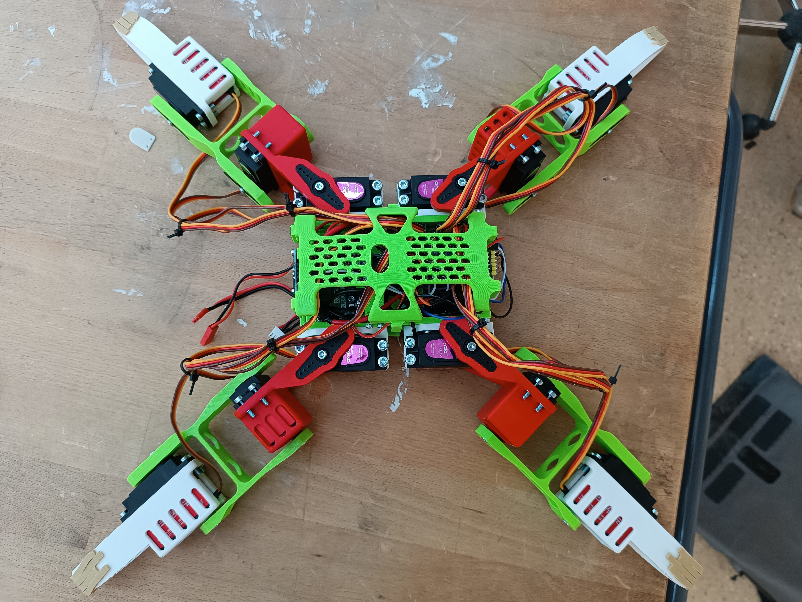

This guide walks you through building the FaceHugger from scratch. It is written for a complete beginner — every step explains not just *what* to do but *why*, and what to watch out for. Read each step fully before acting on it.

**Estimated time:** 4–6 hours for a first build.

**Colour guide for printed parts:** In the photos, the body and mounts are **green**, the thighs and hips are **red**, and the knees are **white**. Link 2 and Link 3 are **green**. This makes it easier to identify parts in the pictures.

---

## Before you start

!!! note "Checklist — verify everything before beginning"

    Do not skip this step. Discovering a missing part mid-build is very frustrating.

    **Printed parts**

    | Part | Qty | Colour in photos |
    |---|---|---|
    | Shell (body top cover) | 1 | Green |
    | Body frame | 1 | Green |
    | Mounts (leg attachment brackets) | 4 | White |
    | LiPo cage (battery holder) | 1 | Green |
    | Rubber pad for LiPo | 1 | Beige/tan |
    | Link 1 — Hip | 4 | Red |
    | Link 2 — Thigh | 4 | Green |
    | Link 3 — Knee housing | 4 | White |

    **Hardware / fasteners**

    !!! tip "Tip — sort your screws first"
        Before starting, separate all screws and nuts into labelled groups (a muffin tin or small cups work well). Nothing slows a build down more than hunting for the right M3 screw.

    | Location | Fastener | Qty |
    |---|---|---|
    | Mounts → Body | M2.5×8 screws | 16 |
    | Mounts → Body | M2.5 hex nuts | 16 |
    | Hip servo | M4×12 screws | 12 |
    | Hip servo horn | M3×8 screws | 4 |
    | Hip hex nuts | M4 hex nuts | 12 |
    | Hip servo horn hex nut | M3 hex nuts | 4 |
    | Thigh servo | M3×12 screws | 16 |
    | Thigh ball bearing + servo horn | M3×8 screws | 8 |
    | Thigh hex nuts | M3 hex nuts | 20 |
    | Knee servo | M3×12 screws | 16 |
    | Knee ball bearing + servo horn | M3×8 screws | 8 |
    | Knee hex nuts | M3 hex nuts | 20 |
    | Bridges | M2.5×6 screws | 7 |
    | OLED screen | M2×10 screws | 4 |
    | OLED screen | M2 hex nuts | 4 |
    | ESP32 | M2.5×5 screw | 1 |
    | ToF sensors (×3) | M2×4 screws | 6 |
    | IMU | M2.5×2 screws | 2 |
    | PCA9685 Multiplexer | M2.5×6 screws | 4 |
    | Buck Converter | M2.5×5 screws | 2 |
    | Servo horns (all legs) | M3×8 screws | 12 |

    **Electronics**

    | Component | Qty | Notes |
    |---|---|---|
    | QYRC DSS-230MG servo | 12 | 3 per leg |
    | PCA9685 PWM multiplexer | 1 | The servo controller board |
    | ESP32 | 1 | The main microcontroller |
    | OLED screen (0.96" I²C) | 1 | |
    | IMU (MPU-6050) | 1 | The gyroscope/accelerometer |
    | ToF distance sensors | 3 | Time-of-Flight sensors |
    | BMS (Battery Management System) | 1 | Protects the LiPo |
    | Buck Converter | 1 | Steps voltage down to 5V |
    | Capacitor | 1 | For power smoothing |
    | LiPo 2S battery | 1 | Handle carefully — see battery warnings |
    | Ball bearings | 12 | 3 per leg (1 knee + 1 thigh + 1 hip side) |
    | Servo horns | 12 | Usually included with servos |
    | Elastic bands | 4 | One per leg knee |
    | Zip ties | 4 | For cable management |
    | FF jumper cables | 2 | Female-to-Female, for capacitor |
    | I²C cable trees | 4 | 1-female → 3-female splitters: VCC, GND, SDA, SCL |

    **Tools you will need**

    - Soldering iron + solder
    - Wire strippers
    - Small Phillips-head screwdriver
    - Hex/Allen key set (M2, M2.5, M3, M4)
    - Tweezers or needle-nose pliers (for inserting hex nuts)
    - Multimeter (recommended, for checking solder joints)

---

## Overview of the build

The FaceHugger has three major sections built in this order:

1. **Legs** — Build all four legs first, completely, before touching the body. Each leg is identical.
2. **Body electronics** — Solder and mount all electronics into the body frame.
3. **Final assembly** — Attach legs to body, route all wiring, connect the battery last.

---

## Part 1 — Legs

The robot has four identical legs. Each leg consists of three segments connected in a chain:

- **Knee** (white) — the foot/lower segment. Contains one servo and one ball bearing.
- **Thigh** (red) — the middle segment. Contains one servo and one ball bearing.
- **Hip** (red) — the upper segment that connects to the body. Contains one servo.

The segments are connected by printed link pieces:

- **Link 3** (green, H-shaped, labelled "3") — connects knee servo output to thigh.
- **Link 2** (green, H-shaped, labelled "2") — connects thigh servo output to hip.
- **Link 1** (red, large bracket) — is the hip itself, which clips onto the body mount.

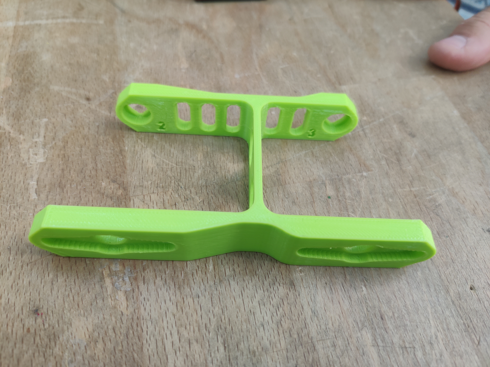

!!! tip "Identify your link pieces"
    Look closely at the green H-shaped link pieces — they have small numbers ("2" and "3") moulded into them. Make sure you use the right one at each stage. Using the wrong link will result in a leg that can't move correctly.

**Build one complete leg start-to-finish, then repeat ×3.**

---

### Step 1 — Knee: insert hex nuts

Take one **knee piece** (white, elongated shell shape) and locate the hex nut slots. There are **5 slots** — four in a square pattern (for the servo screws) and one on the side (for the ball bearing).

!!! warning "Insert hex nuts BEFORE the servo"
    The hex nuts must go in first, while you have clear access. Once the servo is in, you cannot reach the slots. Push each hex nut firmly into its slot using tweezers or the tip of a screwdriver — they should sit flush. If a nut spins when you later try to drive a screw into it, it was not seated properly.

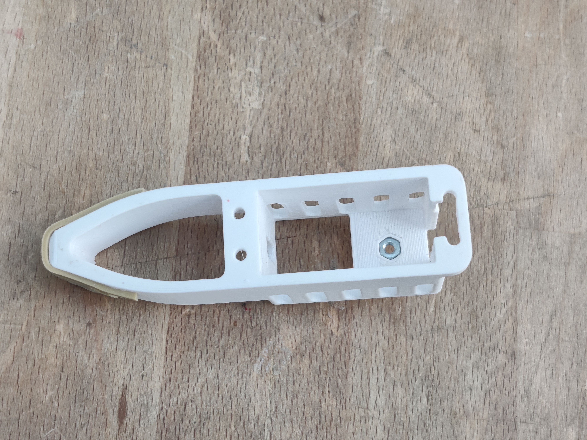

**Fasteners for this step:** 5× M3 hex nuts.

---

### Step 2 — Knee: install the servo

Take one **DSS-230MG servo**. Before inserting it, notice the cable — it needs to come out through the **small rectangular hole** on the side of the knee piece, not just hang loose.

Insert the servo into the opening in the knee. The servo body should sit flush inside the housing. Thread the cable through the exit hole as you push the servo in.

Secure the servo with **4× M3×12 screws**, one in each corner. Tighten evenly — do not overtighten, as the printed plastic can crack.

!!! warning "Cable routing"
    Before tightening the screws, confirm the cable exits cleanly through the hole and is not pinched between the servo and the housing wall. A pinched cable will eventually fray and cause signal issues.

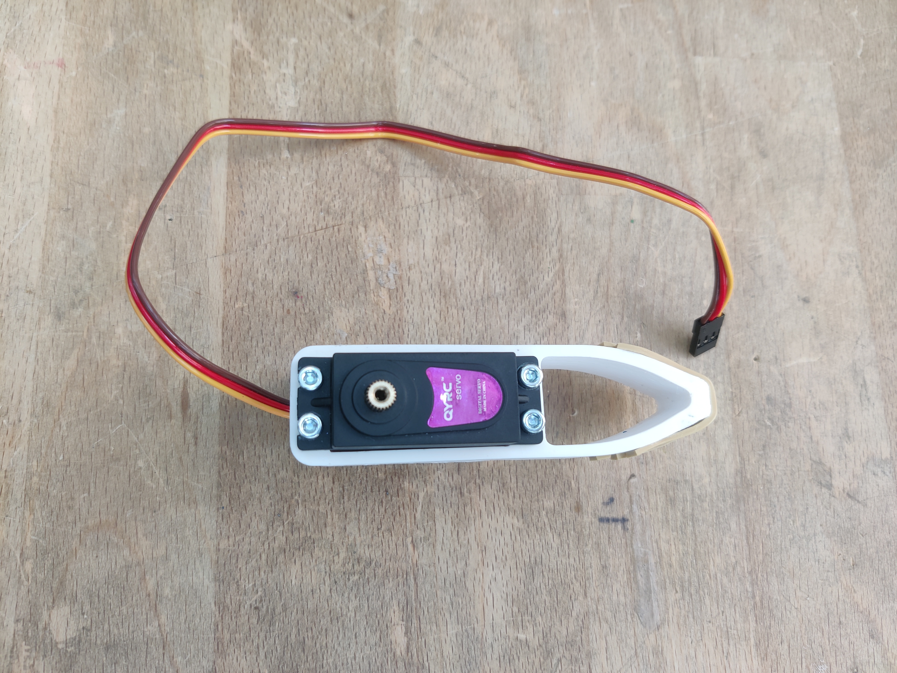

**Fasteners for this step:** 4× M3×12 screws.

---

### Step 3 — Knee: install the ball bearing

The ball bearing goes on the **opposite end** from the servo gear (the rounded tip of the knee piece). It sits in a recessed pocket and is held by a single screw that passes through the bearing's inner race.

Press the bearing into the pocket. Thread an **M3×8 screw** through the centre of the bearing and into the hex nut you inserted in Step 1. Tighten until snug — the bearing should spin freely but not rattle.

!!! tip "Check bearing spin"
    After tightening, spin the bearing with your finger. It should rotate smoothly with no grinding or wobble. If it grinds, the screw is overtightened — back off slightly.

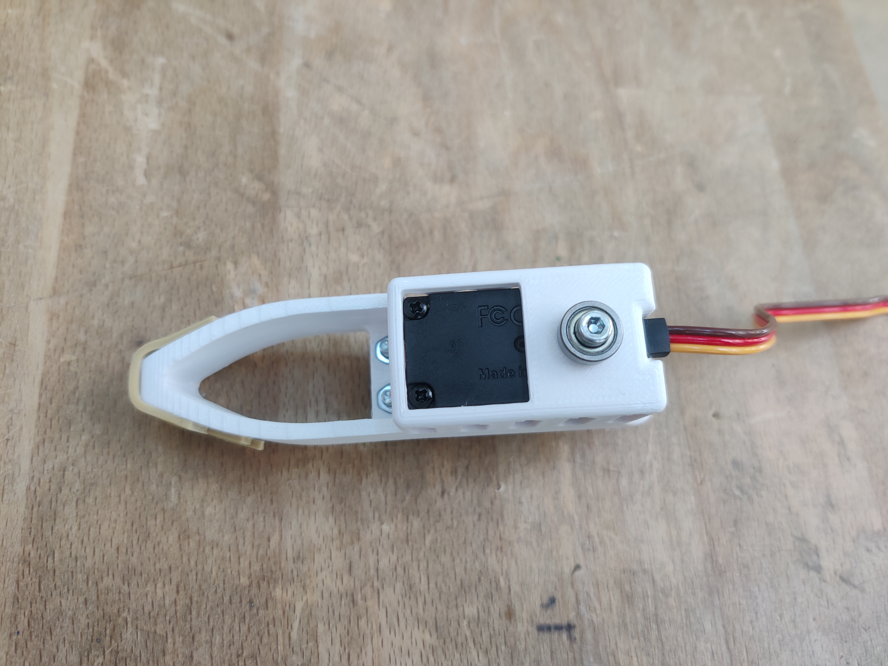

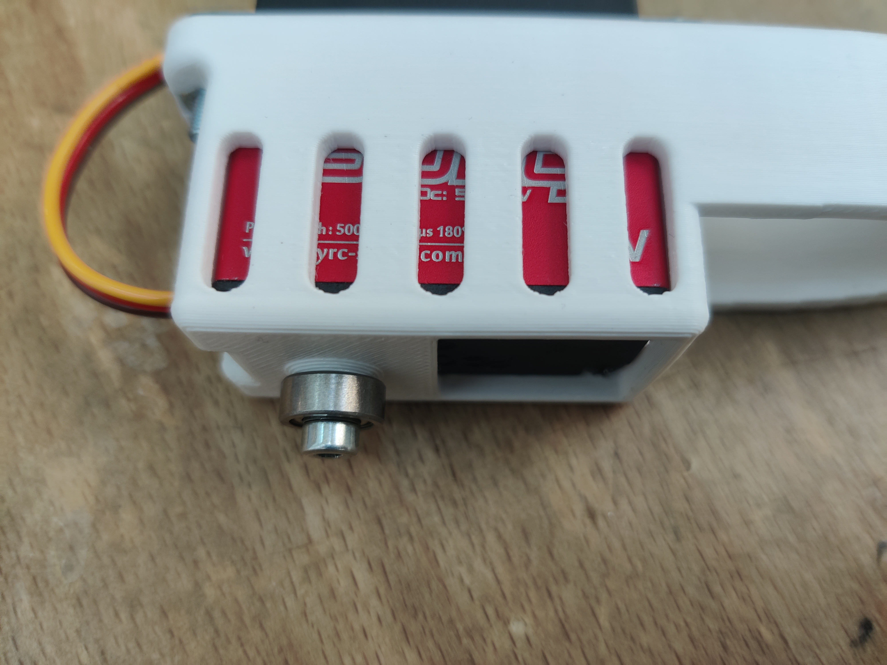

**Fasteners for this step:** 1× M3×8 screw.

The knee is now complete.

---

### Step 4 — Add Link 3 to the knee

Take the **Link 3** piece (the green H-shaped piece labelled "3"). One side of the H has two round recesses for a servo horn; the other side has two recesses for a ball bearing pivot.

Insert the **knee assembly** into the ball-bearing side of Link 3 so that the bearing fits into the matching socket in the link. Then take a **servo horn** and press it onto the servo spline (the toothed shaft coming out of the servo). Align it so the arm points in a neutral direction, then secure with **1× M3×8 screw** through the horn centre into the servo.

!!! tip "Servo horn orientation"
    The servo horn should point roughly perpendicular to the knee piece's long axis when the servo is at its centre position (90°). This gives maximum range of motion in both directions. If you are unsure, centre the servo electronically before attaching the horn.

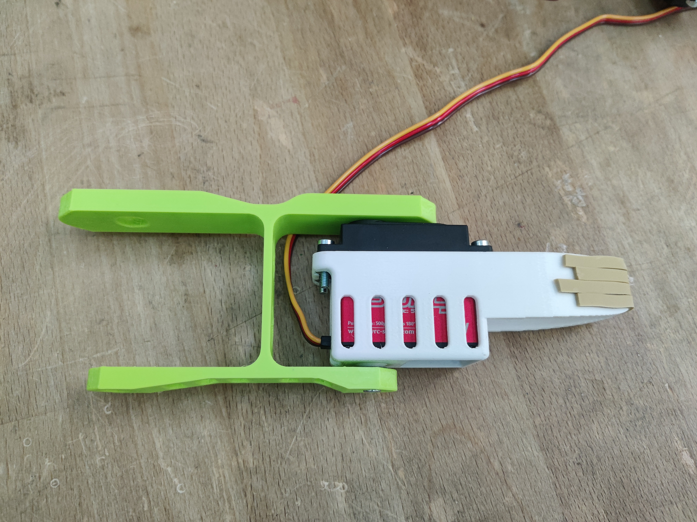

**Fasteners for this step:** 1× M3×8 screw (servo horn).

---

### Step 5 — Thigh: insert hex nuts

Take one **thigh piece** (red, U-shaped bracket). This is a more open structure than the knee. Insert **5× M3 hex nuts** into the slots — four for the servo and one for the ball bearing, following the same approach as Step 1.

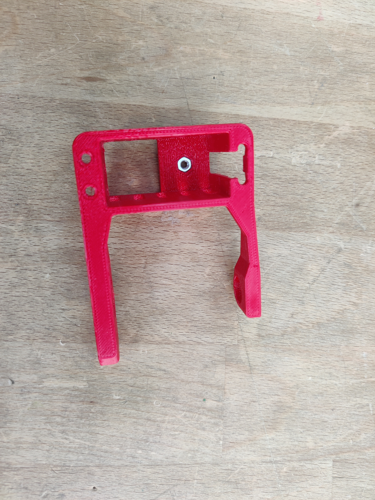

!!! tip "The thigh has a printed label"
    Look for a small embossed label on the thigh piece. This tells you which direction the servo cable should exit.

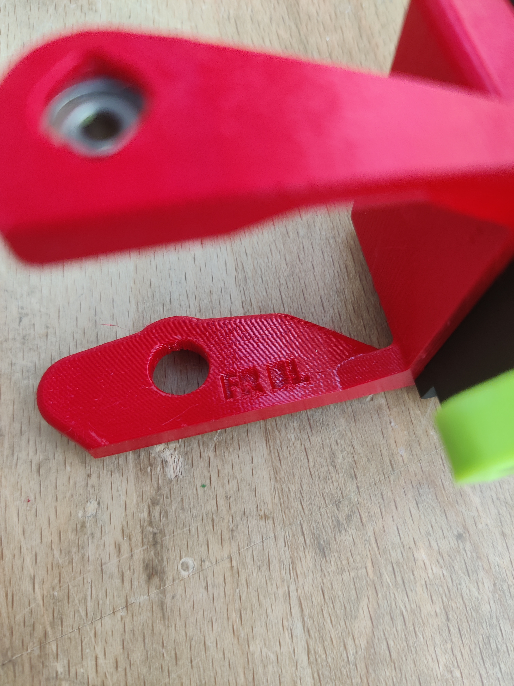

**Fasteners for this step:** 5× M3 hex nuts.

---

### Step 6 — Thigh: install the servo

Insert the servo into the thigh bracket, cable-first, so the cable exits through the bracket opening. Secure with **4× M3×12 screws**.

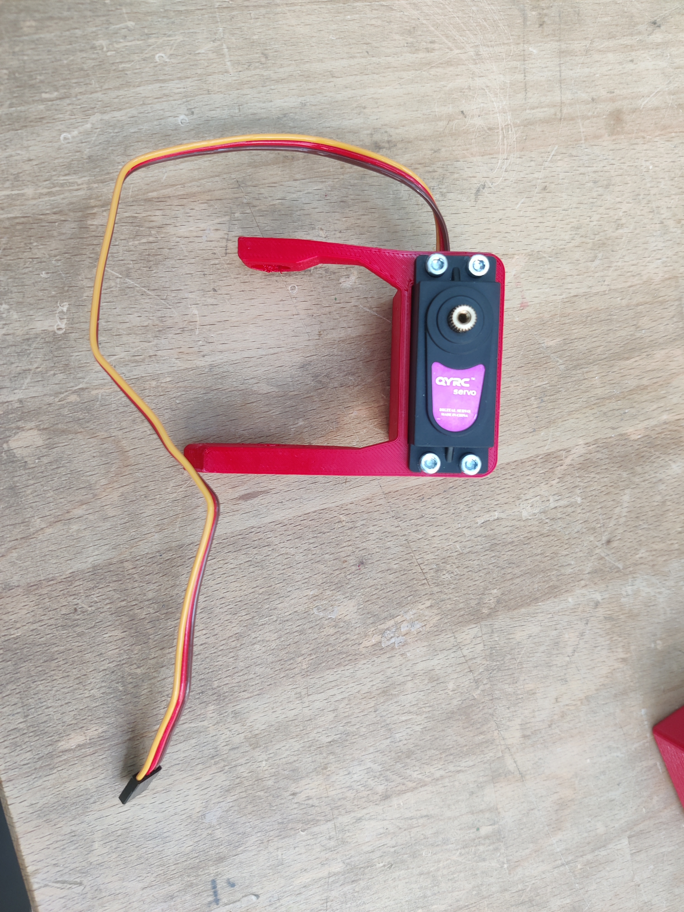

**Fasteners for this step:** 4× M3×12 screws.

---

### Step 7 — Thigh: install the ball bearing

Press the ball bearing into the recessed pocket on the free arm of the thigh bracket. Secure with **1× M3×8 screw** through the bearing's centre into the hex nut behind it.

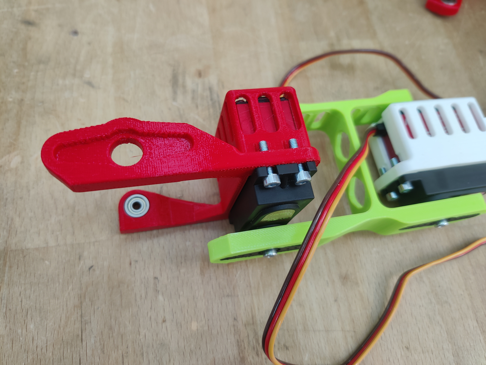

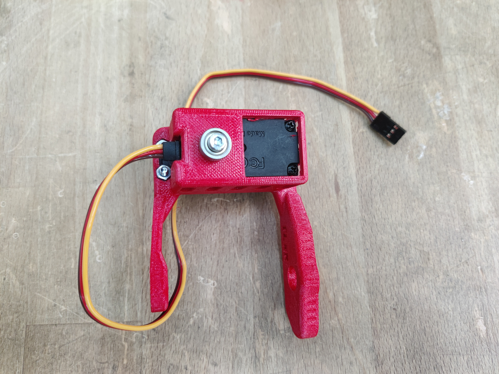

**Fasteners for this step:** 1× M3×8 screw.

---

### Step 8 — Add Link 2 to the thigh

Take the **Link 2** piece (green H-shape labelled "2"). Fit the **thigh assembly** into the ball-bearing side of Link 2. Attach the **servo horn** to the thigh servo and screw it to Link 2 with **1× M3×8 screw**.

**Fasteners for this step:** 1× M3×8 screw (servo horn).

---

### Step 9 — Knee + Thigh sub-assembly check

At this point you should have the knee (with Link 3) and the thigh (with Link 2) as two separate sub-assemblies. They connect together in the next section.

The knee servo horn on Link 3 mates with the open side of Link 2 — the H-piece on the thigh side. Clip the knee's Link 3 into the thigh's Link 2 bracket. This joint should pivot freely around the ball bearing axis.

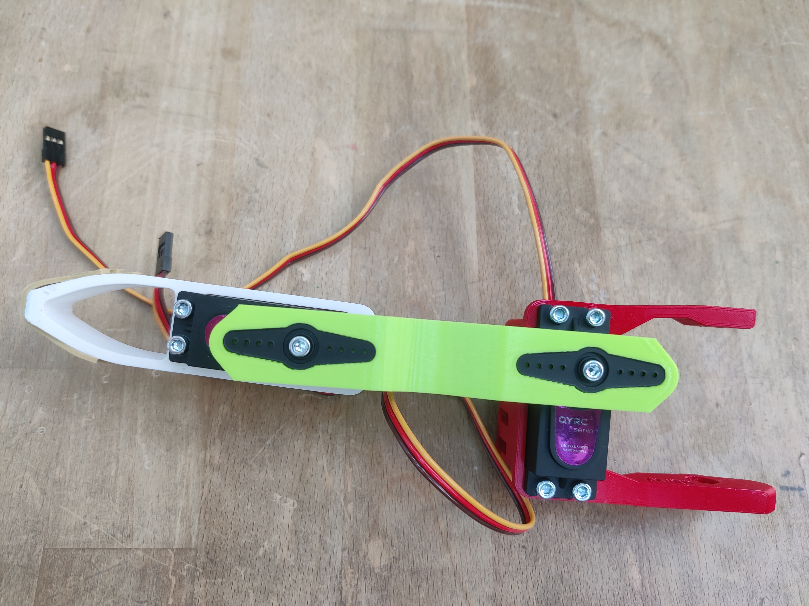

!!! tip "Joint freedom check"
    Flex the knee joint by hand. It should move through a wide arc with light resistance from the servo's internal gears. If it feels stiff or grinds, check that the ball bearing screw is not over-tightened.

---

### Step 10 — Hip: insert hex nuts and install servo

Take one **hip piece** (red, larger bracket). Insert hex nuts — **4× M4 hex nuts** for the servo (the hip uses larger M4 screws because it bears more load) and **1× M3 hex nut** for the servo horn side.

Insert the servo and secure with **4× M4×12 screws**.

**Fasteners for this step:** 4× M4 hex nuts, 1× M3 hex nut, 4× M4×12 screws.

---

### Step 11 — Attach full leg to hip (Link 1)

The hip piece **is** Link 1. Clip the thigh+knee sub-assembly onto the hip by mating the open bracket end of Link 2 with the hip bracket. The hip servo horn connects to Link 2.

Attach the servo horn to the hip servo, ensuring it points in the correct neutral direction. Screw the horn to Link 2 with **1× M3×8 screw**.

!!! warning "Horn orientation matters"
    On all three joints, always attach servo horns with the servo at its electrical centre position (command a 90° / 1500µs pulse if using a servo tester). If you attach the horn with the servo off-centre, the leg will have uneven range of motion and may bind at one extreme.

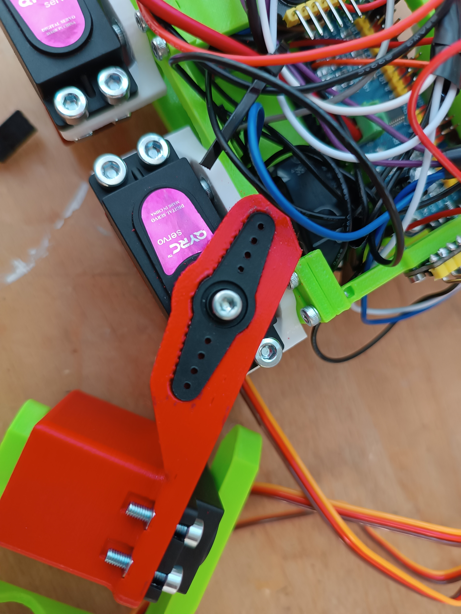

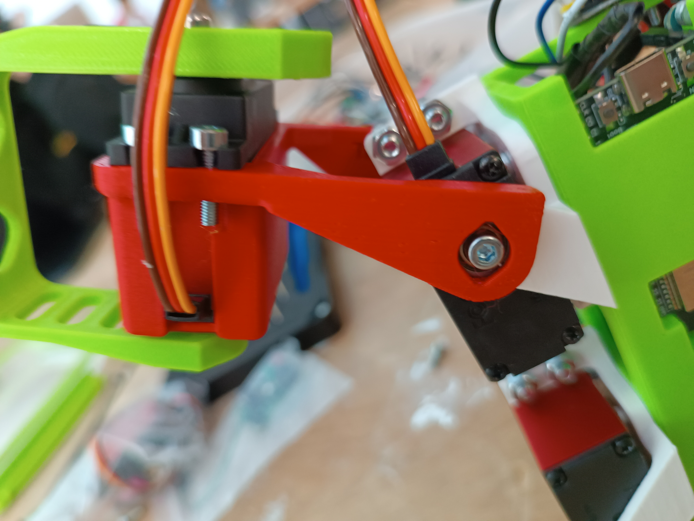

**Fasteners for this step:** 1× M3×8 screw (servo horn).

---

### Step 12 — Elastic band on knee

Fit one **elastic band** around the knee joint area. This provides light return tension and helps keep cable slack from flopping around.

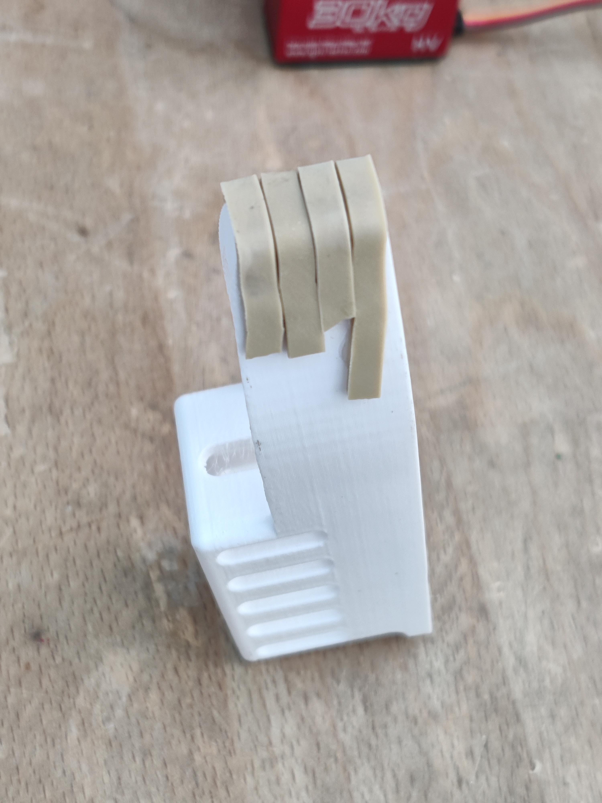

---

### ✅ Repeat Steps 1–12 for the remaining three legs

You should now have **four complete leg assemblies**, each with three servos, two ball bearings, and all link pieces attached.

---

## Part 2 — Body electronics

!!! danger "No power during assembly"
    Do not connect the battery at any point during this section. Connect it only as the very last step of the entire build.

### Understanding the electronics

Before soldering, it helps to understand what each board does:

- **ESP32** — The brain. Runs your firmware and controls everything over I²C and PWM.
- **PCA9685 (Multiplexer)** — A 16-channel PWM driver. The ESP32 sends it commands over I²C, and it generates the individual PWM signals for each of the 12 servos.
- **BMS (Battery Management System)** — Protects the LiPo from overcharge, over-discharge, and short circuits. Always sits between the battery and the rest of the electronics.
- **Buck Converter** — Takes the 2S LiPo voltage (~7.4V) and steps it down to a stable 5V for the logic boards. The servos run directly from the LiPo voltage via the PCA9685 power rail.
- **Capacitor** — Smooths voltage spikes when servos draw sudden current. Wired in parallel with the PCA9685's onboard capacitor.
- **IMU (MPU-6050)** — Measures orientation and acceleration. Used by the firmware for balance control.
- **OLED screen** — Small display for status readout.
- **ToF sensors** — Measure distance to objects. Used for obstacle detection.

---

### Step 13 — Solder the power chain

This is the most critical soldering step. Take your time and double-check polarity at every connection before applying heat.

**What to solder:**

1. Solder the **BMS output** to the **Buck Converter VIN** and the **PCA9685 power input**. The BMS protects everything downstream, so it must be first in the chain.
2. Solder **VIN** and **VOUT** cables to the Buck Converter's terminal pads. On the **input side**, scrape back ~5mm of insulation and tin the wire. On the **output side**, crimp or solder a **female JST/Dupont connector** so it can be plugged and unplugged from the ESP32's 5V pin.

!!! danger "Polarity"
    Red = positive (+), Black = negative (−). Getting this backwards will destroy your boards instantly. Before soldering, trace each wire's origin and confirm its polarity with a multimeter if you are unsure.

!!! tip "Soldering tip for beginners"
    Heat the pad, not the solder. Touch your iron to the pad and the wire simultaneously, then bring solder to the joint — not to the iron. A good joint looks shiny and smooth, like a small volcano. A bad joint looks dull and lumpy ("cold joint") and will fail intermittently.

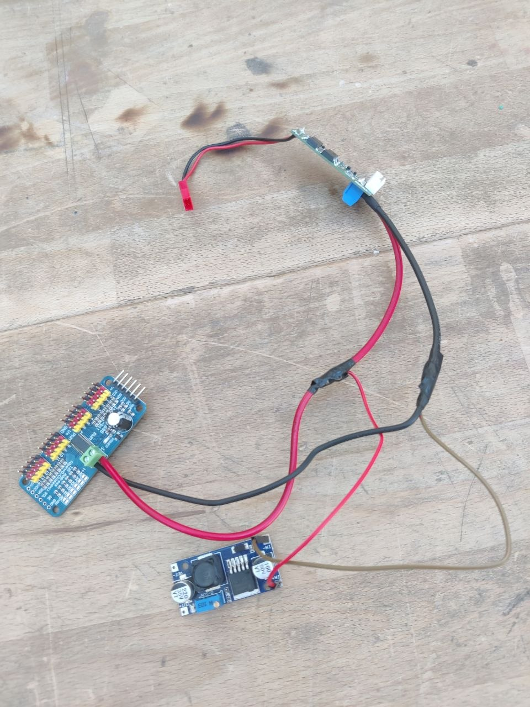

---

### Step 14 — Capacitor wiring

The capacitor is wired **in parallel** with the PCA9685's built-in capacitor to increase the total energy reserve for servo current spikes.

Using **2× FF jumper cables**, connect:
- One cable: capacitor **+** pin → PCA9685 **V+** power pin
- Other cable: capacitor **−** pin → PCA9685 **GND** power pin

Check that the capacitor's polarity stripe (the light-coloured stripe with minus signs) is on the **−** side.

---

### Step 15 — Prepare the body for electronics

Before inserting any electronics, insert the hex nuts into the body frame.

The body has dedicated mounting holes for the ESP32, PCA9685, Buck Converter, and mounts. Each hole has a slot behind it for a hex nut. Using tweezers, press the appropriate hex nuts into each slot:

- **ESP32:** 1× M2.5 hex nut
- **PCA9685:** 4× M2.5 hex nuts
- **Buck Converter:** 2× M2.5 hex nuts

Now screw the **four white mounts** onto the body's corner attachment points using **4× M2.5×8 screws + M2.5 hex nuts per mount (16 total)**. The mounts are what the legs will clip onto.

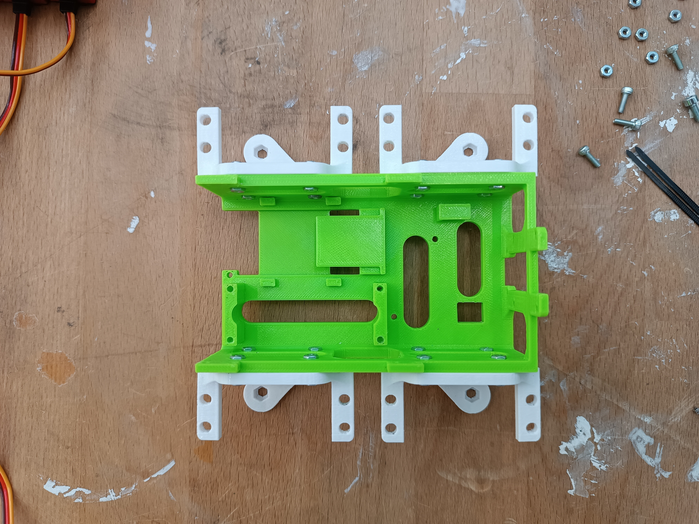

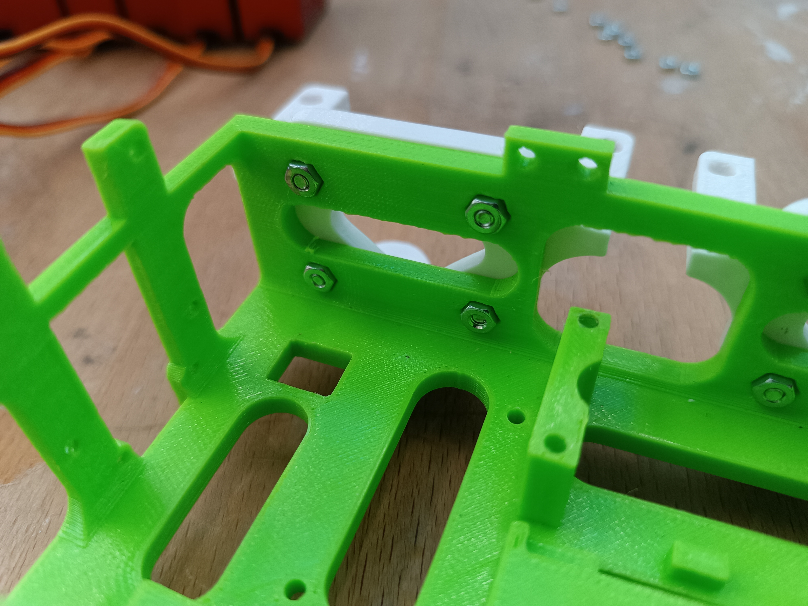

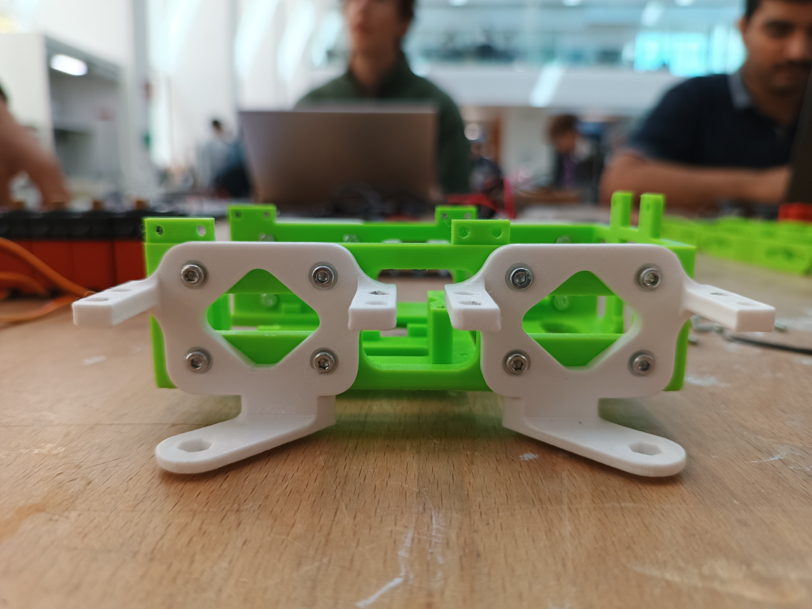

---

### Step 16 — Install the ESP32

Slide the **ESP32** into its dedicated slot in the body frame. The USB-C port should face outward so you can still flash firmware after assembly.

Secure with **1× M2.5×5 screw**.

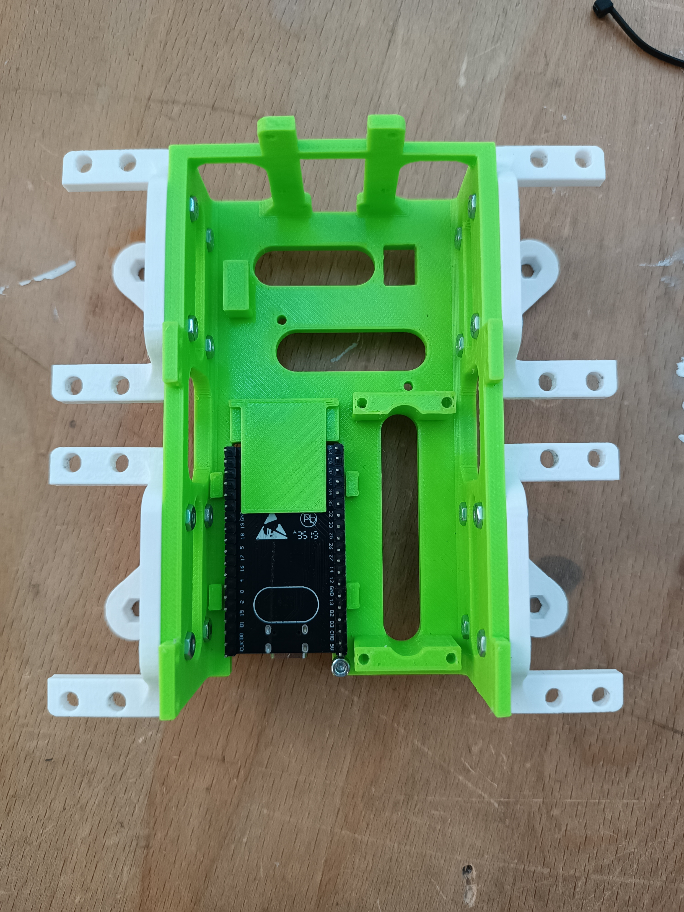

**Fasteners for this step:** 1× M2.5×5 screw.

---

### Step 17 — Install the PCA9685 and Buck Converter

Place the **PCA9685** into its position in the body and screw down with **4× M2.5×6 screws**. The servo output headers should face outward or toward the leg cables.

Place the **Buck Converter** into its position and screw down with **2× M2.5×5 screws**.

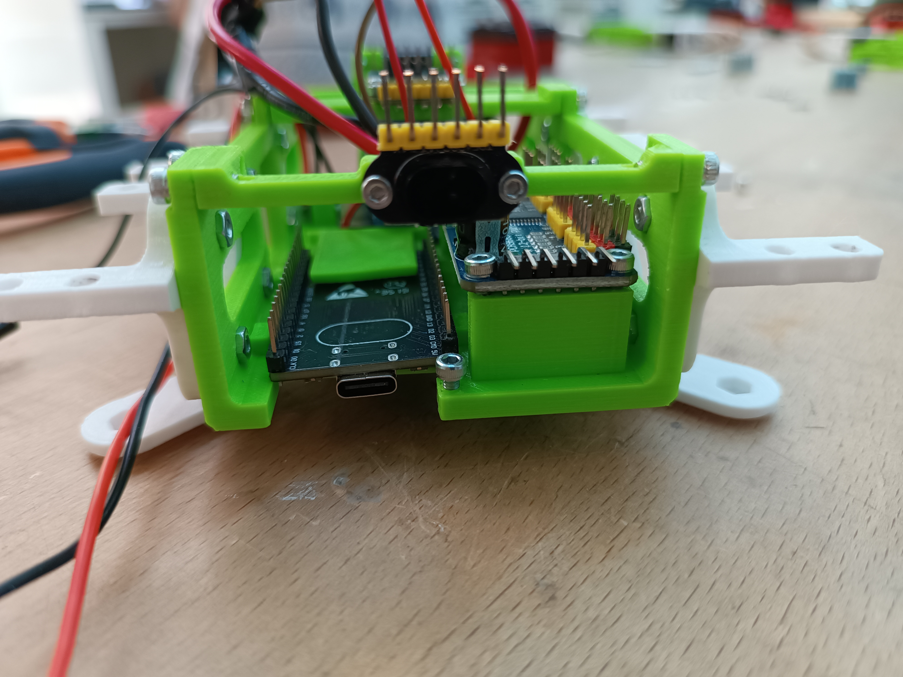

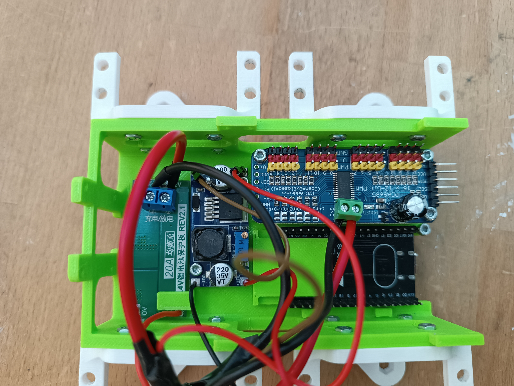

---

### Step 18 — Install the bridge, IMU, and OLED

The **bridge** is a small cross-shaped printed piece that mounts on the front face of the body. It holds the **IMU** on one arm and a **ToF sensor** in the centre.

1. Screw the **IMU** onto the bridge arm using **2× M2.5×2 screws**.
2. Screw the **front ToF sensor** onto the bridge centre using **2× M2×4 screws**.
3. Screw the bridge assembly onto the body using **M2.5×6 screws**.

Then mount the **OLED screen** above the front face using **4× M2×10 screws + 4× M2 hex nuts**.

The remaining **2 ToF sensors** mount on the side bridges using **2× M2×4 screws** each.

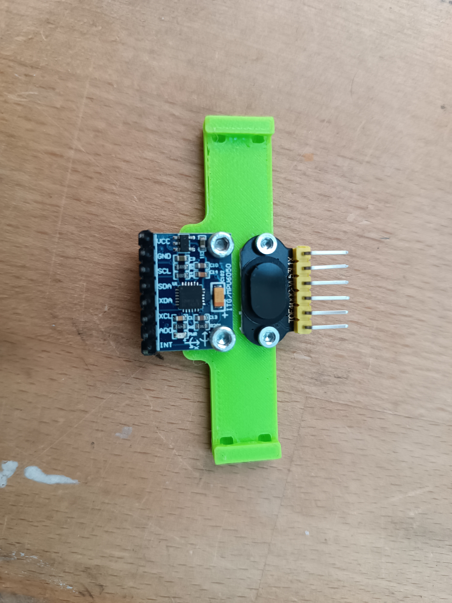

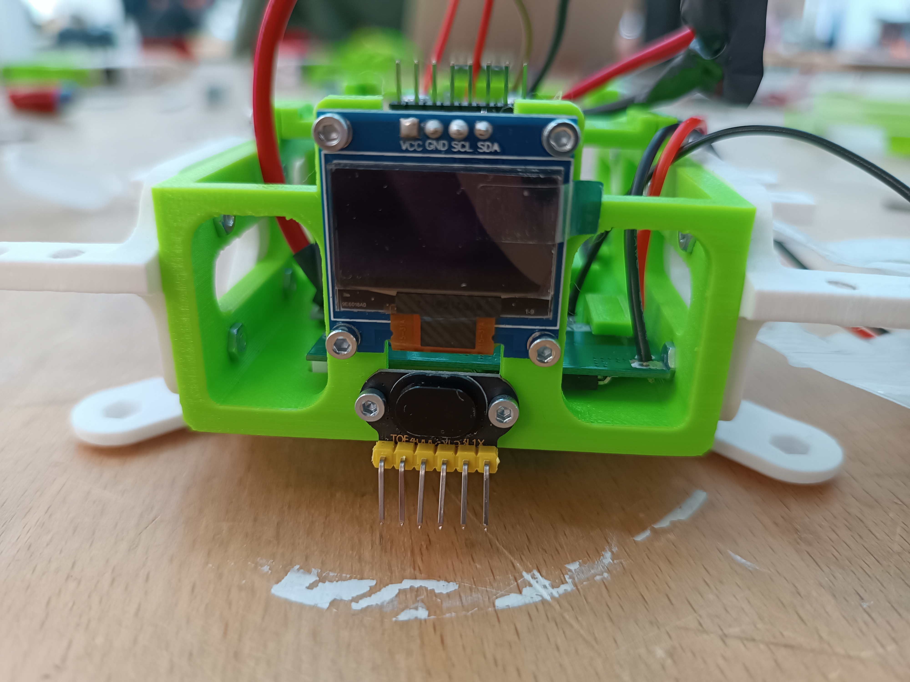

**Fasteners for this step:** 2× M2.5×2, 2× M2×4 (front ToF), M2.5×6 (bridge), 4× M2×10, 4× M2 hex nuts.

---

## Part 3 — Wiring

!!! warning "Cabling — read before you wire"
    Plan your cable routes before you commit. Cables that cross a moving joint must have enough **slack** to allow the full range of motion without pulling taut. A taut cable will eventually pull off its connector or tear a pad off a PCB. Coil excess length loosely and secure with a zip tie.

### Step 19 — I²C cable trees

The ESP32 communicates with the OLED, IMU, and PCA9685 over a single I²C bus (two wires: SDA and SCL, plus power). You need to make **4 cable trees** — one for each signal — so that one ESP32 pin fans out to all three peripherals.

Each cable tree has:
- **1 female connector** on one end → plugs into the ESP32
- **3 female connectors** on the other end → one each for OLED, IMU, PCA9685

If you are also connecting the 3 ToF sensors to the I²C bus, make **3 additional trees** (or use 6-way splits instead).

**I²C pin mapping on the ESP32:**

| Signal | ESP32 pin | Wire colour convention |
|--------|-----------|------------------------|
| VCC (3.3V logic) | 3V3 | Red |
| GND | Any GND | Black |
| SDA (data) | GPIO 21 | Blue or White |
| SCL (clock) | GPIO 22 | Yellow or Green |

!!! tip "Labelling helps"
    Use a marker to write the signal name (VCC / GND / SDA / SCL) on a small piece of tape and wrap it around each cable near the ESP32 connector. This makes debugging much easier later.

Connect each peripheral:

| Peripheral | VCC source | Notes |
|---|---|---|
| OLED screen | 3.3V | Check your specific module — some accept 5V |
| IMU (MPU-6050) | 3.3V | |
| PCA9685 | 3.3V (logic), 5V (V+) | The V+ pin powers servos via Buck Converter, separate from I²C VCC |
| ToF sensors | 3.3V | |

Refer to the wiring diagram in the project documentation for the full schematic.

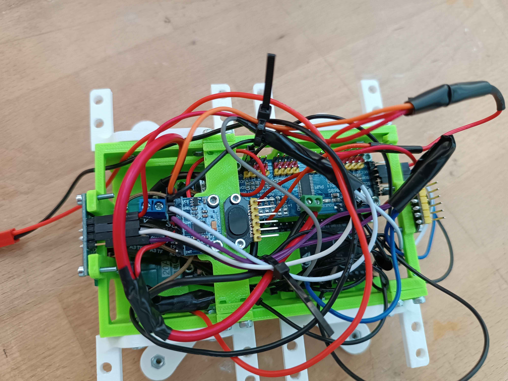

---

### Step 20 — Connect servo cables to PCA9685

The PCA9685 has 16 servo output channels (0–15). Plug the **12 servo cables** (3-pin JST/Dupont: GND / VCC / Signal) into channels 0–11. Keep a consistent mapping — document which channel corresponds to which servo:

| Suggested channel | Servo |
|---|---|
| 0 | Front-right hip |
| 1 | Front-right thigh |
| 2 | Front-right knee |
| 3 | Front-left hip |
| 4 | Front-left thigh |
| 5 | Front-left knee |
| 6 | Rear-right hip |
| 7 | Rear-right thigh |
| 8 | Rear-right knee |
| 9 | Rear-left hip |
| 10 | Rear-left thigh |
| 11 | Rear-left knee |

!!! warning "Plug servo cables the right way"
    The 3-pin servo connector is not keyed — it can go in backwards. The dark wire (GND) should face the outside edge of the PCA9685 board (the side labelled GND). Check your PCA9685's silkscreen to confirm.

---

## Part 4 — Final assembly

### Step 21 — Attach legs to body

Each leg's **hip bracket** clips onto one of the four **white mounts** on the body corners. Slide the hip bracket tabs into the mount slots until they click. No screws are needed for this joint — it is a friction/clip fit.

Once all four legs are clipped on, confirm each hip can rotate freely by hand.

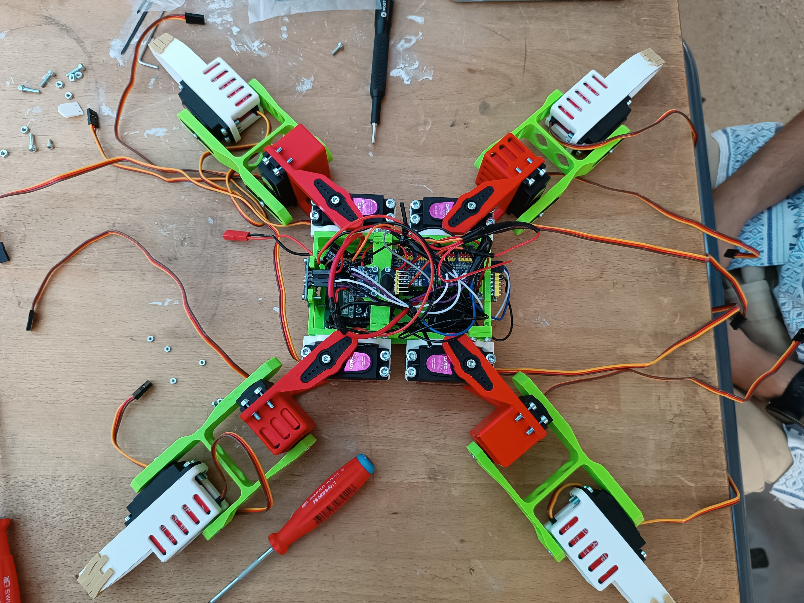

---

### Step 22 — Route and secure all cables

With legs attached, route each servo cable along the leg to the body. Use **zip ties** to bundle cables at the hip joint, leaving a small loop of slack at each joint so movement is unimpeded.

Fold and tuck any excess cable length inside the body cavity. Use the **4 elastic bands** to hold servo cables against the leg structure at the knee joints.

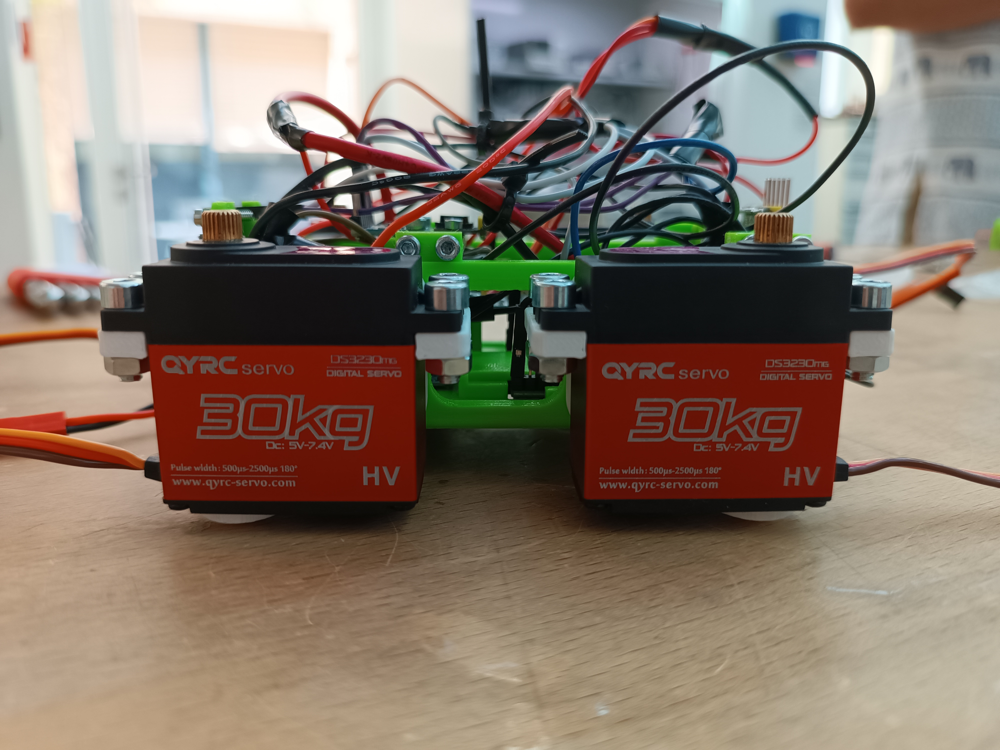

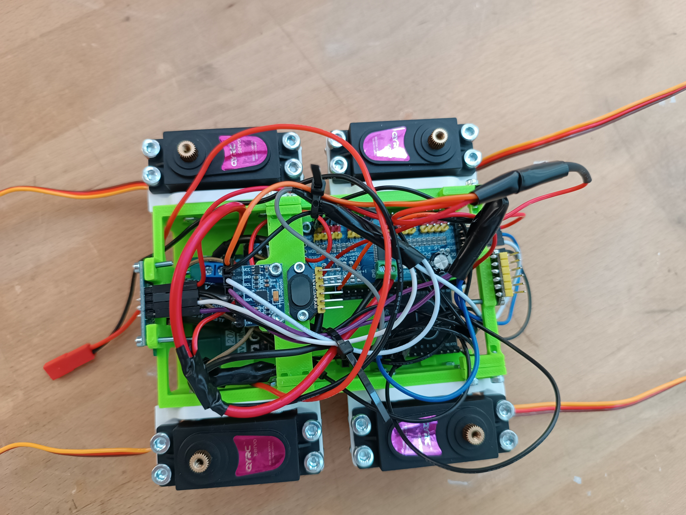

---

### Step 23 — Install battery

Place the **rubber pad** into the bottom of the LiPo cage first. This pad provides vibration dampening and prevents the LiPo pouch from chafing against the printed plastic. Slide the **LiPo 2S** battery into the cage. The balance connector and main connector should exit from the open end.

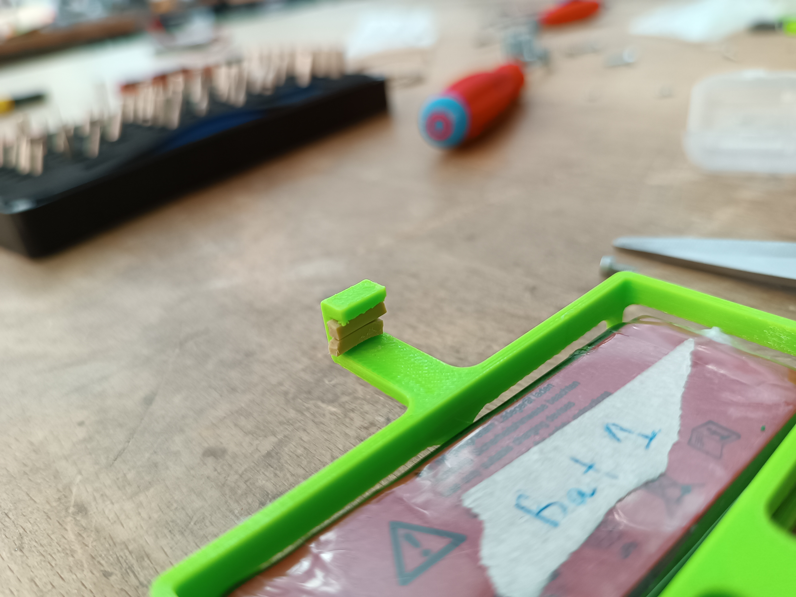

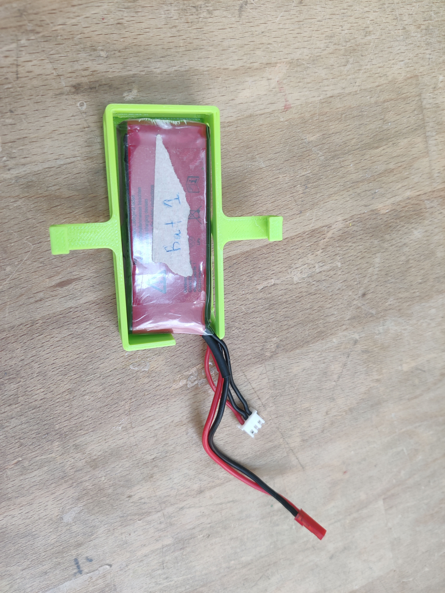

Clip or slide the LiPo cage into the underside of the body frame.

!!! danger "Battery safety — read carefully"
    - **Never short the battery leads.** Even briefly touching + and − together can cause fire.
    - **Check polarity before connecting.** The main connector on this build uses a JST connector (red = +, black = −). Verify your connector matches before plugging in.
    - **Do not connect the battery yet.** Only connect it in the very next step, after everything else is complete and double-checked.
    - **Never leave a LiPo charging unattended.**
    - **Store LiPo at storage voltage (~3.8V/cell)** if not using the robot for more than a few days.

---

### Step 24 — Final checks before power-on

Go through this checklist methodically before plugging in the battery:

- [ ] All 12 servo cables are plugged into the PCA9685, correct orientation (GND to outside edge)
- [ ] I²C bus connected: ESP32 → OLED, IMU, PCA9685 (and ToFs if fitted)
- [ ] Buck Converter output connected to ESP32 5V input
- [ ] BMS connected between battery connector and the rest of the power chain
- [ ] Capacitor wired in parallel, polarity correct
- [ ] All screws on leg joints are tightened but not cracked
- [ ] All ball bearings spin freely
- [ ] No servo cables are pinched in a joint or taut across a range of motion
- [ ] ESP32 USB-C port is accessible for firmware flashing
- [ ] No loose wires or uninsulated joints inside the body cavity

---

### Step 25 — Connect the battery and fit the shell

Once every item above is checked, connect the **balance lead** first (smaller white connector), then the **main power lead** (larger red JST). The OLED should light up and the ESP32's onboard LED should blink.

If anything smells burnt or a board gets hot immediately — **disconnect the battery at once** and inspect for reversed polarity or a short circuit.

Once you confirm the electronics are responding normally, fit the **shell** over the top of the body by pressing it down onto the mounting clips.

---

## Finished robot

**Congratulations — your FaceHugger is assembled!**

The next step is flashing the firmware to the ESP32 and calibrating the servo zero positions. Refer to the [Software](software.md) and [Calibration](calibration.md) sections of this documentation.