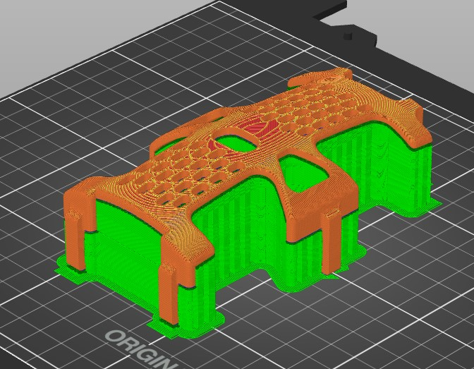

# 3D Printing

## Printer & filament

You may use either Prusa MK3S or MK4S printers. Those are available in the printing room of the SPOT. Make sure to download the specific settings for the EPFL printers. You can find the steps to do so in the SPOT website. 

## Print settings

Our prints only use **SPOT-PETG** filament with **0.20 mm** muzzle width. Whether you use **STRUCTURAL** or **SPEED** settings is up to your timing. They yield similar results but try to use **STRUCTURAL** if you are not in a hurry. You do not need to change the infill percentage (15%). Make sure to select the correct printer model in PrusaSlicer (MK3S or MK4S).

## Body parts

`BodySkeleton.stl` : 

Do not change the orientation that appears when you first import the file in PrusaSlicer. 

You must add **Grid** or **Fitted** supports under every uncovered zone, including under the ESP32 hood and the little Lipo protector wing. Make sure to only add supports for "support generators" in PrusaSlicer. Do not add supports inside the screw holes.

`Middle_bridge.stl` and `Behind_bridge.stl` : Print as is.

`HipMount.stl` :

Print with the back (largest surface) of the mount on the print bed. Add Grid or Fitted supports to the extrusion with the hex nut recess. Do not add supports inside the recess itself. 

Before printing this file, copy it once, then mirror it twice along the back. You should have a total of 4 hip mounts.

`Shell.stl` :

Do not forget to add supports on every surface facing the printing board, including the little surfaces above the hooks.

## Leg parts

!!! todo
    Describe orientation for each link. The `.3mf` files already encode the correct orientation, so open them in PrusaSlicer and import as-is.
    Add PrusaSlicer screenshots showing each plate. 

The leg `.3mf` files are pre-plated with the correct orientation already applied, so you can open them in PrusaSlicer directly without adjusting anything.

`LegMountL.stl` and `LegMountR.stl` :

!!! todo
    Orientation notes and screenshot. These are in `cad/body/prusa/HipMount.3mf` together with the hip mounts.

`Link1L.stl` and `Link1R.stl` :

!!! todo
    Orientation notes and screenshot. Note the L/R mirror pair: both are in the same plate.

`Link2.stl` :

!!! todo
    Orientation notes and screenshot.

`Link3.stl` :

!!! todo
    Orientation notes and screenshot.

## Files

The `.3mf` files include the correct part orientation and plate layout, so use these for slicing, not the raw STLs.

!!! note
    The individual STL files in `cad/leg/` and `cad/body/` are auto-generated by the Fusion exporter and committed for pipeline use. The `.3mf` files below are the user-facing print-ready versions.

**Body**

- [`cad/body/prusa/BodyAndBridges.3mf`](https://github.com/epfl-cs358/2026sp-FaceHugger/blob/main/cad/body/prusa/BodyAndBridges.3mf): body shell and both bridges on one plate
- [`cad/body/prusa/HipMount.3mf`](https://github.com/epfl-cs358/2026sp-FaceHugger/blob/main/cad/body/prusa/HipMount.3mf): all 4 hip mounts (pre-mirrored)

**Legs**

!!! todo
    Describe what each `.3mf` contains and which one to use. `FHLegsPrintThreePlates.3mf` likely has the full set, so confirm and add a note.

- [`cad/leg/prusa/FaceHuggerLeg.3mf`](https://github.com/epfl-cs358/2026sp-FaceHugger/blob/main/cad/leg/prusa/FaceHuggerLeg.3mf)
- [`cad/leg/prusa/FHLegsLink1and2.3mf`](https://github.com/epfl-cs358/2026sp-FaceHugger/blob/main/cad/leg/prusa/FHLegsLink1and2.3mf)
- [`cad/leg/prusa/FHLegsPrintThreePlates.3mf`](https://github.com/epfl-cs358/2026sp-FaceHugger/blob/main/cad/leg/prusa/FHLegsPrintThreePlates.3mf)
- [`cad/leg/prusa/IndividualLegPrints.3mf`](https://github.com/epfl-cs358/2026sp-FaceHugger/blob/main/cad/leg/prusa/IndividualLegPrints.3mf)
