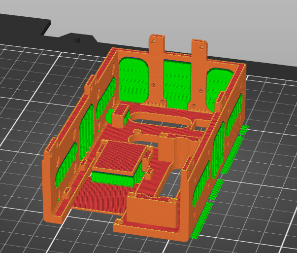
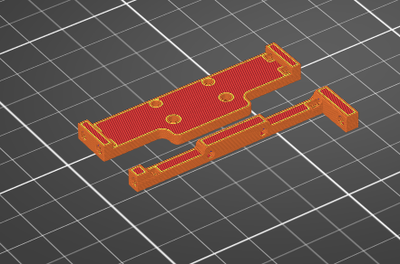
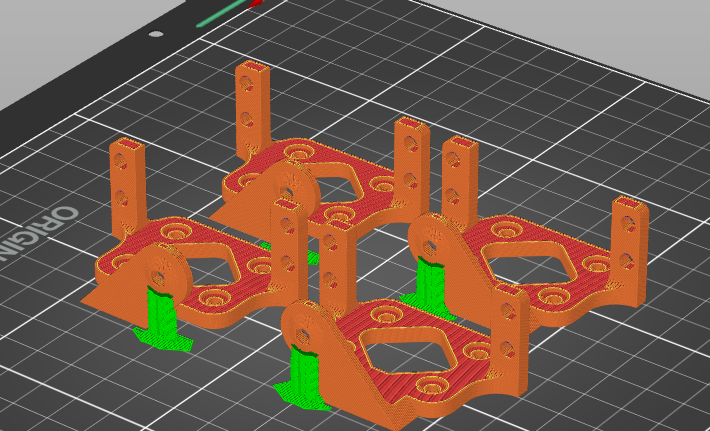
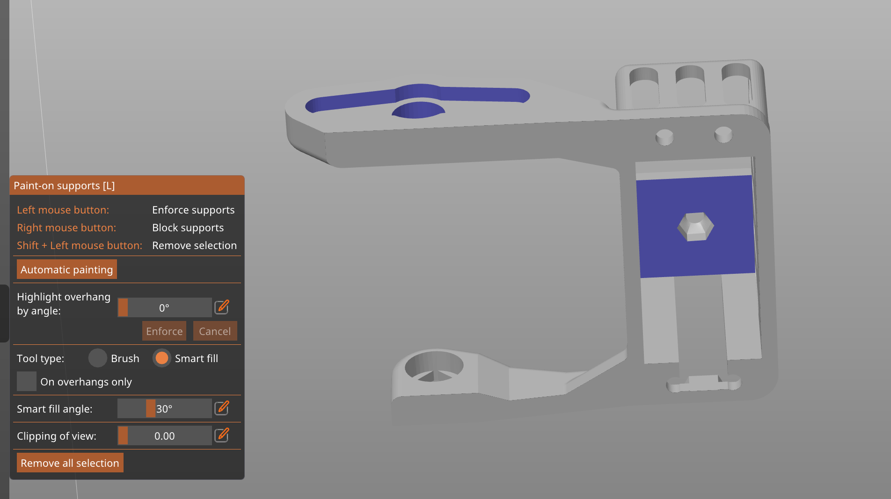
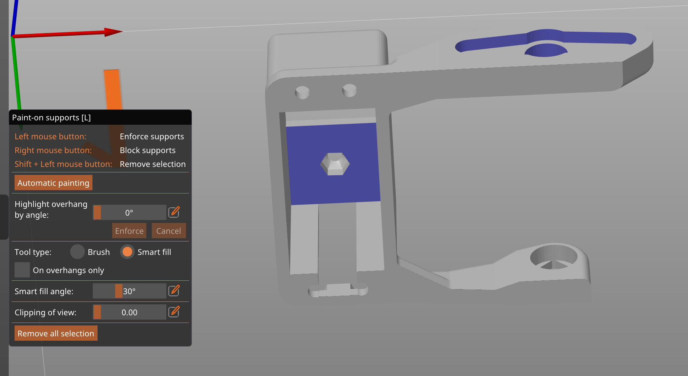
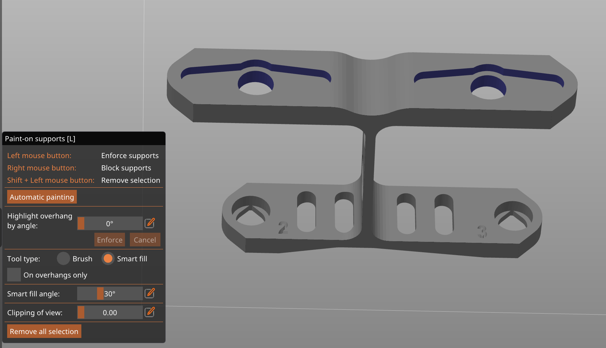
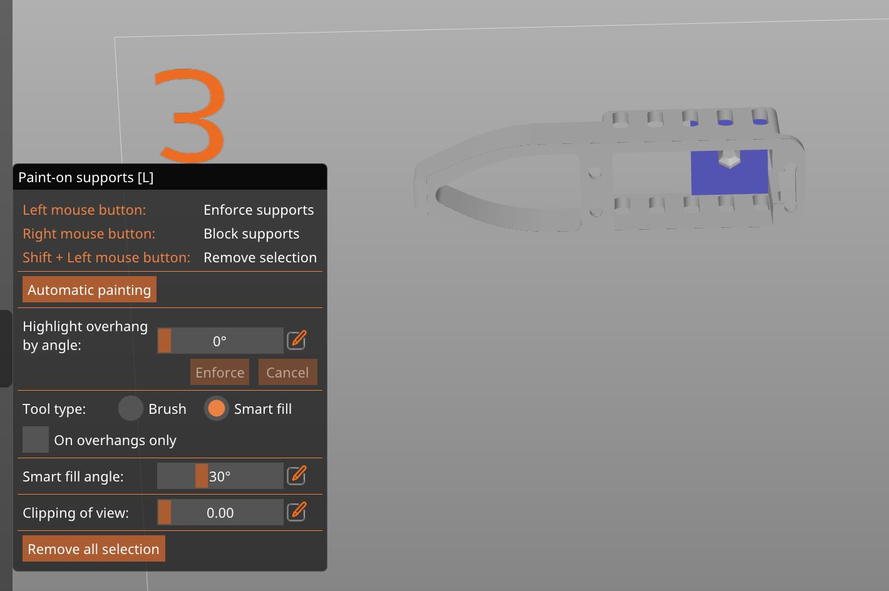

# 3D Printing

## Printer & filament

All prints were made at the **SPOT**, EPFL's makerspace. The SPOT provides preconfigured PrusaSlicer profiles for their printers — download them from the SPOT website before slicing. They have both **MK3S** and **MK4S** printers; make sure to select the correct model in PrusaSlicer.

## Print settings

Our prints only use **SPOT-PETG** filament with **0.20 mm** layer height. Whether you use **STRUCTURAL** or **SPEED** settings is up to your timing — they yield similar results, but prefer **STRUCTURAL** if you are not in a hurry. Leave infill at the default 15%.

Most parts need paint-on supports (Smart fill, 30°) on specific faces — see each part section below for which faces to paint. Do not use automatic support generation.

## Part viewer

Use this to inspect each part in 3D and confirm the print orientation before slicing.

  

    Body
    <button data-model="../../assets/models/BodySkeleton.glb">BodySkeleton</button>
    <button data-model="../../assets/models/MiddleBridge.glb">MiddleBridge</button>
    <button data-model="../../assets/models/BehindBridge.glb">BehindBridge</button>
    <button data-model="../../assets/models/HipMount.glb">HipMount</button>
    <button data-model="../../assets/models/LipoCage.glb">LipoCage</button>
    <button data-model="../../assets/models/Shell.glb">Shell</button>
    Legs
    <button data-model="../../assets/models/Link1L.glb">Link1L</button>
    <button data-model="../../assets/models/Link1R.glb">Link1R</button>
    <button data-model="../../assets/models/Link2.glb">Link2</button>
    <button data-model="../../assets/models/Link3.glb">Link3</button>
  

  <model-viewer camera-controls auto-rotate
                environment-image="neutral"
                shadow-intensity="1" shadow-softness="0.1"
                exposure="0.7"
                camera-orbit="45deg 70deg auto"
                style="width:100%;height:380px;"></model-viewer>

## Body parts

`BodySkeleton.stl` :

Do not change the orientation that appears when you first import the file in PrusaSlicer.

You must add **paint-on supports** (Smart fill, 30°) under every uncovered zone, including under the ESP32 hood and the little Lipo protector wing. Make sure to only paint supports — do not use automatic support generation. Do not paint inside the screw holes.

`Middle_bridge.stl` and `Behind_bridge.stl` : Print as is.

`HipMount.stl` :

Print with the back (largest surface) of the mount on the print bed. Add paint-on supports (Smart fill, 30°) to the face with the hex nut recess. Do not paint inside the recess itself.

Before printing, copy the file once and mirror it along the back axis — you need a total of 4 hip mounts (2 mirrored pairs).

## Leg parts

The leg `.3mf` files are pre-plated with the correct orientation already set, so open them in PrusaSlicer directly without adjusting anything.

All leg parts use **paint-on supports → Smart fill → 30°**. Do not use automatic support generation — only paint the faces shown below.

`Link1L.stl` and `Link1R.stl` :

Print standing upright as exported. Paint supports on the top bridge face and the servo mount face as shown below. Link1L and Link1R are mirrored — both are on the same plate in the `.3mf`.

`Link2.stl` :

Print flat. Paint supports under the two bridge overhangs at the top face.

`Link3.stl` :

Print as exported (tip facing up). Paint one support zone on the servo pocket face at the heel end.

### Expected print times

The table below is from PrusaSlicer with the full 4-leg set (3 plates) on an **MK4S**. Normal mode is the SPEED profile; Stealth mode is STRUCTURAL.

| Plate | Filament | Normal mode (Speed) | Stealth mode (Structural) |
|-------|----------|---------------------|---------------------------|
| Bed 1 | 72 g / 23.6 m | 4 h 19 min | 5 h 14 min |
| Bed 2 | 59 g / 19.4 m | 3 h 39 min | 4 h 27 min |
| Bed 3 | 67 g / 21.9 m | 3 h 40 min | 4 h 41 min |
| **Total** | **199 g / 65 m** | **11 h 39 min** | **14 h 22 min** |

Budget roughly half a day of print time for all leg parts in SPEED mode, or a full day in STRUCTURAL mode.

## Files

The `.3mf` files include the correct part orientation and plate layout — use these for slicing, not the raw STLs.

!!! note
    The individual STL files in `cad/leg/` and `cad/body/` are auto-generated by the Fusion exporter and committed for pipeline use. The `.3mf` files below are the user-facing print-ready versions.

**Body**

- [`cad/body/prusa/BodyAndBridges.3mf`](https://github.com/epfl-cs358/2026sp-FaceHugger/blob/main/cad/body/prusa/BodyAndBridges.3mf): body shell and both bridges on one plate
- [`cad/body/prusa/HipMount.3mf`](https://github.com/epfl-cs358/2026sp-FaceHugger/blob/main/cad/body/prusa/HipMount.3mf): all 4 hip mounts (pre-mirrored)

**Legs**

`FHLegsPrintThreePlates.3mf` contains the full 4-leg set across 3 plates and is the one to use for a complete build. The other files are single-leg or partial plates left from earlier iterations.

- [`cad/leg/prusa/FHLegsPrintThreePlates.3mf`](https://github.com/epfl-cs358/2026sp-FaceHugger/blob/main/cad/leg/prusa/FHLegsPrintThreePlates.3mf) — full set, 3 plates **(use this)**
- [`cad/leg/prusa/FaceHuggerLeg.3mf`](https://github.com/epfl-cs358/2026sp-FaceHugger/blob/main/cad/leg/prusa/FaceHuggerLeg.3mf)
- [`cad/leg/prusa/FHLegsLink1and2.3mf`](https://github.com/epfl-cs358/2026sp-FaceHugger/blob/main/cad/leg/prusa/FHLegsLink1and2.3mf)
- [`cad/leg/prusa/IndividualLegPrints.3mf`](https://github.com/epfl-cs358/2026sp-FaceHugger/blob/main/cad/leg/prusa/IndividualLegPrints.3mf)
