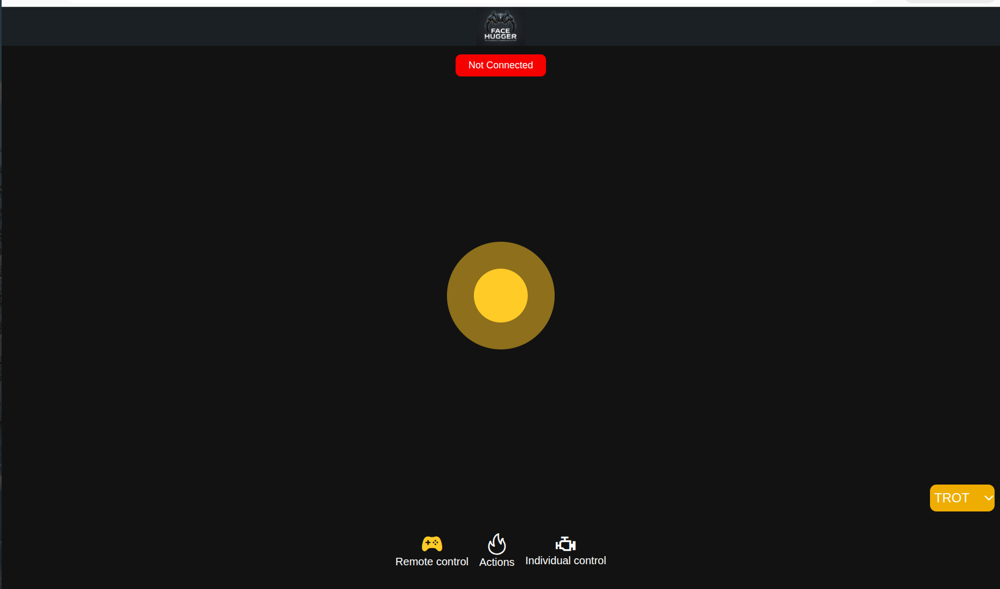
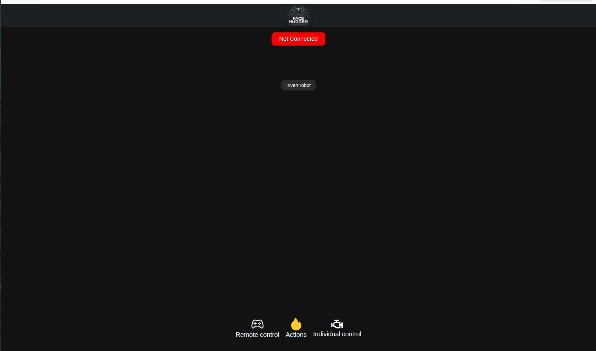
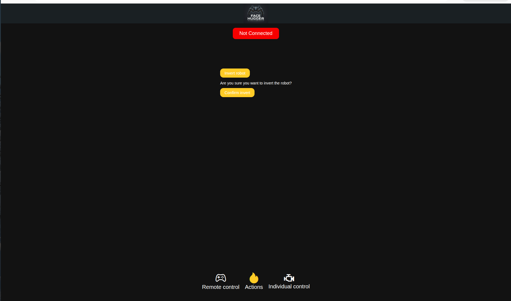
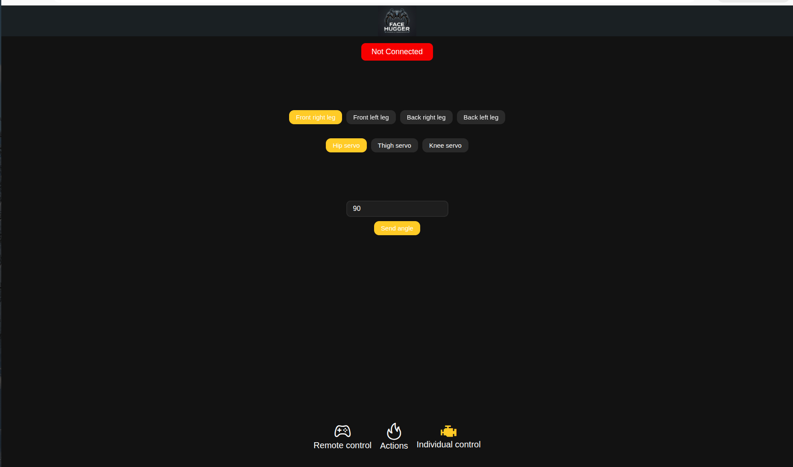

# Remote Control App

The FaceHugger remote control app is a mobile application (React Native / Expo) that communicates with the ESP32 over Wi-Fi. It gives you three modes of control: a joystick for driving, one-shot action buttons, and per-servo angle control for calibration.

## What you need

| Item | Notes |
|---|---|
| Android or iOS phone | Android 10+ / iOS 14+ |
| Node.js 18+ | Only needed if running from source or Expo Go |
| Expo Go app | [Android](https://play.google.com/store/apps/details?id=host.exp.exponent) / [iOS](https://apps.apple.com/app/expo-go/id982107779) (only for Option A below) |
| Pre-built APK (optional) | Only for Option B (get it from the project team) |

## Installing the app

=== "Option A: Expo Go (no build required)"

    Expo Go lets you run the app directly from the development server without building an APK.

    1. Install **Expo Go** on your phone from the links above.
    2. Clone the repo and install dependencies on your computer:

    ```bash
    cd code/remote-control-app/MyApp
    npm install
    npm run start
    ```

    3. A QR code will appear in the terminal. Scan it with Expo Go (Android) or the Camera app (iOS).

    The app loads on your phone and hot-reloads on every source change, which is useful while developing.

=== "Option B: Android APK sideload"

    If you have a pre-built `.apk` file, you can install it directly without the development server.

    !!! warning "Allow unknown sources"
        Before installing an APK outside the Play Store, you must allow it in Android settings:
        **Settings → Security → Install unknown apps**, then grant permission to your file manager.

    1. Transfer the `.apk` file to your phone (USB cable, Google Drive, etc.).
    2. Open the file on your phone and tap **Install**.
    3. Launch **FaceHugger** from your home screen.

    !!! note
        APK sideloading is Android-only. For iOS, the app must be distributed via TestFlight or run through Expo Go.

## Connecting to the robot

The ESP32 creates its own Wi-Fi access point, so your phone must join that network, not your home Wi-Fi.

!!! warning "Disconnect from your home network first"
    iOS and Android sometimes switch back to a known network in the background. If the connection pill stays red after following the steps below, check that your phone is still on the FaceHugger network.

**Steps:**

1. Power on the robot and wait for the OLED face to appear. This confirms the Wi-Fi AP is up and the WebSocket server is listening.

2. On your phone, open **Wi-Fi settings** and join the FaceHugger network.

    <!-- photo: ../assets/img/remote-control/wifi-setup.jpg -->
    !!! example "Photo placeholder"
        *Add a screenshot here: phone Wi-Fi settings showing the FaceHugger AP selected.*

3. Open the app. The connection pill in the header should turn **green** within one or two seconds.

    <!-- photo: ../assets/img/remote-control/connected-header.jpg -->
    !!! example "Photo placeholder"
        *Add a screenshot here: app header showing the green "Connected" pill and live telemetry bar.*

!!! tip "Fixed IP: no configuration needed"
    The ESP32 AP is always at `192.168.4.1`. The app is pre-configured to connect there. You do not need to look up or type any IP address.

## App overview

Every page shares a **persistent header** at the top:

| Section | What it shows |
|---|---|
| Logo | FaceHugger branding |
| Connection pill | Green "Connected" / red "Not Connected" |
| Telemetry bar | Gait mode · Speed (m/min) · Gyroscope X/Y/Z · error message if any |

The telemetry bar is hidden while disconnected. It is populated by the `T:10` status packets the robot sends every ~500 ms.

Three pages are selected from a **bottom tab bar**.

## Page 1: Remote Control

The main driving interface. Switching to this tab sends `STATE_WALK` to the robot, enabling the gait engine.

<figure markdown="span">
  { width="400" }
  <figcaption>Remote Control page: joystick centred, TROT gait selected</figcaption>
</figure>

### Joystick

Drag in any direction to steer. The joystick maps angular sectors to eight direction commands:

| Direction | Command |
|---|---|
| Up | Forward |
| Up-right / Up-left | Forward-right / Forward-left |
| Right / Left | Strafe right / Strafe left |
| Down-right / Down-left | Backward-right / Backward-left |
| Down | Backward |

Releasing the joystick sends a **STOP** command. The robot also has a built-in 2-second timeout: if no movement command arrives while in `STATE_WALK`, it stops automatically.

### Gait mode

The dropdown in the bottom-right corner switches between two gaits:

| Mode | Description |
|---|---|
| **TROT** | Diagonal pairs move together for a faster, natural walking gait |
| **CRAB** | Legs move more independently for lateral and omnidirectional travel |

Selecting a gait sends the change immediately and is remembered across reconnects.

## Page 2: Actions

One-shot commands that put the robot into `STATE_ACTION`.

<figure markdown="span">
  { width="400" }
  <figcaption>Actions page: Invert robot button</figcaption>
</figure>

<figure markdown="span">
  { width="400" }
  <figcaption>Confirmation prompt before the invert command is sent</figcaption>
</figure>

| Button | What it does |
|---|---|
| **Invert robot** | Triggers the wall-flip / inversion maneuver. A confirmation prompt appears before the command is sent. |
| **Rest pose** | Drives all 12 servos to 90°, a neutral reset useful before calibration. |
| **Neutral stance** | Brings the robot to its standard standing pose using the default angles from the firmware. |

!!! warning "Invert requires sufficient battery"
    The firmware gates `STATE_ACTION` on battery voltage. If the Invert button does nothing, check the battery charge.

## Page 3: Individual Control

Direct per-servo angle control, used for calibration. Switching to this tab sends `STATE_IDLE`, so the gait engine turns off and servos hold position.

<figure markdown="span">
  { width="400" }
  <figcaption>Individual Control page: leg and servo selectors, angle input</figcaption>
</figure>

**Workflow:**

1. Select a leg: **Front Right** · **Front Left** · **Back Right** · **Back Left**.
2. Select a servo: **Hip** · **Thigh** · **Knee**.
3. Enter an angle (0-180°) and tap **Send angle**.

Each tap sends a single calibration packet to that servo. The input field remembers the last-sent angle for each leg/servo pair within the session, so switching between servos restores the last value you committed.

!!! tip "Use this page during servo calibration"
    After assembly, send each servo to 90° with the Rest pose button (Page 2), then use this page to fine-tune individual joints. See [Calibration](calibration.md) for the full procedure.

## Changing the robot's IP address

The target IP is set in `code/remote-control-app/MyApp/config/config.ts`:

```ts
export const webSocketIP = "192.168.4.1"  // default ESP32 AP gateway
```

You only need to change this if the robot is connected to a router in station mode rather than acting as its own AP. In that case, find the IP the router assigned to the ESP32 from the serial monitor and update this value.

## Troubleshooting

| Symptom | Likely cause | Fix |
|---|---|---|
| Header pill stays red | Phone is not on the robot's Wi-Fi network | Open Wi-Fi settings and join the FaceHugger AP |
| App connects but robot doesn't respond to joystick | Robot is still in `STATE_IDLE` | Swipe to the Remote Control tab, which triggers `STATE_WALK` |
| Robot stops moving after ~2 seconds of holding still | Firmware 2-second idle timeout (intentional) | Keep dragging the joystick to sustain movement |
| Invert button does nothing | Battery voltage below the action gate threshold | Charge or replace the battery |
| Telemetry bar stays hidden after connecting | `T:10` status packets not arriving | Check the serial monitor, as the firmware may have crashed; power-cycle the robot |
| Expo Go can't load the app (version mismatch) | Expo Go is outdated | Update Expo Go from the App Store / Play Store, then re-run `npm run start` |
| `npm install` fails with native module errors | Node version too old | Use Node 18+; run `node --version` to check |
