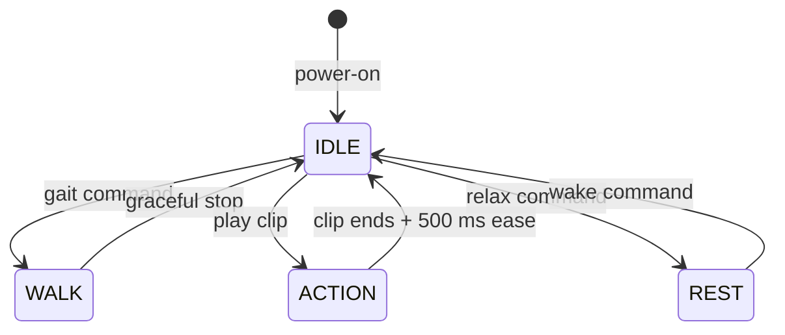

# Software

## Overview

FaceHugger runs firmware on an ESP32 (the robot itself) alongside host-side
tooling: a Python simulation stack, Blender animation scripts, and a React Native
remote-control app. The firmware is split into three logical layers under
`code/firmware/src/`: `brain/` (network and sensors), `nervous_system/`
(kinematics, legs, servos, and motion), and `shared/` (config and data
structures). Deep reference detail lives in the
[firmware reference](../reference/firmware/index.md).

## How it works

The core of the firmware is an inverse-kinematics loop: a foot target position
is resolved to three joint angles (shoulder, hip, knee), then remapped from
math-space to servo-space via `translateToServo()` before being written to the
PCA9685 PWM driver.

Motion is governed by a five-state FSM (IDLE, WALK, ACTION, REST, FAILSAFE).
Gaits (looping locomotion) run in WALK; one-shot authored clips run in ACTION.
Both paths converge at the same angle-to-servo path.

\[
\tau_{knee} = F_{tip} \cdot L_3 \cdot \cos\theta_{knee}
\]

## Setup and running

Build, flash, and connect to the robot via the Toolchain pages:

- [Toolchain overview](toolchain/index.md): pipeline from CAD to firmware flash.
- [Flashing the firmware](toolchain/flashing.md): PlatformIO build, upload,
  monitor, and Wi-Fi/WebSocket connection details.

For the simulation and Blender workflows, start at
[Toolchain overview](toolchain/index.md) and follow the links to
[Fusion 360 export add-ins](toolchain/fusion-export.md) and
[Blender clip authoring and export](toolchain/blender-clips.md).

The remote-control app is documented in the
[remote-control reference](../reference/remote-control/index.md).
