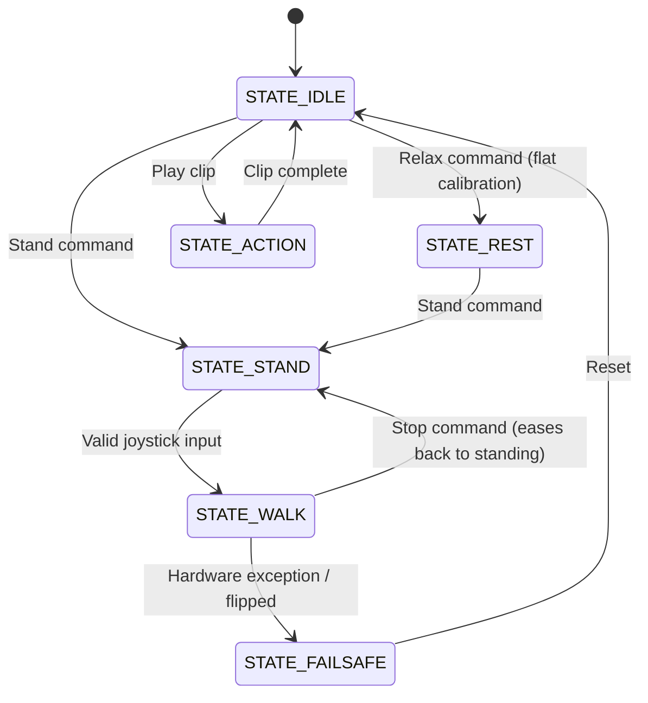

# Software

## Overview

FaceHugger spans several toolchains that meet at one shared contract (the conventions and the WebSocket protocol). The pieces are:

| Component | Language / tooling | Where |
|---|---|---|
| Firmware | C++ (Arduino), built with **PlatformIO** for the ESP32 | `code/firmware/` |
| Simulation | **Python 3.12** + PyBullet (a conda env, see below) | `code/simulation/` |
| Animation | **Blender 5.1** (its own bundled Python) + a Fusion 360 export script | `animation/`, `cad/scripts/` |
| Remote control app | **React Native / Expo** (TypeScript) | `code/remote-control-app/MyApp/` |
| Mechanical design | **Fusion 360** + the printable-STL export script | `cad/` |

The three software components that run code are the embedded C++ firmware on the ESP32, a host-side PyBullet simulation, and the mobile remote-control app. The animation and CAD tooling run inside Blender and Fusion 360 respectively, using those applications' own bundled Python, so they need no environment of their own.

### Firmware architecture (ESP32)

The firmware lives under `code/firmware/src/`: four module folders plus the top-level `main.cpp`.

| Module | Role |
|---|---|
| `nervous_system/` | Coordinates the whole robot body: legs, screen, servos, gaits, and clip playback |
| `brain/` | High-level external communication: receiving and processing packets, handling sensor I/O |
| `shared/` | Configuration and data types shared across modules |
| `display/` | Assets and utility files for the screen |
| `main.cpp` | Initialises and continuously updates `nervous_system` and `brain` |

**`nervous_system/`**

- `spinal_cord.cpp/h`: software abstraction for full limb coordination; implements the gaits, the baked-clip player, invert (a pose mirror), and the state machine
- `leg.cpp/h`: software abstraction for a single leg
- `kinematics.cpp/h`: IK math, kept for reference and tested against the simulation. Locomotion does not use runtime IK: gaits are phase-based angle schedules and gestures are baked clips
- `servo.cpp/h`: software abstraction for servo control (angles and PWM pulses)
- `face.cpp/h`: software abstraction for screen display and updates
- `movements.h`: enums for the module: Leg IDs, gait parameters and types, action types
- `README.md`: summary of the module

**`brain/`**

- `network.cpp/h`: handles all external communication with the app: receives and
  parses packets, creates the Wi-Fi hotspot, manages WebSocket connections
- `diagnostics.cpp/h`: spins up a lightweight HTTP server (port defined by
  `diagnostics::kHttpPort`) that exposes a rolling CSV log of the robot's internal
  state; samples a `SpinalCord::Snapshot` at a fixed interval and appends it to an
  in-memory ring buffer
- `csv_log.h / csv_log.cpp`: ring buffer and CSV serialisation layer used by
  `diagnostics`; each row captures a full snapshot of the robot at a point in time

    The diagnostics HTTP endpoints are:

    | Endpoint | Method | Description |
    |---|---|---|
    | `/` | `GET` | Lists available endpoints |
    | `/log` | `GET` | Returns the CSV header followed by the full rolling buffer |
    | `/log/clear` | `POST` | Clears the ring buffer |

    The CSV log contains the following columns:

    | Column | Description |
    |---|---|
    | `millis` | Timestamp in milliseconds since boot |
    | `robot_state` | Current FSM state |
    | `gait` | Active gait type |
    | `is_moving` | `1` if the robot is executing a gait, `0` if standing |
    | `is_inverted` | `1` if the robot is detected as upside-down |
    | `last_cmd_ms` | Timestamp of the last received command |
    | `target_x/y/yaw` | Commanded velocity setpoints |
    | `active_x/y/yaw` | Currently executing velocity values |
    | `fr/fl/br/bl_hip/thigh/knee` | Servo angles (°) for all 12 joints |

**`shared/`**

- `config.h`: PCA9685 channel assignments for all limbs, default servo angles, I²C addresses
- `data.h`: command types and robot states

**`display/`**

- `assets/`: all sprites for the robot's face expressions, the corresponding PROGMEM bitmap header file, and the converter scripts

**`main/`**

- `main.cpp`: initialises and continuously updates `nervous_system` and `brain`

### Host-side tooling

**Remote control app**: built with React Native and Expo Go. Connects to the ESP32's hotspot and sends lightweight JSON packets over WebSockets to trigger gaits, individual limb control, and special actions (invert (a pose mirror), clip playback, etc.).

**Simulation**: a PyBullet physics environment for testing gaits, clips, and weight distribution offline before deploying to hardware. It can run the exact compiled firmware in the loop (software-in-the-loop), so what you validate in the sim is the same C++ that runs on the robot. See the [simulation reference](../reference/simulation/index.md).

**`API_SPEC.md`**: the JSON contract describing how the app and the ESP32 communicate. The [WebSocket API reference](../reference/api.md) documents the live `T:` protocol.

## How it works

### Boot sequence

When the ESP32 receives power, `main.cpp` triggers the following setup sequence:

1. **Network**: `brain` initialises the Wi-Fi Access Point (`192.168.4.1`) and opens WebSocket port `81`
2. **Hardware bus**: I²C bus initialises on GPIO 21 (SDA) and GPIO 22 (SCL)
3. **Peripherals**: OLED screen (`0x3C`) boots to the neutral face; PCA9685 (`0x40`) powers up
4. **Posture**: `nervous_system` commands all servos to their default standing angles defined in `config.h`

### Execution loop

FaceHugger runs on a non-blocking, continuous update loop:

1. `brain` listens for incoming WebSocket packets from the app
2. On receipt (e.g. `{"T":1,"dir":"FW"}`), it parses the JSON and updates the target state in the shared data structure
3. `nervous_system`'s FSM reads the state and calculates the next micro-step for the active gait
4. `face` checks whether the robot's state requires an emotional update (e.g. confused jittering when stopped or inverted) and pushes pixels to the OLED

### Finite State Machine (FSM)

The physical posture and gait cycle are driven by an FSM inside `SpinalCord`. There are six states (`data.h`):

| State | Value | Meaning |
|---|---|---|
| `STATE_IDLE` | 0 | Holding position, awaiting a command |
| `STATE_WALK` | 1 | Executing a gait |
| `STATE_ACTION` | 2 | Playing a one-shot clip (including the wall-flip, which is a clip) |
| `STATE_FAILSAFE` | 3 | Hardware exception or flipped; motion suppressed |
| `STATE_REST` | 4 | All servos at 90 degrees: the flat calibration pose, safe to power off |
| `STATE_STAND` | 5 | Standing on the per-leg `NEUTRAL[]` pose; the launch reference for gaits |



A gait launches from `STATE_STAND` and, when stopped, eases back to standing rather than dropping to idle. `STATE_REST` is the all-90 calibration pose used when mounting servo horns or powering down, not a "neutral" pose.

## Setup

### PlatformIO: Firmware (ESP32)

**Prerequisites:** [VS Code](https://code.visualstudio.com/) with the [PlatformIO extension](https://platformio.org/install/ide?install=vscode) installed.

!!! warning
    The OLED bitmaps require significant flash memory. Skipping the partition step below will cause an overflow error at compile time.

**Steps:**

1. Clone the repository and open the firmware folder in VS Code
2. PlatformIO will automatically detect `platformio.ini` and install the required libraries
3. Confirm `platformio.ini` contains the following partition override:
```ini
    [platformio]
    default_envs = upesy_wroom

    [env:upesy_wroom]
    platform = espressif32
    board = upesy_wroom
    framework = arduino
    monitor_speed = 115200
    monitor_filters = direct, esp32_exception_decoder
    monitor_dtr = 0
    monitor_rts = 0
    lib_deps =
        pololu/VL53L0X @ ^1.3.1
        bblanchon/ArduinoJson @ ^7.0.0
        links2004/WebSockets @ ^2.4.1
        adafruit/Adafruit PWM Servo Driver Library
        adafruit/Adafruit GFX Library @ ^1.11.5
        adafruit/Adafruit SSD1306 @ ^2.5.7

    [env:native]
    platform = native
    test_framework = unity
    lib_deps = bblanchon/ArduinoJson @ ^7.0.0
    build_flags =
        -std=c++14
        -Isrc/nervous_system
        -Isrc/brain
        -D UNITY_INCLUDE_DOUBLE
    build_src_filter =
        +<nervous_system/kinematics.cpp>
        +<nervous_system/motion_math.cpp>
        +<brain/csv_log.cpp>
        +<brain/clip_list_serializer.cpp>
    test_build_src = yes
```

The `[env:native]` block builds a handful of source files on the host (no ESP32 needed) so the Unity tests can run, including the IK math and the math-to-servo transform shared with the simulation. Run them with `pio test -e native`.
4. Connect the ESP32 via USB, then run the following commands from the PlatformIO terminal:
```bash
   pio run                        # compile the firmware
   pio run -t upload              # flash to the ESP32
   pio device monitor -b 115200   # open the serial monitor to verify boot
```
5. A successful boot prints the ESP32's assigned IP address and confirms the WebSocket server is listening on port `81`

### React Native: Remote Control App

**Prerequisites:** [Node.js](https://nodejs.org/) (v18 or later) and the [Expo Go](https://expo.dev/go) app installed on your iOS or Android device.

**Steps:**

1. Navigate to the app directory:
```bash
   cd remote-control-app/MyApp
```
2. Install dependencies:
```bash
   npm install
```
3. Start the Expo development server:
```bash
   npx expo start
```
4. Scan the QR code displayed in the terminal with Expo Go (Android) or the default Camera app (iOS)
5. The app will load on your device. Before using it, ensure your phone is connected to the FaceHugger Wi-Fi hotspot (see [Running](#running) below)

## Running

### Power-on sequence

!!! danger "Order matters"
    Always follow this sequence exactly. Powering the servos before the ESP32 is
    fully booted will cause the PCA9685 to output undefined PWM signals, which can
    violently snap all 12 servos to random positions and damage the leg joints.

!!! warning "USB vs LiPo: never both at once"
    Do not connect the ESP32 to a PC via USB while the system is powered by the
    LiPo. Pick one power source: USB for development and flashing, LiPo for
    untethered operation. Running both simultaneously can damage the ESP32's
    onboard voltage regulator.

1. **Place the robot on a flat surface.** Ensure all four legs are extended and
   the robot is right-side up. The servos will snap to their default standing pose
   the moment power is applied.

2. **Choose your power source:**

    === "LiPo (untethered operation)"

        Connect the LiPo to the BMS. This simultaneously powers the ESP32 logic
        (via the Buck Converter) and the servo rail (via the PCA9685). Everything
        comes up at once, so the full sequence below applies.

    === "USB (development / debugging)"

        Plug the ESP32 in via USB. This powers the logic only, so the servos will
        not be energised. Use this mode when flashing firmware or reading serial
        logs. Do not connect the LiPo at the same time.

3. **Wait for the OLED face.** The neutral eye sprite appearing on screen
   confirms that the I²C bus is stable, the PCA9685 is initialised at `0x40`, and
   the WebSocket server is listening on port `81`. If the screen stays blank, check
   your I²C wiring on GPIO 21 (SDA) and GPIO 22 (SCL).

4. **Connect to the hotspot.** On your phone or laptop, open Wi-Fi settings and
   connect to the FaceHugger network. The ESP32 Access Point is statically assigned
   to `192.168.4.1`, so no DHCP configuration is required.

5. **Launch the app.** Open Expo Go and load the remote control app. The app will
   attempt to open a WebSocket connection to `ws://192.168.4.1:81`. A successful
   connection is indicated by the controller UI becoming active. If the connection
   times out, confirm your device is on the FaceHugger hotspot and not your home
   Wi-Fi.

6. **Test before moving.** Gently nudge each leg by hand to confirm all 12 servos
   are holding position with resistance. A loose or unresponsive leg indicates a
   disconnected servo cable or a wrong PCA9685 channel assignment in `config.h`.

### Shutdown sequence

Shutting down in the wrong order can leave the servos in an unpowered but
commanded state, causing the robot to collapse suddenly.

1. **Stop all motion.** Send a stop command from the app and wait for the robot
   to return to its standing pose
2. **Disconnect the LiPo.** Unplug the battery from the BMS. This simultaneously
   cuts power to the servos and the logic rail. The robot will go limp, so keep a
   hand under it or lay it on its side before pulling the connector
3. **Disconnect logic power.** If in USB development mode, unplug the USB cable
4. **Close the app**

### Host-side simulation

The PyBullet simulation lets you develop and test gaits and clips entirely offline,
without any risk to the hardware. By default it runs the **exact compiled firmware**
in the loop, so the motion you see is produced by the same C++ that runs on the robot.

**Prerequisites:** Python 3.12 and a few packages. On macOS there is no PyBullet wheel
on PyPI, so a **conda environment is the recommended setup** (it also pulls in the
pybind11 toolchain used to compile the firmware into the sim). One environment covers
the simulator and the helper scripts:

```bash
conda create -n facehugger python=3.12
conda activate facehugger
conda install -c conda-forge pybullet pybind11
pip install -r code/simulation/requirements.txt
```

On Linux you can skip conda and `pip install -r code/simulation/requirements.txt`
directly. See [Software environments](#software-environments) below for the full
picture of which folders need which environment.

**Common commands** (run from `code/simulation/`):

```bash
python facehugger.py sim                 # GUI, standing pose
python facehugger.py sim --walk          # walk gait (firmware in the loop)
python facehugger.py sim --trot          # trot gait
python facehugger.py sim --clip "wave"   # play a baked clip
python facehugger.py sim --serve         # firmware-backed WebSocket API on :8081
python facehugger.py sim --app           # sim + WebSocket API + the web app
```

`--walk` and `--trot` are separate gaits, both driven by the compiled firmware; pass
`--python` to use the pure-Python re-port instead (no C++ toolchain needed).
`sim --serve` runs the same `T:` WebSocket protocol as the real robot, so the mobile
app or the browser [control panel](../reference/remote-control/control-panel.md) can
drive the sim; `sim --app` brings up the sim, the API, and the web app together. The
full flag surface, the under-the-hood firmware-in-the-loop design, and the Blender and
`flash` subcommands are documented in the
[simulation CLI reference](../reference/simulation/cli.md).

!!! tip
    Validate any change to gait parameters or clips in the sim before flashing the
    ESP32. A gait that looks stable in simulation is not guaranteed stable on
    hardware, but a gait that fails in simulation will always fail on hardware.

## Software environments

Each toolchain manages its own dependencies; there is no single environment that
spans all of them, because they run in different runtimes.

- **Simulation (`code/simulation/`)** is the only host-Python project. Use one conda
  environment named `facehugger` (PyBullet and pybind11 from conda-forge, the rest
  from `requirements.txt`). The same env runs the simulator, the URDF generator, and
  the verification scripts.
- **Firmware (`code/firmware/`)** is managed entirely by PlatformIO, which creates
  its own isolated build environments from `platformio.ini`. No Python env is needed.
- **Mobile app (`code/remote-control-app/MyApp/`)** uses npm; `npm install` reads
  `package.json`.
- **Animation and CAD** run inside Blender and Fusion 360, each using that
  application's bundled Python. The scripts are loaded from within the app, not run
  against a project environment.

So "one environment for everything" is not possible across these runtimes, but the
host-Python side is genuinely one conda env. A `pyproject.toml` for `code/simulation/`
(with optional-dependency groups for sim, the WebSocket API, and docs) would be a
reasonable future tidy-up, but `requirements.txt` is what the project uses today.