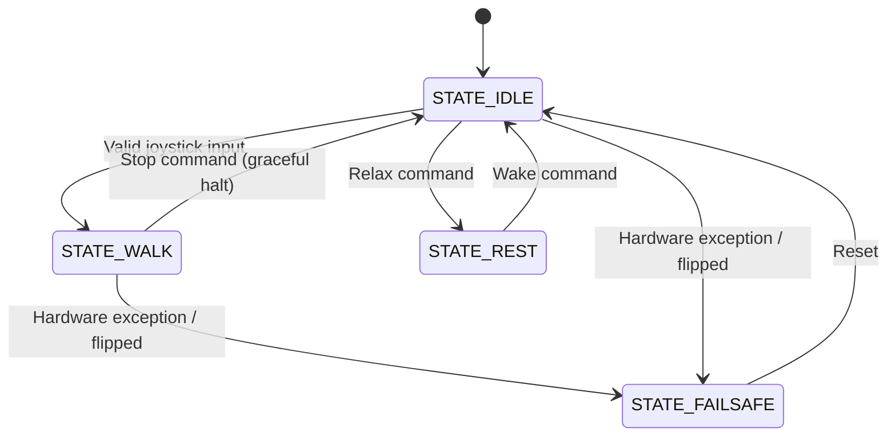

# Software

## Overview

The FaceHugger software ecosystem is divided into three main components: the embedded C++ firmware running on the ESP32, a host-side physics simulation using PyBullet, and a mobile remote-control application built with React Native.

---

### Firmware architecture (ESP32)

The firmware is divided into 5 modules:

| Module | Role |
|---|---|
| `nervous_system/` | Coordinates the whole robot body — legs, screen, servos, and the IK math |
| `brain/` | High-level external communication — receiving and processing packets, handling sensor I/O |
| `shared/` | All data shared across modules |
| `display/` | Assets and utility files for the screen |
| `main/` | Initialises and updates `nervous_system` and `brain` |

**`nervous_system/`**

- `spinal_cord.cpp/h` — software abstraction for full limb coordination; implements all gaits and actions
- `leg.cpp/h` — software abstraction for a single leg (`setPose` not used — gaits are hardcoded)
- `kinematics.cpp/h` — IK math computation (bypassed — gaits are hardcoded)
- `servo.cpp/h` — software abstraction for servo control (angles and PWM pulses)
- `face.cpp/h` — software abstraction for screen display and updates
- `movements.h` — enums for the module: Leg IDs, gait parameters and types, action types
- `README.md` — summary of the module

**`brain/`**

- `network.cpp/h` — handles all external communication with the app: receives and parses packets, creates the Wi-Fi hotspot, manages WebSocket connections

**`shared/`**

- `config.h` — PCA9685 channel assignments for all limbs, default servo angles, I²C addresses
- `data.h` — command types and robot states

**`display/`**

- `assets/` — all sprites for the robot's face expressions, the corresponding PROGMEM bitmap header file, and the converter scripts

**`main/`**

- `main.cpp` — initialises and continuously updates `nervous_system` and `brain`

---

### Host-side tooling

**Remote control app** — built with React Native and Expo Go. Connects to the ESP32's hotspot and sends lightweight JSON packets over WebSockets to trigger gaits, individual limb control, and special actions (inverted walking, dancing, etc.).

**Simulation** — a PyBullet physics environment used to test Inverse Kinematics, gait patterns, and weight distribution offline before deploying to hardware.

**`API_SPEC.md`** — the strict JSON contract defining exactly how the app and the ESP32 communicate.

---

## How it works

### Boot sequence

When the ESP32 receives power, `main.cpp` triggers the following setup sequence:

1. **Network** — `brain` initialises the Wi-Fi Access Point (`192.168.4.1`) and opens WebSocket port `81`
2. **Hardware bus** — I²C bus initialises on GPIO 21 (SDA) and GPIO 22 (SCL)
3. **Peripherals** — OLED screen (`0x3C`) boots to the neutral face; PCA9685 (`0x40`) powers up
4. **Posture** — `nervous_system` commands all servos to their default standing angles defined in `config.h`

### Execution loop

FaceHugger runs on a non-blocking, continuous update loop:

1. `brain` listens for incoming WebSocket packets from the app
2. On receipt (e.g. `{"dir": "FW"}`), it parses the JSON and updates the target state in the shared data structure
3. `nervous_system`'s FSM reads the state and calculates the next micro-step for the active gait
4. `face` checks whether the robot's state requires an emotional update (e.g. confused jittering when stopped or inverted) and pushes pixels to the OLED

### Finite State Machine (FSM)

The physical posture and gait cycle are driven by a strict FSM inside `SpinalCord`:



---

## Setup

### PlatformIO — Firmware (ESP32)

**Prerequisites:** [VS Code](https://code.visualstudio.com/) with the [PlatformIO extension](https://platformio.org/install/ide?install=vscode) installed.

!!! warning
    The OLED bitmaps require significant flash memory. Skipping the partition step below will cause an overflow error at compile time.

**Steps:**

1. Clone the repository and open the firmware folder in VS Code
2. PlatformIO will automatically detect `platformio.ini` and install the required libraries
3. Confirm `platformio.ini` contains the following partition override:
```ini
    [platformio]
    default_envs = upesy_wroom

    [env:upesy_wroom]
    platform = espressif32
    board = upesy_wroom
    framework = arduino
    monitor_speed = 115200
    monitor_filters = direct, esp32_exception_decoder
    monitor_dtr = 0
    monitor_rts = 0
    lib_deps =
        pololu/VL53L0X @ ^1.3.1
        bblanchon/ArduinoJson @ ^7.0.0
        links2004/WebSockets @ ^2.4.1
        adafruit/Adafruit PWM Servo Driver Library

    [env:native]
    platform = native
    test_framework = unity
    build_flags =
        -std=c++14
        -Isrc/nervous_system
    build_src_filter =
        +<nervous_system/kinematics.cpp>
        +<brain/csv_log.cpp>
    test_build_src = yes
```
4. Connect the ESP32 via USB, then run the following commands from the PlatformIO terminal:
```bash
   pio run                        # compile the firmware
   pio run -t upload              # flash to the ESP32
   pio device monitor -b 115200   # open the serial monitor to verify boot
```
5. A successful boot prints the ESP32's assigned IP address and confirms the WebSocket server is listening on port `81`

---

### React Native — Remote Control App

**Prerequisites:** [Node.js](https://nodejs.org/) (v18 or later) and the [Expo Go](https://expo.dev/go) app installed on your iOS or Android device.

**Steps:**

1. Navigate to the app directory:
```bash
   cd remote-control-app/MyApp
```
2. Install dependencies:
```bash
   npm install
```
3. Start the Expo development server:
```bash
   npx expo start
```
4. Scan the QR code displayed in the terminal with Expo Go (Android) or the default Camera app (iOS)
5. The app will load on your device — before using it, ensure your phone is connected to the FaceHugger Wi-Fi hotspot (see [Running](#running) below)

---

## Running

### Power-on sequence

!!! danger "Order matters"
    Always follow this sequence exactly. Powering the servos before the ESP32 is
    fully booted will cause the PCA9685 to output undefined PWM signals, which can
    violently snap all 12 servos to random positions and damage the leg joints.

!!! warning "USB vs LiPo — never both at once"
    Do not connect the ESP32 to a PC via USB while the system is powered by the
    LiPo. Pick one power source: USB for development and flashing, LiPo for
    untethered operation. Running both simultaneously can damage the ESP32's
    onboard voltage regulator.

1. **Place the robot on a flat surface** — ensure all four legs are extended and
   the robot is right-side up. The servos will snap to their default standing pose
   the moment power is applied.

2. **Choose your power source:**

    === "LiPo (untethered operation)"

        Connect the LiPo to the BMS. This simultaneously powers the ESP32 logic
        (via the Buck Converter) and the servo rail (via the PCA9685). Everything
        comes up at once — the full sequence below applies.

    === "USB (development / debugging)"

        Plug the ESP32 in via USB. This powers the logic only — the servos will
        not be energised. Use this mode when flashing firmware or reading serial
        logs. Do not connect the LiPo at the same time.

3. **Wait for the OLED face** — the neutral eye sprite appearing on screen
   confirms that the I²C bus is stable, the PCA9685 is initialised at `0x40`, and
   the WebSocket server is listening on port `81`. If the screen stays blank, check
   your I²C wiring on GPIO 21 (SDA) and GPIO 22 (SCL).

4. **Connect to the hotspot** — on your phone or laptop, open Wi-Fi settings and
   connect to the FaceHugger network. The ESP32 Access Point is statically assigned
   to `192.168.4.1` — no DHCP configuration required.

5. **Launch the app** — open Expo Go and load the remote control app. The app will
   attempt to open a WebSocket connection to `ws://192.168.4.1:81`. A successful
   connection is indicated by the controller UI becoming active. If the connection
   times out, confirm your device is on the FaceHugger hotspot and not your home
   Wi-Fi.

6. **Test before moving** — gently nudge each leg by hand to confirm all 12 servos
   are holding position with resistance. A loose or unresponsive leg indicates a
   disconnected servo cable or a wrong PCA9685 channel assignment in `config.h`.

---

### Shutdown sequence

Shutting down in the wrong order can leave the servos in an unpowered but
commanded state, causing the robot to collapse suddenly.

1. **Stop all motion** — send a stop command from the app and wait for the robot
   to return to its standing pose
2. **Disconnect the LiPo** — unplug the battery from the BMS. This simultaneously
   cuts power to the servos and the logic rail. The robot will go limp — keep a
   hand under it or lay it on its side before pulling the connector
3. **Disconnect logic power** — if in USB development mode, unplug the USB cable
4. **Close the app**

---

### Host-side simulation

The PyBullet simulation lets you develop and test gaits entirely offline, without
any risk to the hardware. It mirrors the same kinematic model used in the firmware.

**Prerequisites:** Python 3.8+, `pybullet`, and `numpy` installed:

```bash
pip install pybullet numpy
```

**Available commands:**

| Command | Description |
|---|---|
| `python facehugger.py sim` | PyBullet GUI, robot in default standing pose |
| `python facehugger.py sim --walk` | PyBullet GUI, immediately runs the default Trot gait |
| `python facehugger.py blender --rigged` | Launch Blender with the rigged model |

```bash
python facehugger.py sim              # GUI, standing pose
python facehugger.py sim --walk       # walk gait
python facehugger.py blender --rigged # Blender rigged model
```

!!! tip
    Use `sim` to validate any changes to gait parameters or IK constants in
    `config.h` before flashing new firmware to the ESP32. A gait that looks stable
    in simulation will not always be stable on hardware, but a gait that fails in
    simulation will always fail on hardware.