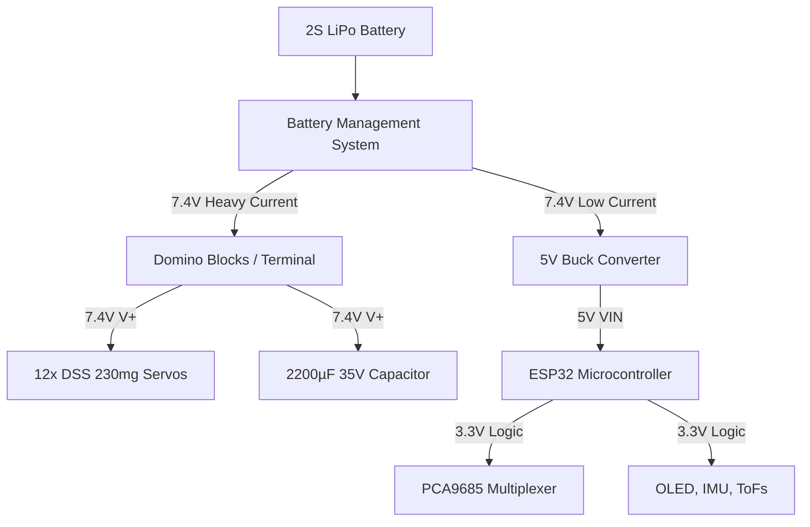
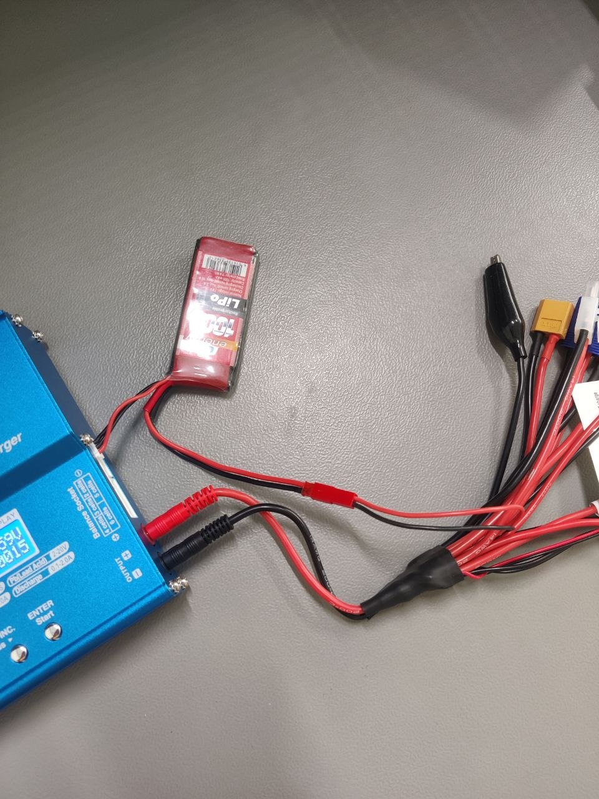
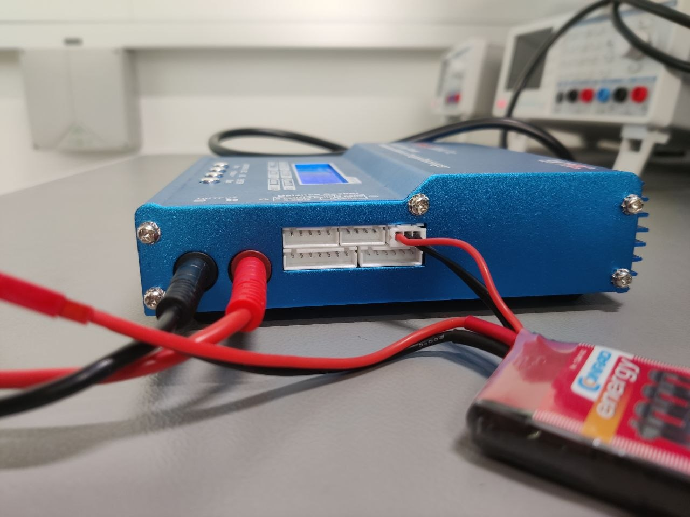

# Electronics & Wiring

This document details the complete electrical nervous system of the FaceHugger quadruped. It covers the dual-rail power distribution strategy (Muscle vs. Logic), the I2C sensor bus, and the exact servo pin mappings.

!!! warning "Pinout may change"
    The exact pinout is not final. Treat pin assignments here as the current proposal, not a contract. Always confirm against the firmware `config.h` before wiring or soldering.

## Schematic
*(Insert KiCad SVG Export Here)*
``

### Block-by-Block Walkthrough
* **The Power Block:** Raw 2S LiPo voltage flows through the BMS. It then splits into two paths: the heavy-duty Domino blocks (for the servos) and the Buck Converter (stepping down to 5V for the ESP32).
* **The Brain (ESP32):** Powered by the 5V Buck Converter. It outputs a 3.3V logic signal to power the I2C sensors and generates the SDA/SCL signals.
* **The Servo Bus (PCA9685):** Receives 3.3V logic from the ESP32, but its `V+` rail receives raw battery voltage from the Domino blocks to drive the servos. 
* **The Sensor Bus (I2C):** The OLED (0x3C), IMU, and ToFs all share the same parallel SDA/SCL lines from the ESP32.

## Power Distribution

FaceHugger v7.5 is capable of pulling over **30 Amps** during heavy dynamic movements. The traces on a standard PCA9685 multiplexer will vaporize at 10 Amps. Therefore, we strictly separate the "Muscle" power from the "Logic" power.

* **The Muscle (Domino Bypass):** The Red (V+) and Brown (GND) wires from the servos do not plug into the PCA9685. They are routed directly to heavy-duty Domino blocks wired to the LiPo. Only the Yellow (PWM) signal wires plug into the PCA9685.
* **The Capacitor:** A massive 2200µF (35V) electrolytic capacitor is wired in parallel across the Domino block V+ and GND rails to absorb instantaneous inrush current and prevent logic brownouts.

## Servo Wiring

The Yellow (PWM) signal wires from the 12 servos connect to the PCA9685 multiplexer. Ensure you map the physical legs exactly to these hardware channels, or the Inverse Kinematics math will actuate the wrong joints.

| Leg ID | Hip Channel | Thigh Channel | Knee Channel |
| :--- | :--- | :--- | :--- |
| **Front Right (FR)** | 8 | 9 | 10 |
| **Front Left (FL)** | 12 | 13 | 14 |
| **Back Right (BR)** | 4 | 5 | 6 |
| **Back Left (BL)** | 0 | 1 | 2 |

## ESP32 Pinout

All peripheral communication is handled via a single I2C bus. The ESP32's native hardware I2C pins are split into custom cable trees (1 Female to 3+ Females) to connect all devices in parallel.

| ESP32 Pin | Function | Connects To |
| :--- | :--- | :--- |
| **VIN / 5V** | Main Logic Power In | 5V Output from Buck Converter |
| **GND** | Common Ground | Buck Converter, I2C Tree GND, PCA9685 GND |
| **3V3** | Sensor Power Out | OLED (VCC), IMU (VCC), ToFs (VCC), PCA9685 (VCC) |
| **GPIO 21** | I2C SDA (Data) | OLED, IMU, ToFs, PCA9685 (SDA pins) |
| **GPIO 22** | I2C SCL (Clock) | OLED, IMU, ToFs, PCA9685 (SCL pins) |

## Battery & Connector Safety

!!! danger "Read before powering on"
    High-current robotics require strict safety protocols. Failure to follow these steps will result in destroyed electronics or LiPo fires.

1. **Never Power Servos via the Multiplexer:** Pushing 30A through the PCA9685's green screw terminal will instantly melt the internal copper traces and likely destroy the ESP32 via ground-loop backflow. Use the Domino blocks.
2. **Polarity Check:** Verify the polarity of the 2200µF capacitor before connecting the battery. The white stripe (negative) must go to GND. Plugging an electrolytic capacitor in backward will cause it to violently rupture.
3. **I2C Separation:** Ensure the 3.3V logic cable tree NEVER touches the 7.4V battery power rails. 
4. **Power Sequence:** The 2S LiPo battery must be the absolute last thing connected. 

## Charging Your LiPo

Properly charging your 2S LiPo battery is critical for both the lifespan of the battery and your safety. The images below demonstrate a standard multi-chemistry balance charger (like an IMAX B6). 

!!! warning "LiPo Charging Safety"
    **Never leave a charging LiPo unattended.** Always charge it inside a fireproof LiPo safe bag on a non-flammable surface. If the battery ever begins to puff or swell, immediately stop the charge and move it outside.

### 1. Connect the Main Power Leads
Always connect the main output cables to the charger before plugging in the battery to prevent short circuits.
* Insert the **Red (Positive)** banana plug into the red output port on the charger.
* Insert the **Black (Negative)** banana plug into the black output port.
* Connect the other end of the cable (the red JST connector) to the main power lead of your LiPo battery.

### 2. Connect the Balance Lead
The balance lead ensures each individual cell in the 2S battery charges to exactly the same peak voltage (4.20V per cell). Skipping this step can lead to a catastrophic cell overcharge.
* Locate the small white balance connector on the battery (it has 3 wires for a 2S battery).
* Plug this into the **2-cell** balance socket on the side of the charger. The plug has alignment rails, so do not force it; it will only slide in one way.

### 3. Configure the Charger Settings
Once both the main power and balance cables are securely connected, configure the charger interface:
* **Mode:** Navigate to `LiPo BALANCE CHG` mode (do not use standard "Charge" or "Fast Charge").
* **Voltage/Cells:** Set to `2S` (7.4V).
* **Current:** Set the charge current to a safe **1C** rate (1x the battery's capacity in Amps). For a 1000mAh battery, set the current to **1.0A**.
* Press and hold the `Start/Enter` button to initiate the battery check. The charger will ask you to confirm that its detected cell count matches your setting. Press Enter again to begin charging.