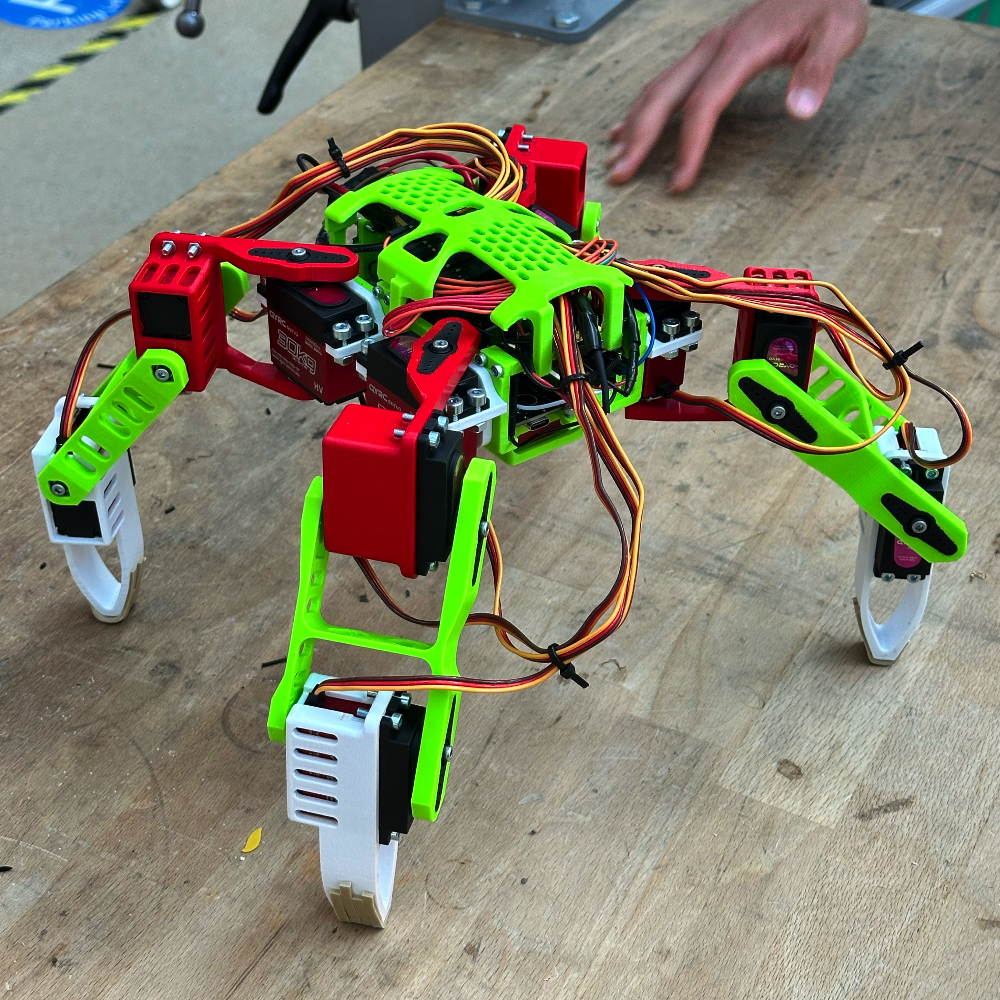

# FaceHugger, a quadruped robot

FaceHugger is a four-legged walking robot designed, built, and programmed from scratch by six Computer Science students for EPFL's *Making Intelligent Things* course (2026 spring). We took it from an empty Fusion 360 file to a walking, animatable robot in eight weeks, working in weekly SCRUM sprints across CAD, 3D printing, electronics, firmware, a control app, and a full simulation and animation pipeline.

This wiki is two things at once: a **build guide** if you want to reproduce or assemble the robot, and a **technical reference** if you want to understand how it works or build on it. You do not need to read it in order. Jump straight to whatever you came for.

!!! tip "Where to start"
    New here? Read [Design](guide/design.md) for the concept, then follow the build guide top to bottom. Looking for how a specific part works? Go straight to the [Reference](reference/conventions.md). Want to know who built it? See the [Team](team.md).

## Build the robot

-   :material-pencil-ruler:{ .lg .middle } __Design__

    ---

    The quadruped concept, how a leg moves, and why it is sized this way.

    [:octicons-arrow-right-24: Design](guide/design.md)

-   :material-cog:{ .lg .middle } __Parts & Materials__

    ---

    Bill of materials: printed parts, electronics, fasteners, ball bearings.

    [:octicons-arrow-right-24: Parts](guide/parts.md)

-   :material-printer-3d:{ .lg .middle } __3D Printing__

    ---

    What to print, slicer settings, and orientation for each part. All prints were made at the SPOT (EPFL's makerspace) on Prusa MK3S and MK4S printers.

    [:octicons-arrow-right-24: Printing](guide/printing.md)

-   :material-sine-wave:{ .lg .middle } __Electronics & Wiring__

    ---

    Schematic, circuitry, pinout, and battery safety.

    [:octicons-arrow-right-24: Wiring](guide/wiring.md)

-   :material-hammer-wrench:{ .lg .middle } __Assembly__

    ---

    Step-by-step build, with photos and cabling warnings.

    [:octicons-arrow-right-24: Assembly](guide/assembly.md)

-   :material-cpu-64-bit:{ .lg .middle } __Software & Calibration__

    ---

    Flash the firmware, calibrate the servos, and drive the robot.

    [:octicons-arrow-right-24: Software](guide/software.md)

## Understand how it works

-   :material-axis-arrow:{ .lg .middle } __Conventions__

    ---

    The coordinate frames, angle spaces, leg naming, and the math-to-servo transform everything else depends on.

    [:octicons-arrow-right-24: Conventions](reference/conventions.md)

-   :material-chip:{ .lg .middle } __Firmware__

    ---

    The ESP32 motion engine: gaits, the clip player, the state machine, and kinematics.

    [:octicons-arrow-right-24: Firmware](reference/firmware/index.md)

-   :material-movie-open:{ .lg .middle } __Animation pipeline__

    ---

    CAD to URDF, the Blender rig, and how authored clips become motion on the robot.

    [:octicons-arrow-right-24: Animation](reference/animation/index.md)

-   :material-robot-industrial:{ .lg .middle } __Simulation__

    ---

    The PyBullet simulator, the CLI, and how it runs the exact firmware in the loop.

    [:octicons-arrow-right-24: Simulation](reference/simulation/index.md)

## See it in action

*FaceHugger at rest — 12 servos, ESP32 brain, PCA9685 driver*

<video src="assets/img/general-robot-pics-videos/general-moves.MOV" controls width="100%"></video>
*General moves — walk, trot, and wave clips*

<video src="assets/img/general-robot-pics-videos/robot-dancing.MOV" controls width="100%"></video>
*Dancing clip*

<video src="assets/img/general-robot-pics-videos/robot-flipping.MOV" controls width="100%"></video>
*Auto-flip — the robot detects when it's upside-down and mirrors its pose*

## The robot at a glance

FaceHugger is driven by an ESP32 that talks to twelve servos (three per leg) through a PCA9685 driver. A mobile app and a browser panel send high-level commands over WebSocket, and the firmware turns them into leg motion using phase-based gait schedules and baked animation clips, with no runtime inverse kinematics in the locomotion path. The same robot model drives a PyBullet simulation that runs the *exact* firmware code, so motion can be designed and validated before it ever reaches hardware.

Built by six students over eight weeks. See the [Team](team.md) for who did what.
