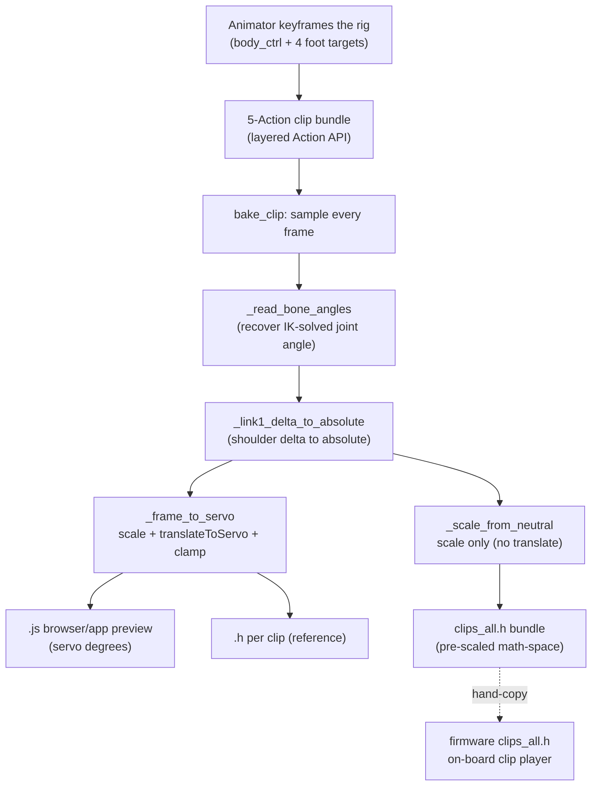

# Blender animation to robot: the clip panel and export pipeline

This is the last stage of the pipeline: an animator keyframes a gesture on the Blender rig, and it ends up as a clip the robot can replay on its own. The **FH Clip Panel** add-on (`animation/addons/fh_clip_panel.py`, Blender 5.x) is the tool that authors those gestures and, crucially, does the math-to-servo conversion on the host at export time. The robot only ever replays baked frames; it never re-runs the conversion.

If you are extending this, the one idea to hold onto is the responsibility split:

- **The plugin is the authoring and conversion brain.** It stores clips, reads the IK-solved rig pose, and converts to servo angles.
- **The export artifacts are inert pre-computed data.** A `.js` for browser/app preview, a `.h` for reference, and the bundled `clips_all.h` for the on-board player.
- **The firmware just replays.** `clipPoseAt` (`motion_math.cpp`) linearly interpolates the stored 12-angle frames between keyframes. It applies no clip-specific scaling or per-leg conversion at playback.

For a step-by-step authoring walkthrough see the [Blender clips how-to](../../guide/toolchain/blender-clips.md). The on-board player design is in the [roadmap](../roadmap.md), and the angle spaces it all rests on are in [Conventions](../conventions.md).

## The data flow



Both the `.js` and `clips_all.h` formats ship **pre-scaled math-space angles**. The `.js` files send one `T:12` (`CMD_STREAM_FRAME`) packet per frame from a browser console, and the on-board clip player reads `clips_all.h` and runs `translateToServo` at playback time — applying CALIB on the firmware side only. The mobile-app bundle `clips_extra.json` follows the same math-space convention, tagged `wire: "T12"` so a stale CALIB-baked bundle fails loudly in the app. `T:4` is reserved for raw per-servo calibration sessions (the `LegControl` screen), not for clip streaming.

## Key functions and why they exist

- **`_read_bone_angles`** recovers each joint angle from the *evaluated* pose. IK joints store the solved result only in the bone's evaluated matrix, not in `rotation_euler`, so the function inverts the pose composition and reads bone-local Z. Reading `rotation_euler` naively was the original "all-zero export" bug.
- **`_link1_delta_to_absolute`** fixes the shoulder. The rig's analytic yaw driver outputs a *delta from rest* (zero at the standing pose), but everything downstream expects *absolute* math-space angles where standing equals `NEUTRAL`. This converts `absolute = NEUTRAL + sign * delta` per leg, once, so both export paths inherit it.
- **`_scale_from_neutral`** does only the 2/3 scale, no per-leg conversion. Both the `.js` exporter (`to_js`) and the firmware bundle (`to_clips_header`) and the app bundle (`to_clips_extra_json`) emit through it — all three are math-space, with the firmware applying `translateToServo` + CALIB at playback / receipt.
- **`_frame_to_servo`** is the host twin of the firmware `translateToServo` (lives in `code/simulation/firmware_port/exporter_parity.py`, not in the exporter's `servo_math.py` — the exporter is CALIB-free). Three steps: scale toward `NEUTRAL` by 2/3, apply the per-leg servo branch (`FL: 90 + (sh - 135)`, `FR: 90 + (sh - 45)`, `BL: 90 + (sh + 135)`, `BR: 90 + (sh + 45)`, with thigh/knee mirrored per side), then clamp to 0-180 and round. It powers two surfaces: the firmware-parity test (`gen_clip_parity_reference.py`) and the Blender panel's "current servo angles" preview.
- **`to_js` / `to_c_header` / `to_clips_header`** emit the three artifacts. `to_js` bakes a configurable ESP IP into a self-contained WebSocket player; `to_clips_header` bundles the clips it is handed into one `clips_all.h` plus a `clips_manifest.json`, enforcing strictly increasing frame times and `uint16` limits. The panel passes it the ticked export selection, so the bundle is the curated firmware set, not necessarily every clip in the file.

## Conventions baked at export

- **The 2/3 scale** (`convention.json`, `scale = 0.6667`) is applied toward `NEUTRAL`, in both export paths, at bake time. The firmware never re-scales clip data. This is a clips-only scale and is unrelated to the per-gait SCALE inside the firmware gaits.
- **`_frame_to_servo` is byte-identical to the firmware `translateToServo`**, kept honest by `animation/scripts/test_servo_parity.py`, which copies the firmware switch verbatim as independent ground truth. Divergence means a wrong joint or wrong direction on hardware.
- **Servo 90 is each leg's outward direction for all four legs**, including FL at `90 + (sh - 135)`. `animation/scripts/check_export_consistency.py` asserts this against `convention.json`, which stays the single source of truth.
- **Clips author in math-space; the device applies CALIB.** The bundled `clips_all.h` stays in pre-scaled math-space, with no per-servo calibration baked in. The on-board player runs `translateToServo` at playback time, which centres each thigh/knee delta on that leg's `CALIB_*` value from `shared/config.h`. The same baked clip therefore lands on real mechanical flat on any robot, even after a recalibration that changes a CALIB by a few degrees - no re-export needed. See [Invert mirror and CALIB](../conventions.md#invert-mirror-and-calib).

See [Conventions](../conventions.md) for the angle spaces and the full per-leg `translateToServo` table.

## The clip panel features

The add-on adds a "FaceHugger" tab to the 3D viewport sidebar (press `N`). It manages clips, poses, selections, and exports against the rigged scene `animation/fh_rigged_latest.blend`.

**Clip management.** A clip is a named 5-Action bundle, one Action per control object (`body_ctrl` plus the four `foot_target_*`), wired with Blender 4.4+'s layered Action API. A clip is a one-shot gesture, not a loop: after the final frame the robot eases back to `NEUTRAL` over 500 ms, then goes idle. Save the `.blend` for clips to persist, since the panel rescans on every viewport redraw.

**Pose library.** `animation/poses.json` stores named snapshots of the five control objects. Applying a pose is a pure viewport transform with no keyframes; **Key into Clip** commits the applied pose into the active clip at the chosen frame. A yellow warning shows whenever a pose is applied but not yet keyed.

**Selection sets.** One-click selection of control groups (All, Body, Legs, Front, Back, and per-leg) for faster keyframing. Pure viewport selection, no transforms touched.

**Export.** The Export sub-panel bakes the active clip (or the ticked selection) and writes, under `animation/exported_clips/`:

| Artifact | Contents | Consumer |
|---|---|---|
| `<clip>.csv` | frame, time, 12 math-space angles | inspection (legacy) |
| `<clip>.h` | the same as a C array | reference (legacy) |
| `<clip>.js` | finished servo degrees + a WebSocket player | browser/app live preview |
| `clips_all.h` + `clips_manifest.json` | the ticked export selection, pre-scaled math-space | the on-board clip player |

The per-row checkboxes in the Clips sub-panel are the firmware set: both **Export Active Clip** and **Export Selected Clips** rebuild `clips_all.h` and the manifest from exactly the ticked clips, replacing the previous bundle. Untick a work-in-progress clip and it stays out of the robot's set without being deleted. With nothing ticked, the bundle is left untouched rather than wiped. The headless `export_all_clips.py` is the exception: it bundles *every* clip in the file regardless of the selection, so use the panel for a curated set and the headless tool for a full re-export.

**Deterministic clip order.** `to_clips_header` and `to_clips_extra_json` sort clip names alphabetically before emitting, so a clip's index in the bundle (its `FH_CLIPS[]` id, and the same id in `clips_manifest.json` and `clips_extra.json`) is a function of the clip name alone, not the order Blender happens to walk the Actions or the order they were authored in. Re-exporting after adding, renaming, or unticking a clip shifts ids predictably and only where it must; existing ids do not silently reshuffle. The firmware refers to clips by these ids, the on-device clip list flashes them in this order, and the app's clip list reads `clips_manifest.json`, so this is what keeps "clip 3" the same clip across a re-export.

**Reload Add-on button.** A `FILE_REFRESH` button at the top of the FaceHugger panel re-reads `fh_clip_panel.py` from disk and re-registers the add-on in place. It is the iteration loop for editing the panel source: save the file, click Reload, see the change, with no Blender restart and no `.blend` reload. A failed reload (broken source) surfaces the exception in the info bar instead of leaving Blender in a half-registered state.

When the **Copy clips_all.h to firmware** toggle is on (default), each bundle export also copies `clips_all.h` straight into `code/firmware/src/nervous_system/` and reports the path, so there is no manual sync step (it assumes the add-on runs from a repo checkout, and warns instead of failing if the firmware dir is absent). Two folder buttons, **Exports** and **Firmware**, open the source and destination directories in the OS file browser.

**Activity heatmap.** Colours the servo meshes from green (quiet) to red (jerky) by frame-to-frame angle delta, so you can spot mechanical shock before export. Only 8 of 12 servos are coloured because the hip servo was merged into the body CAD.

**Bezier/Linear toggle.** Switches the active clip's F-curves between Bezier (smooth authoring) and Linear (exact robot playback). Non-destructive: Bezier handles are restored on switch back.

**Authoring warnings.** A frame-delta warning (around 20 degrees between consecutive frames), a simultaneous-servo hint, and an FPS nudge toward 12 fps or lower (fewer packets for the same motion).

**Headless export.** `animation/addons/export_all_clips.py` re-exports every clip in a `.blend` without the GUI:

```bash
BLENDER_BIN=/Applications/Blender-5.1.app/Contents/MacOS/Blender
"$BLENDER_BIN" --background --factory-startup \
  animation/fh_rigged_latest.blend \
  --python animation/addons/export_all_clips.py
```

## Gotchas for a builder or extender

1. **There are two `clips_all.h`.** The exporter writes `animation/exported_clips/clips_all.h`; the firmware compiles `code/firmware/src/nervous_system/clips_all.h`. They are the same self-contained bundle format, so syncing is a plain file copy (no per-clip `#include`, no `.cpp` to edit). By default the panel copies it for you on export (the **Copy clips_all.h to firmware** toggle); with the toggle off you must copy it by hand, or stale motion ships. A third `clips_all.h` under `code/firmware/test/fixtures/` is an unrelated test fixture.
2. **The shoulder fix lives in the exporter, not the rig.** Clips used to collapse on playback because the rig's yaw driver emits a delta (zero at rest), under-anchoring the shoulders. The fix is `_link1_delta_to_absolute` in the exporter, which keeps `convention.json` as the single source of truth and stays unit-testable. Do not "fix" it by rebuilding the rig. See [the clip shoulder convention](../conventions.md) for the full reasoning.
3. **The FL shoulder convention requires matching hardware.** FL's `90 + (sh - 135)` regularization assumes the FL shoulder horn is mounted so that servo 90 points outward. If you re-mount the FL horn, re-export all clips.
4. **`SCALE` applies to clips only.** Do not conflate it with the per-gait SCALE inside the firmware gait engine.
5. **The per-clip `.h` is not the firmware feed.** The firmware reads the bundled `clips_all.h`. The per-clip `.h` and `.css` are reference/legacy formats.
