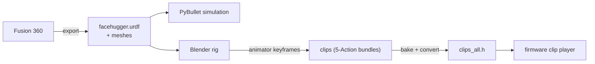

# Animation pipeline

This section follows the robot from CAD all the way to motion, and it is the same backbone the simulation rides on. Fusion 360 exports the geometry and joints, `generate_urdf.py` compiles them into `facehugger.urdf`, and that one URDF feeds two consumers: the [PyBullet simulation](../simulation/index.md) and the Blender rig that animators pose. An animator keyframes a clip on the rig, the exporter bakes it to servo angles and bundles it into `clips_all.h`, and the firmware's on-board clip player replays it. The same `translateToServo` mapping is shared by the firmware, the exporter, and the sim, so a clip behaves the same in all three (see [Conventions](../conventions.md)).

Read it one stage at a time:

- **[3D model to URDF](urdf-pipeline.md)**: the Fusion export and `generate_urdf.py` that build `facehugger.urdf` and the mesh set the sim and rig both use.
- **[URDF to Blender rig](blender-rig.md)**: the posable armature built from that URDF, faithful to the placement PyBullet and the CAD agree on.
- **[Blender to robot clips](clip-panel.md)**: the clip panel add-on and the export pipeline that turns authored gestures into `clips_all.h`.

A future on-board player (a richer `.fhc` format with runtime IK and IMU correction) is planned to replace the current baked-frame replay; see the [roadmap](../roadmap.md). It has not been implemented yet.

## Scene builders vs animator helpers

The scripts in `animation/scripts/` split into two groups.

**Scene builders** are run as `blender --python ...` and produce a `.blend` for inspection or rigging:

- `visualize_urdf.py`: places meshes by walking the URDF joint chain at rest pose, and cross-checks that PyBullet and Blender agree. See [3D model to URDF](urdf-pipeline.md).
- `visualize_fusion_export.py`: places meshes directly from `fusion_export.json` world transforms, useful for diagnosing CAD-side issues.
- `urdf_to_blender_rigged.py`: builds the animator-facing rig (a 13-bone armature, FK shoulder, IK on hip and knee, foot-target Empties). See [URDF to Blender rig](blender-rig.md).

**Animator-facing helpers** (in `animation/addons/`) operate on an open or saved `.blend`:

- `fh_clip_panel.py`: the Blender N-panel add-on that manages clips, a pose library, selection sets, and export to `animation/exported_clips/`. See [Blender to robot clips](clip-panel.md).
- `export_all_clips.py`: a headless re-export of every clip in a `.blend`, for regenerating the artifacts without the GUI.
