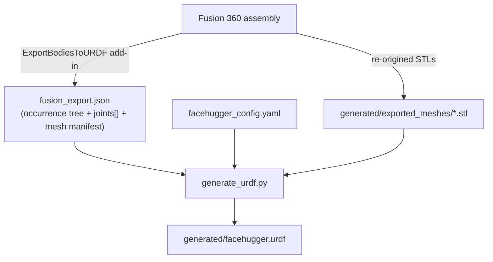

# 3D model to URDF

This is the first stage of the pipeline: a Fusion 360 assembly becomes a single `facehugger.urdf` that PyBullet and Blender both consume. It is a two-program pipeline joined by one JSON intermediate, plus a small declarative config. The URDF is the kinematic source of truth, and everything downstream (the sim, the Blender rig, the IK reference cases) is derived from it.

## Who owns what

**The Fusion add-in** (`cad/scripts/ExportBodiesToURDF/`) owns everything that needs the live CAD model. It runs inside Fusion and writes three artifacts to `code/simulation/generated/`:

- `fusion_export.json`: the complete, unpruned occurrence tree (every screw, PCB, servo) plus four name-driven whitelists (the mesh manifest, construction points, construction axes, and a `joints[]` array with each revolute joint's axis, origin, and limits). The tree is kept complete on purpose so downstream tools can resolve any occurrence path for a world transform; pruning it would break path resolution.
- `fusion_export.txt`: a human-readable version for sanity checking.
- `exported_meshes/*.stl`: the meshes, selected by an `EXPORT_RULES` whitelist.

Crucially, the add-in owns which CAD bodies become which STL (`EXPORT_RULES`), the re-origin geometry (moving each mesh's local origin onto its URDF joint landmark), and the joint axis/origin/limit capture. Mesh visibility in Fusion has no effect; capture is entirely whitelist-driven.

**`generate_urdf.py`** (`code/simulation/urdf_gen/`) owns the kinematic assembly. It reads the JSON and the config and emits the URDF XML: the CAD-name to URDF-name joint topology, the per-leg world placement, the shoulder-rest derivation, the right-side axis and limit flips, and the inertial-origin correction. It contains zero hardcoded coordinates; all geometry comes from the JSON.

**`facehugger_config.yaml`** owns only what the CAD genuinely does not know: robot and mesh names, the four leg instances (id, mount point, and L/R side for diagonal mesh sharing), and servo physical fallbacks (`mass_kg`, `effort_nm`, `velocity_rad_s`). The per-leg yaw, shoulder limits, and shoulder neutral that used to live in the config were removed once they became derived from the rest pose and the URDF.

## Construction points: the CAD-side design contract

The export does not guess geometry. It reads **named construction points** that are placed deliberately in the Fusion model, and the world coordinates of those points become the numbers the URDF needs. This is the heart of the design: the model is authored so that the values the pipeline wants already exist as datums, and the code just looks them up by name.

A few points carry the whole leg chain:

- `BodyToLink1Point`, `Link1ToLink2Point`, `Link2ToLink3Point`: the three joint pivots. Each sits exactly on its rotation axis, so its world position is both the URDF joint origin and the landmark the mesh is re-origined onto.
- `LegMountFixedPoint`: where a leg bracket mates to the chassis, so each leg can be placed on the body without hardcoding a corner offset.
- `ServoMountPoint`: one per servo enclosure. Because the shared `servo.stl` is re-origined to this datum, dropping the servo visual at this point's world position places it correctly, for every servo on every leg.

Two design ideas make this robust. First, points are placed **on the feature that matters** (the rotation axis, the mating face, the servo datum) rather than near it, so the extracted coordinate is exact and needs no fudge factor. Second, the lookup is **purely name-driven**: the code resolves an occurrence path plus a point name. That keeps `generate_urdf.py` free of hardcoded coordinates, but it also means the names are a contract. If a construction point, or the occurrence that holds it, is renamed in CAD, the lookup silently returns nothing and that piece quietly disappears from the URDF. (This is exactly how the right-side shoulder servos once went missing: the mirrored servo occurrence had a different name than the lookup expected.) When you add or rename parts, keep the datum names stable, or update the matching path in the exporter and `generate_urdf.py`.

!!! todo "Design tips for construction-point placement"
    Notes on how to place and name construction points and axes when designing or extending the model, gathered from building FaceHugger. To be written.

## Which files the simulation uses, and the separate build route

The simulation and the URDF consume the **generated** artifacts, not the CAD source. `generate_urdf.py` reads `generated/fusion_export.json` and the meshes in `generated/exported_meshes/` (the chassis included) and produces `generated/facehugger.urdf`. That URDF and those meshes are what PyBullet loads and what the Blender rig is built from. The `exported_meshes/` STLs are committed for convenience, but they are export artifacts: do not hand-edit them, and treat the Fusion model as their source.

Physically building the robot is a separate route with separate files. The print-ready parts live in the repository's top-level `cad/` folder (the `.3mf` plates and the print STLs) and are documented in the [3D printing guide](../../guide/printing.md). Those come from a different Fusion add-in that exports print-ready STLs with a per-body up-axis orientation, which has nothing to do with the URDF pipeline. In short: `generated/` is for the simulation and URDF, and `cad/` is for printing and assembly. Someone who wants to build the robot follows the printing guide into `cad/`; someone who wants to simulate or extend it uses `generated/`.

## The key transforms (and why they exist)

- **Leg-assembly normalization.** The leg assembly is placed in CAD with a non-identity world rotation (around 90 degrees about Z). The add-in extracts that rotation and pre-applies it to each leg-internal joint's axis and origin so the JSON lands in a world-aligned frame.
- **STL re-origin.** Each mesh is exported with its vertices in the occurrence's world frame, then the joint-landmark world position is subtracted so the mesh's local origin sits exactly on its URDF joint (`BodyToLink1Point`, `Link1ToLink2Point`, and so on). The amount subtracted is recorded as `origin_shift_mm` in the manifest. This is why the URDF emits `<origin xyz="0 0 0"/>` on every visual: the geometry is already placed.
- **Inertial CoM correction.** Because the visual origin is zeroed but Fusion reported the center of mass in the pre-shift frame, `generate_urdf` subtracts the same `origin_shift_mm` from the CoM so the inertial frame still tracks the geometry. A small placeholder mass and inertia are used when Fusion physics are missing.
- **Shoulder rest.** Joint zero equals the Fusion mechanical rest. The FL shoulder rest defines zero; FR/BL/BR rests are derived by mirror and rotate, and right-side legs get their axis negated and limits negate-swapped so that the same joint angle produces the same physical motion on every leg. See [Conventions](../conventions.md) for the math-space and per-leg servo mapping that this feeds.

## Non-obvious decisions worth knowing

- **The URDF is the source of truth, and everything is derived from it.** PyBullet, the Blender rig, and the IK reference cases are all expected to agree with the URDF, not the other way around. `generate_urdf` even bakes a machine-parseable leg-metadata comment into the URDF so the simulator need not re-open the JSON.
- **The mirror plane is the leg-assembly XZ plane.** The right-side link and mount bodies are XZ mirrors of the left, and `BodyToLink1Point` lies on the plane (Y = 0), so the re-origin math is identical for both sides.
- **Two distinct "flips" must not be confused.** The geometric back-of-pair flip (0 or 180 degrees, derived from leg id, which positions meshes) is separate from the kinematic shoulder rest (which goes into the joint origin rpy).
- **Re-exports preserve the servo-role assignment.** The manifest block recording which servo occurrence is shoulder, hip, or knee is read from the prior JSON and carried forward, with stale paths repaired after a CAD rename.
- **The chassis Shell is an xref, matched by wildcard.** The top-cover Shell lives in an external Fusion component (`FlexibleSkeleton:1/Shell:1`), so its `bRepBody` comes through under the underlying auto-name (e.g. `Body26`), not the display name shown in the Browser. `EXPORT_RULES` accepts `"body": "*"` as "the first body in this occurrence", which is what the Shell rule uses. The Shell still bakes into the single `QuadrupedBody.stl` chassis mesh — it rides along like `LipoCage` rather than becoming a separate sim body. If the Shell xref ever grows a second body, switch the rule back to an explicit name.

## Gotchas for a builder or extender

1. **Never hand-edit anything in `generated/`** (`facehugger.urdf`, `fusion_export.json`, the STLs). They are all regenerated.
2. **`EXPORT_RULES` and the whitelists live in the add-in, not downstream.** To change which bodies make up the chassis or a link, edit `EXPORT_RULES` (and the point/joint whitelists) in the add-in, then re-export. `generate_urdf` only reads the resulting manifest.
3. **The CoM frame trap.** Fusion reports a center of mass in the immediate parent frame, not the occurrence's own frame, so it must be lifted with the parent-to-world transform or it double-transforms.
4. **The foot tip is currently inferred** from the max +Y vertex cluster of `leg_lower.stl` until a real foot-tip construction point exists in CAD.
5. **Servo numbering is still a proposal.** `servo_mapping.yaml` is pending firmware `SERVO_CONFIG[]` confirmation; flag the gap before baking clips.
6. **Leg naming.** URDF and Python use `fl/fr/bl/br`. Do not propagate the firmware's `fr/fl/rr/rl` names here.

For the CAD-side authoring steps see the [Fusion export how-to](../../guide/toolchain/fusion-export.md). The next stages are [URDF to Blender rig](blender-rig.md) and [Blender to robot clips](clip-panel.md). The [PyBullet simulation](../simulation/pybullet-control.md) loads this same URDF for its geometry, so the robot you simulate is the robot this stage describes.
