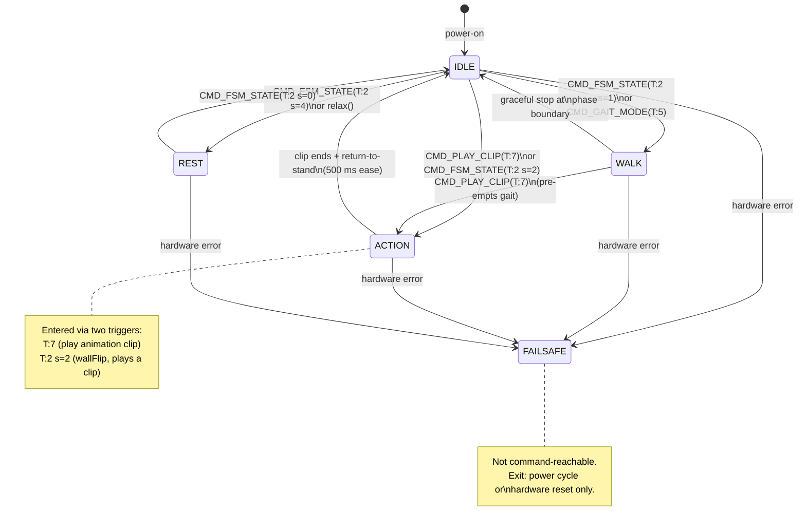
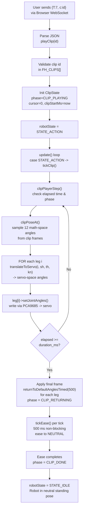
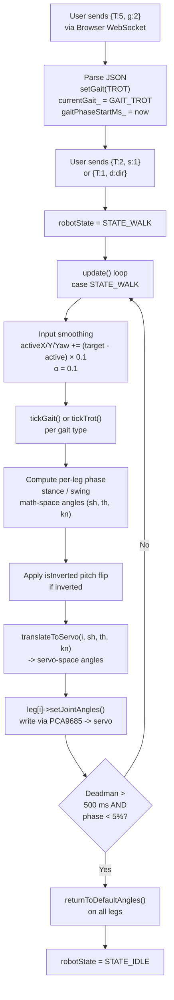
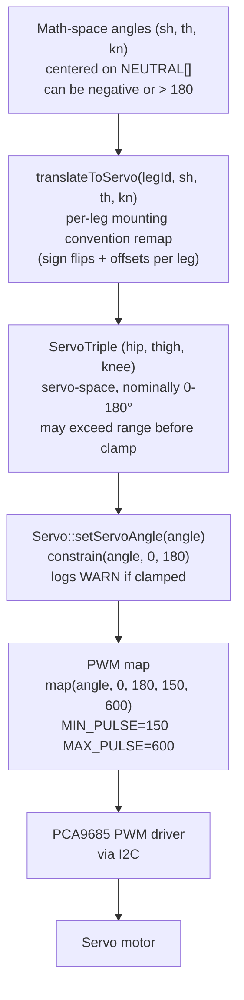

# FSM states

The firmware's motion control is implemented as a five-state FSM. At any moment the robot is in exactly one state, and only one motion source (gait or clip) drives the servos. Commands sent over WebSocket trigger transitions; the FSM never has concurrent owners.

## State diagram

## IDLE

IDLE is the default state. The robot stands in the neutral pose with servos stationary and no motion output. The `update()` loop does nothing in this state beyond holding the last-commanded angles (typically the neutral standing pose).

**Enter:** robot boots; `CMD_FSM_STATE` (T:2, `{"s": 0}`); gait gracefully stops at a clean phase boundary after the deadman switch fires; clip finishes the 500 ms return-to-stand ease.

**Exit:** `CMD_FSM_STATE` with `s:1` -> STATE_WALK; `CMD_FSM_STATE` with `s:4` -> STATE_REST; `CMD_PLAY_CLIP` (T:7) -> STATE_ACTION; `CMD_GAIT_MODE` (T:5) followed by `CMD_FSM_STATE` (T:2, s:1) -> STATE_WALK.

## WALK

WALK drives the looping locomotion cycle. The selected gait (WALK, TROT, or CRAB) runs via `tickGait()` or `tickTrot()`, computing angles for all four legs in sync from `globalPhase`. A GAIT_NONE selection keeps the robot stationary within this state.

**Enter:** `CMD_GAIT_MODE` (T:5, `{"g": 1/2/3}`) sets the gait type and transitions to STATE_WALK; `CMD_FSM_STATE` (T:2, `{"s": 1}`) with a non-NONE gait already selected.

**Motion:** direction is set via `CMD_MOVE` (T:1). Input is smoothed at alpha = 0.1 per tick. The deadman switch zeros targets after 500 ms of silence. Graceful stop waits for the active vector to be near zero and `globalPhase < 0.05` before returning all legs to NEUTRAL and entering IDLE. If `|activeYaw| > 0.05`, `tickYawRotation()` overrides the selected gait and spins the robot in place.

All gaits follow the same pipeline: sample joint angles in math-space from `NEUTRAL[]` plus deltas, apply the `isInverted` pitch flip to thigh/knee when the robot is inverted, call `translateToServo(legId, sh, th, kn)`, then write servo angles via `leg[i]->setJointAngles()`. Because every motion path runs through this same `applyServos` step, the robot can locomote while inverted.

**Exit:** `CMD_PLAY_CLIP` (T:7) -> STATE_ACTION (clip pre-empts gait); movement released and clean phase boundary -> IDLE; `CMD_FSM_STATE` (T:2, s:0) -> IDLE; `CMD_FSM_STATE` (T:2, s:4) -> REST.

## ACTION

ACTION plays a single-shot authored clip. Clips pre-empt gaits from any state. On clip completion the robot automatically eases back to neutral standing over 500 ms, then the FSM returns to IDLE.

**Enter:** `CMD_PLAY_CLIP` (T:7, `{"c": <clip_id>}`) -> CLIP_PLAYING phase; `CMD_FSM_STATE` (T:2, `{"s": 2}`) calls `wallFlip()`, which enters STATE_ACTION to play a clip. (Historically "wall flip" was a hard-coded animation; it is now just a clip played through STATE_ACTION.)

**Clip playback:** the clip player runs a three-phase lifecycle. In CLIP_PLAYING, each tick calls `clipPlayerStep()` which queries elapsed time and calls `clipPoseAt()` to linearly interpolate 12 math-space angles from the baked frame data. When `elapsed >= duration_ms`, the final frame is applied and the player moves to CLIP_RETURNING. In CLIP_RETURNING, each leg independently eases to NEUTRAL over `CLIP_RETURN_MS` (500 ms) via non-blocking per-servo easing. When the ease completes, the phase advances to CLIP_DONE and the next tick transitions `robotState` to STATE_IDLE.

**Exit:** clip end + return-to-stand complete -> IDLE (automatic); `CMD_FSM_STATE` (T:2, s:1) or `CMD_GAIT_MODE` (T:5) pre-empts and enters WALK.

## Invert (not a state)

Invert is an independent latching toggle, not an FSM state and not an ACTION maneuver. `CMD_ACTION_SELECTION` (T:6, `{"a": 0}`) calls `invertRobot()`, which flips the latching `isInverted` flag; `CMD_SET_INVERT` (T:9) calls `setInverted(bool)` to set the flag explicitly (a no-op if unchanged). Neither command changes `robotState`: the robot stays in whatever state it was already in.

Toggling invert mirrors whatever pose the robot is currently holding, in place: it reads each servo's current angle and flips the pitch joints only (`180 - angle` on thigh and knee; shoulder and hip are left unchanged), easing to the mirrored pose over roughly 300 ms. There are no hard-coded inverted-pose angles, and toggling off mirrors the current pose the same way toggling on does (it does not call `returnToDefaultAngles()`). The gait phase timer is reset and the eye sprite is updated (confused while inverted, front otherwise). A duplicate T:6 within 250 ms is debounced.

Because `isInverted` is latching and every motion path applies the same pitch mirror, the robot keeps the mirror through gaits, clips, and standing, so it can locomote upside-down.

## REST

REST holds all servos at 90° (mid-point of the 0-180° physical range). This is the safe-to-power-down pose: no joint is at an extreme and the robot is mechanically neutral. The `relax()` method sets all four legs to (90, 90, 90) immediately on entry.

**Enter:** `CMD_FSM_STATE` (T:2, `{"s": 4}`); the `relax()` method called from a serial or BLE UI.

**Exit:** `CMD_FSM_STATE` (T:2, s:0 or s:1) -> IDLE or WALK; `CMD_PLAY_CLIP` (T:7) -> STATE_ACTION.

## FAILSAFE

FAILSAFE is the emergency state entered when hardware detects a critical fault such as an I2C bus error or PCA9685 timeout. No user commands are processed. On every loop iteration, `update()` calls `returnToDefaultAngles()` on all four legs, repeatedly parking the robot in its standing pose and preventing a corrupted angle from getting stuck in hardware. FAILSAFE is not reachable via command and cannot be exited by command; recovery requires a power cycle or manual board reset.

## Signal pipelines

### Clip playback pipeline

Clip data is pre-scaled to 2/3 magnitude in the Blender exporter; firmware does not re-scale. `clipPoseAt()` is pure (no side effects). If another command arrives during playback (e.g., `CMD_GAIT_MODE`), the new state pre-empts immediately and the clip is discarded.

### Gait pipeline

Gaits use the same `translateToServo()` function as clips; the difference is the motion source. Yaw rotation overrides the selected gait when `|activeYaw| > 0.05`, applying a diagonal trot pattern that cancels translation and isolates rotation.

### Angle-to-servo path

The `constrain(0, 180)` clamp is the electrical safety backstop on every motion path. A flood of clamp warnings indicates a gait or clip is pushing joints out of range and amplitude should be reduced.

## Timing constants and gait parameters

### Timing constants

| Constant | Value | Purpose |
|----------|-------|---------|
| `CLIP_RETURN_MS` | 500 ms | Ease duration from clip end to NEUTRAL stand |
| Deadman switch | 500 ms | Reset targets if no command for >500 ms |
| Input smoothing alpha | 0.1 | Ramp rate for direction vector (X, Y, Yaw) per tick |

### Gait parameters

| Gait | Period (s) | Step Length (°) | Step Height (°) | Duty | Offsets [FR, FL, RR, RL] |
|------|------------|-----------------|-----------------|------|--------------------------|
| GAIT_NONE | 0.0 | 0.0 | 0.0 | 0.0 | [0, 0, 0, 0] |
| GAIT_WALK | 2.0 | 26.7 | 26.7 | 0.75 | [0.5, 0, 0.25, 0.75] |
| GAIT_TROT | 1.5 | 40.0 | 50.0 | 0.50 | [0.5, 0, 0, 0.5] |
| GAIT_CRAB | 1.5 | 20.0 | 33.3 | 0.50 | [0.5, 0, 0, 0.5] |

Step lengths and heights are tuned constants in the firmware. TROT is the exception: it runs through `tickTrot()`, which uses its own internal `STEP_LENGTH=40` / `STEP_HEIGHT=50` rather than the `GAITS[]` row above (that row's TROT step values are unused). The 2/3 SCALE factor applies only to clips (baked at export time in Blender); gait amplitudes are independent firmware parameters.
