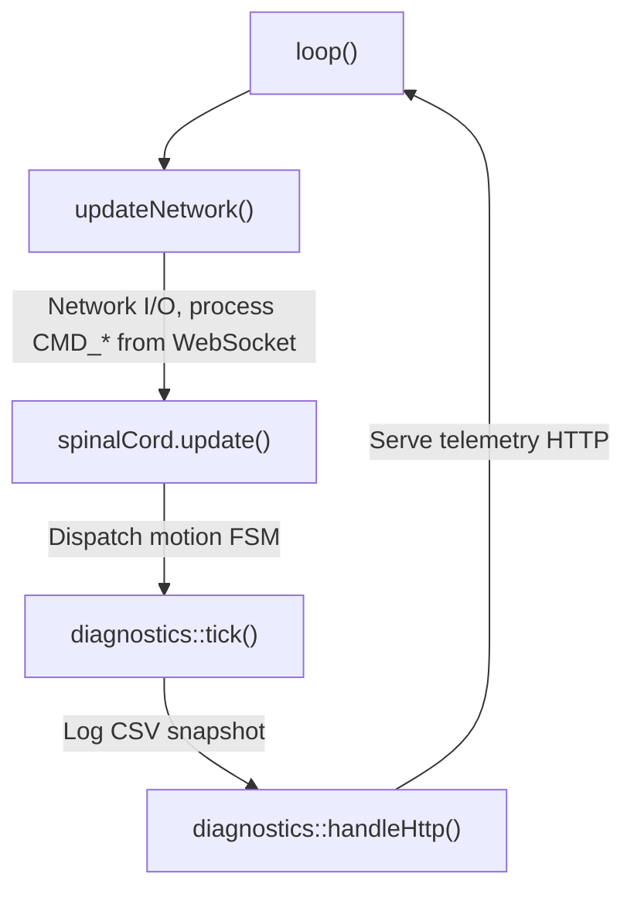

# Firmware

The FaceHugger firmware runs on an ESP32 and is organized into three logical layers: `brain/`, `nervous_system/`, and `shared/`. Understanding how these layers relate is the fastest way to navigate the codebase.

## Layer architecture

`brain/` handles everything that touches the outside world: WiFi, WebSocket command parsing, and sensor polling. It receives JSON commands and forwards them inward. `shared/` holds configuration structs, the `RobotState` enum, and data types that every other layer depends on. `nervous_system/` is where motion lives: it owns the gait engine (`spinal_cord.cpp`), the math brain (`kinematics.cpp` / `movements.h`), the per-leg hardware translator (`leg.cpp`), and the servo PWM driver (`servo.cpp`).

The data flow is one-directional: `brain/` parses a command and calls into `nervous_system/`; `nervous_system/` computes joint angles and writes PWM values via `servo.cpp` to the PCA9685 I2C driver; nothing in `nervous_system/` or `shared/` calls back into `brain/`.

## The 80% hardcoded pose / 20% calibration philosophy

Rather than computing servo positions from inverse kinematics at runtime, most of the standing and locomotion geometry is encoded directly as angle arrays. The key insight is that servo `90` is mechanically locked to mathematical `0°` (horizontal) by the physical calibration procedure: at assembly time, leg pieces are attached while all 12 channels are commanded to `90`, so the "Superman" T-pose is the physical zero of the coordinate system. From that anchor, every pose is expressed as signed degree offsets in math-space, and the `NEUTRAL[]` array records the stable standing pose for each of the four legs. Calibration (the 20%) is only the one-time physical assembly step; no per-servo software offset hunting is needed.

This means the firmware does not carry a general IK solver for locomotion. The gaits are phase-based angle schedules, and clips are baked angle timelines exported from Blender. The `translateToServo()` function is a mounting-convention remap, not inverse kinematics.

### Per-servo calibration (CALIB)

A spline tooth is a few degrees wide, so after the assembly-time horn step each thigh and knee still rests a degree or two off mechanical flat. The eight `CALIB_*_THIGH` / `CALIB_*_KNEE` macros in `shared/config.h` record the servo angle at which each link is actually flat (e.g. `CALIB_BR_THIGH = 103`), and `translateToServo` and the upside-down mirror both work from those values instead of from a hardcoded `90`. The end-user workflow lives in the [calibration guide](../../guide/calibration.md), and the per-joint mirror formula is documented under [Invert mirror and CALIB](../conventions.md#invert-mirror-and-calib).

## Main loop

The firmware runs a single-threaded, non-preemptive event loop on the ESP32. Each pass through `loop()` executes in the following order:



There is no fixed tick rate. The loop runs as fast as the ESP32 can cycle; execution speed is dominated by I2C servo writes and WebSocket polling, typically 50-100 Hz depending on I/O contention. There are no interrupts or RTOS threads. `spinalCord.update()` is the sole motion dispatcher per iteration.

Two control mechanisms keep motion safe in the absence of commands. The deadman switch resets all motion targets to zero if no movement command arrives within 500 ms:

```cpp
if (millis() - lastCommandMs > 500) {
    isMovingRequested = false;
    targetX = targetY = targetYaw = 0.0f;
}
```

Input smoothing prevents abrupt velocity changes by running an exponential moving average with alpha = 0.1 per tick:

```cpp
activeX   += (targetX   - activeX)   * 0.1f;
activeY   += (targetY   - activeY)   * 0.1f;
activeYaw += (targetYaw - activeYaw) * 0.1f;
```

A sudden "forward" command therefore ramps the robot up over roughly 10 ticks (100-200 ms) rather than snapping instantly.

## Module map

| File | Role |
|------|------|
| `spinal_cord.cpp/.h` | FSM dispatcher, gait engine, clip player |
| `kinematics.cpp/.h` | Coordinate geometry, math-space definitions |
| `movements.h` | `GaitParams` structs, `NEUTRAL[]` arrays, gait type enum |
| `leg.cpp/.h` | Per-leg pose application, `translateToServo()` remap, `constrain(0,180)` safety |
| `servo.cpp/.h` | PCA9685 I2C driver, PWM pulse mapping |

For the full motion pipeline (gait phases, clip interpolation, yaw rotation, and the invert pose-mirror) see [motion-engine.md](motion-engine.md). For the FSM states, transition conditions, and signal pipelines, see [fsm-states.md](fsm-states.md).

## Orientation and auto-flip

A single MPU6050 on the I2C bus tells the firmware which way is up. A boot-time classifier reads one accel sample so a robot powered on upside-down wakes up in the right invert mode; the running loop polls `tickImu()` and feeds the result through a 150°/30° hysteresis so the latched `isInverted` flag is decisive instead of chattering near 90°. The auto-flip gate that forwards the latch into `setInverted()` is `SpinalCord::tickAutoInvert`, called from both `main.cpp::loop()` (hardware) and the SIL — so the simulator's auto-flip behaviour is identical to the robot's by construction.

The user can freeze the gate over the wire (T:6 `CMD_SET_AUTO_INVERT`) without changing the current invert state, and the T:10 telemetry frame carries `pitch_deg`, `roll_deg`, `upside_down`, and `auto_invert_enabled` so the app's orientation tile and toggle stay in sync. See [orientation.md](orientation.md) for the full walk-through.
