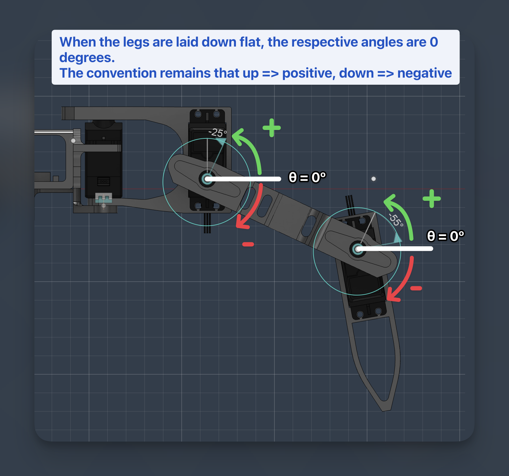
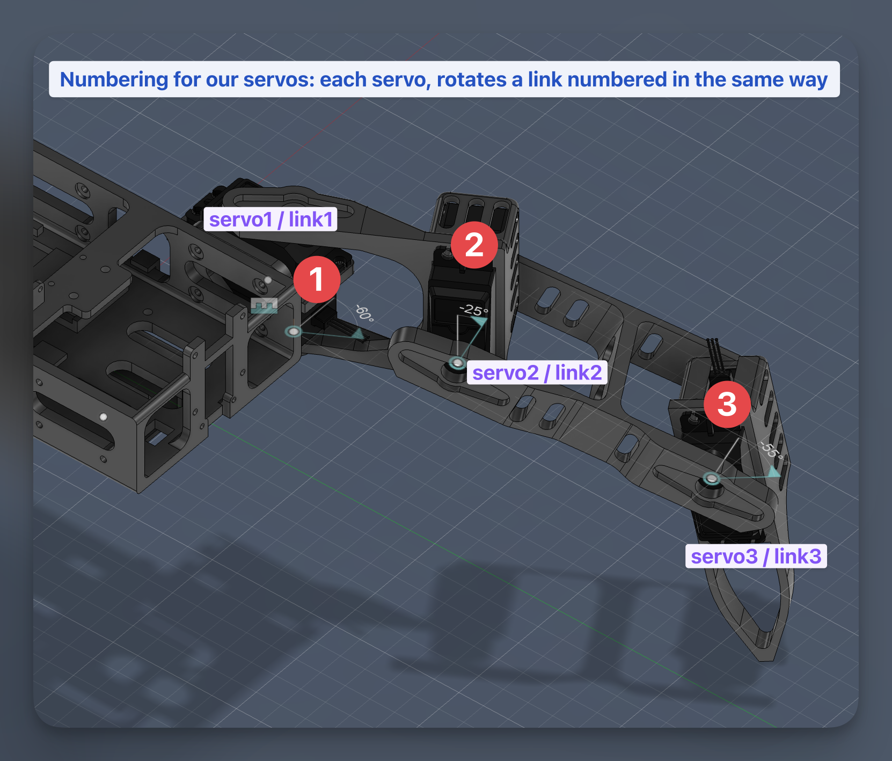
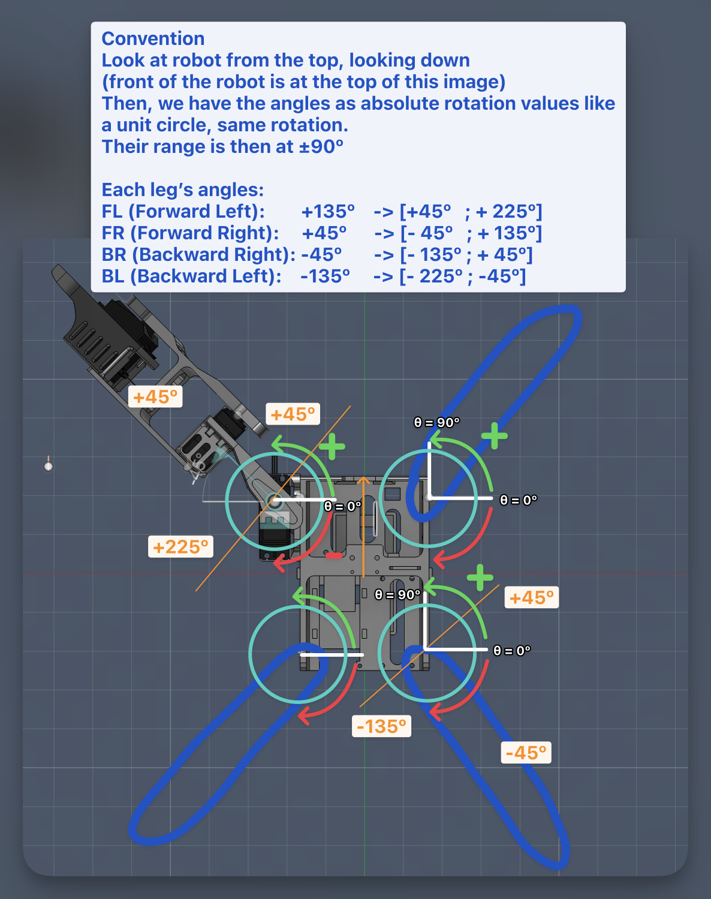

# Kinematics conventions

The URDF is the single source of truth for FaceHugger's kinematics. Every
consumer — PyBullet sim, Blender rig, firmware servo math, animation
exporter — is expected to agree with it. This page documents the
conventions baked into the URDF and walks through how the URDF is
generated from CAD and how PyBullet loads it.

For the CAD-side detail (the Fusion → URDF generator), see
[reference/animation/urdf-pipeline.md](../animation/urdf-pipeline.md).
For the firmware servo-angle convention (`translateToServo` + per-leg
CALIB), see [servo-conventions.md](servo-conventions.md).

## Convention quick-reference

**World frame**: `+X` right, `+Y` forward, `+Z` up.

**Leg naming**: `fl`, `fr`, `bl`, `br` everywhere in URDF, Python and
Blender. The firmware numbers legs `FR=0, FL=1, RR=2, RL=3`; `RR`/`RL`
are the same physical legs as `br`/`bl`. The translation lives at the
firmware boundary — never propagate `rr`/`rl` into Python or Blender.

**Joint names** in the URDF are `{leg}_link{1,2,3}_joint` (e.g.
`fl_link1_joint` for the front-left shoulder). The semantic mapping
`link1 = shoulder`, `link2 = hip`, `link3 = knee` lives in
`pybullet_sim.motor._joint_type_from_name`.

**Rest pose**: URDF `θ = 0` corresponds to each leg's Fusion mechanical
zero. Joint limits in the URDF are shifted by the Fusion `rest` value
so the range is symmetric about θ=0:

```
urdf_lower = fusion.min - fusion.rest
urdf_upper = fusion.max - fusion.rest
```

## Shoulder (link1) — yaw, Z axis

All four shoulders use a single uniform axis: `<axis xyz="0 0 1"/>`. A
positive shoulder angle rotates the leg counter-clockwise viewed from
above. The per-leg rest pose is encoded entirely in
`<joint><origin rpy="0 0 {rest_rad}"/>` — **not** in a per-leg axis
sign. This is *Convention A*. It means "+δ on every leg" rotates each
leg the same way around its own +Z; the rest already places each leg
in the right body quadrant.

The Fusion export only carries the FL leg's mechanical zero
(`Link1Revolute.limits_rad.rest`). The other three rests are derived:

| Leg | Body quadrant | Rest angle |
|---|---|---:|
| FL | -X +Y | -45° (−π/4) |
| FR | +X +Y | +45° (+π/4) |
| BR | +X -Y | +135° (+3π/4) |
| BL | -X -Y | -135° (−3π/4) |

Formula (see `urdf_gen.generate_urdf._shoulder_rest_for`):

```
FR = -FL
BR =  wrap_pi(FL + π)
BL = -wrap_pi(FL + π)
```

URDF shoulder limits are `[-90°, +90°]` for every leg (Fusion's
`[-135°, +45°]` shifted by `rest = -45°`).





## Hip (link2) and knee (link3) — pitch, Y axis

Both axes are along Y, with a per-side sign flip: `+Y` for the L pair
(FL, BR) and `-Y` for the R pair (FR, BL). The flip cancels out the
mirrored physical mounting of the servo horns between the L and R
brackets — so "horn-up = positive angle" describes the same physical
motion on every leg. Both rests are 0°: positive lifts the leg up,
negative drops it.



## URDF generation

Entry point: `python code/facehugger.py urdf`, which invokes
`urdf_gen.generate_urdf`. Inputs:

- `code/simulation/generated/fusion_export.json` — Fusion's export
  (per-mesh `origin_shift_mm`, occurrence tree, joint axes and limits).
- `code/simulation/facehugger_config.yaml` — per-leg handedness
  (`side: L|R`), servo physical properties, the base-link mass extra.
  Per-leg `rpy_z_deg`, `shoulder_limits_deg`, and `shoulder_neutral_deg`
  are no longer in the yaml — they are derived from the JSON.

Output is `generated/facehugger.urdf` with one `<link>` per chassis
body and three per leg (`{leg}_link1`, `{leg}_link2`, `{leg}_link3`).
Twelve revolute joints total. A `<!-- LEG ASSEMBLY METADATA -->` comment
block near the top carries the leg-assembly-local landmark positions
(`BodyToLink1Point`, `Link1ToLink2Point`, `Link2ToLink3Point`,
`FootTip`); consumers read it via `pybullet_sim.urdf_io` rather than
re-opening `fusion_export.json`.

Every mesh has its vertices pre-shifted in CAD so that mesh-local
`(0,0,0)` is the link frame's origin (the next joint's pivot). The
primary `<visual><origin>` is therefore identity; placement happens via
the joint chain. STL `scale="0.001 0.001 0.001"` always — meshes are
in millimetres.

For the deep walk-through (mesh re-origin, mount-point landmarks,
combined-rule meshes, the servo-role assignment) see
[reference/animation/urdf-pipeline.md](../animation/urdf-pipeline.md).

## PyBullet runtime

`python code/facehugger.py sim` boots PyBullet from
`generated/facehugger.urdf` and drives it. The flow is:

1. `pybullet_sim.kinematics.build_config` parses the URDF: joint
   origins, axes, limits per leg; foot-tip position in link3 frame
   (with `Ry(π)` applied for the R pair to mirror the shared
   `leg_upper`/`leg_lower` meshes); per-leg `hip_axis_sign` and
   `knee_axis_sign` from the URDF `<axis>` Y component.
2. `pybullet_sim.scene.connect_and_setup` connects, loads `plane.urdf`
   and `facehugger.urdf` at `(0, 0, body_height + 0.02)`, then builds
   the `joint_name → joint_idx` map.
3. `pybullet_sim.motor.reset_to_stance` bends each leg to the stance
   pose derived from the firmware's NEUTRAL (through `translateToServo`
   with SIL CALIB=90 → servo_angles_to_joint_targets, cached in
   `pybullet_sim.kinematics._NEUTRAL_HIP_KNEE`). Without this step the
   robot stays in rest pose — legs horizontal, the "starfish" layout —
   which is the visual that a flat URDF importer that doesn't apply joint
   state produces.
4. `pybullet_sim.motor.apply_leg_pose` then sends matching motor
   targets so gravity doesn't pull the bent joints back to zero.

After settling, `run_stand` idles the sim; for clips and gaits the
compiled firmware SIL (`firmware_sil.sil_bridge`) computes servo targets
and drives the joints through `apply_joint_targets`.

The body height (`cfg.body_height`) is computed by `build_config` as
the lowest foot Z in the neutral pose, so the body spawns clear of the
floor. With the current CAD it's ≈ 0.12 m; spawn lifts another 2 cm to
absorb collision penetration.

## Convention checklist for new code

- Shoulder axis is `+Z` global, never per-leg sign-flipped.
- Joint angles are in radians end-to-end; degrees only at yaml or UI
  boundaries.
- URDF `θ = 0` is the Fusion rest pose — not "leg straight along ±X".
- Limits come from the URDF (already shifted relative to rest); don't
  re-impose them in code.
- Leg IDs in URDF/Python/Blender are `bl`/`br`. Map to the firmware's
  `rl`/`rr` only at the firmware boundary.
- Link lengths and mount positions are read from the URDF, never
  hardcoded. The Fusion CAD revision can change at any time; anything
  pinned in Python source goes stale.
