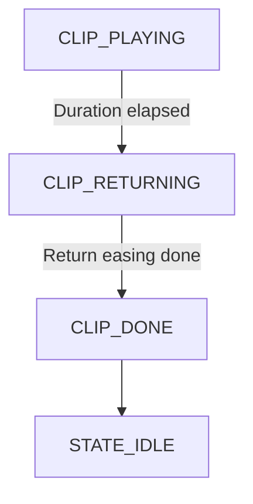
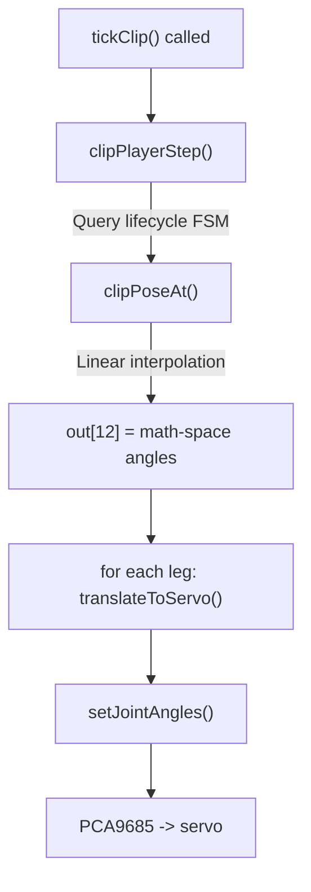
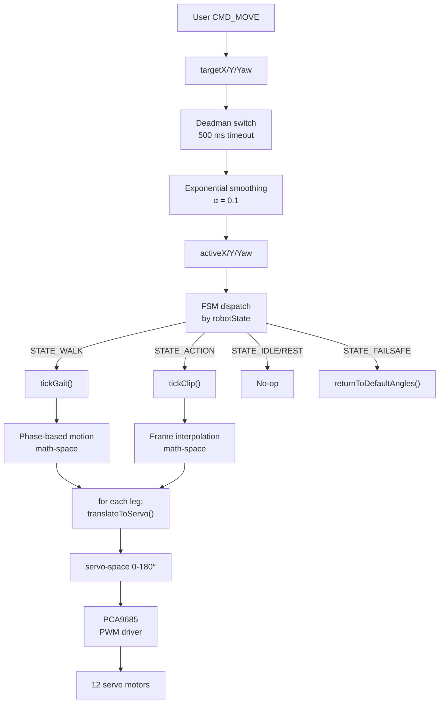

# Motion engine (gaits & clips)

The motion engine is the part of `nervous_system/` that turns smoothed direction inputs into 12 servo angles per tick. Two motion sources exist (the gait engine and the clip player), but only one drives the servos at any instant (the single-owner principle). Clips pre-empt gaits: a `CMD_PLAY_CLIP` switches `robotState` to `STATE_ACTION` and pauses the gait immediately.

## Gait mechanics

### Inputs and global phase

Each gait tick receives three smoothed float inputs in the range [-1, 1]: `activeX` (strafe), `activeY` (forward/back), and `activeYaw` (rotation). These are the outputs of the exponential moving average described in [index.md](index.md).

The gait engine also maintains a monotonic `globalPhase` in [0, 1) that advances with wall-clock time and wraps every `gait.period_s` seconds:

```cpp
const float t = (millis() - gaitPhaseStartMs_) / 1000.0f;
const float globalPhase = fmodf(t / cfg.period_s, 1.0f);
```

Each leg gets its own phase by subtracting its entry from the gait's phase-offset table:

```cpp
const float legPhase = fmodf(globalPhase - cfg.offsets[i] + 1.0f, 1.0f);
```

### Stance and swing

The duty cycle parameter divides the leg phase into two regions. When `legPhase < duty` the leg is in **stance**: the foot is on the ground and the hip sweeps backward at a rate proportional to progress through the stance window. When `legPhase >= duty` the leg is in **swing**: the foot is airborne, the hip reverses to carry the leg forward, and the thigh and knee lift together via a sinusoidal trajectory:

```cpp
if (legPhase < duty) {
    lift = 0.0f;
} else {
    const float p = (legPhase - duty) / (1.0f - duty);
    lift = sinf(p * M_PI) * cfg.step_height_deg;
}
th += lift;
kn -= lift;  // Mirror: thigh up -> knee folds
```

### Per-leg angle computation

Math-space angles are computed as offsets from `NEUTRAL[]`, the per-leg resting bias:

| Leg ID | Name | Shoulder | Thigh  | Knee   |
|--------|------|----------|--------|--------|
| 0      | FR   | 45.0°    | -60.0° | -37.0° |
| 1      | FL   | 75.0°    | -60.0° | -40.0° |
| 2      | RR   | -45.0°   | -50.0° | -50.0° |
| 3      | RL   | -135.0°  | -60.0° | -35.0° |

The shoulder (hip) joint handles forward motion and yaw. Forward sweep is scaled by `activeY`; yaw is blended in via per-leg sign coefficients so the robot steers:

```cpp
const float fwdDir = (i == LEG_FR || i == LEG_FL) ? 1.0f : -1.0f;
const float yawDir = (i == LEG_FR || i == LEG_RR) ? 1.0f : -1.0f;
const float fwdContrib = isCrab ? 0.0f : activeY;
sh += fwdDir * sweep * (fwdContrib + yawDir * activeYaw);
```

The thigh handles lateral (strafe) motion via `activeX`, with left and right legs having opposite signs. The knee contributes only via the swing lift described above.

### CRAB gait

CRAB suppresses the forward component entirely (`fwdContrib = 0`), leaving only lateral and yaw motion. This allows the robot to move sideways and spin in place without any forward travel, which is useful for orienting toward walls or obstacles.

### TROT gait

TROT uses discrete front-hip positions rather than a continuous sweep. Front legs snap between two positions (HIP_IN and HIP_OUT, scaled by forward magnitude) while rear legs still sweep continuously. This creates the characteristic "trotting" pattern with more pronounced stepping on the front pair.

### Graceful stop

The gait does not stop abruptly. It waits for a clean phase boundary where the front legs are in stance and the body is balanced before snapping all legs to NEUTRAL:

```cpp
if (!isMovingRequested && fabsf(activeX) < 0.01f && fabsf(activeY) < 0.01f
    && fabsf(activeYaw) < 0.01f && globalPhase < 0.05f) {
    // snap all legs to returnToDefaultAngles()
    robotState = STATE_IDLE;
    return;
}
```

The three conditions are: the user released the joystick (or the deadman switch fired after 500 ms), the active vector is near zero, and the phase is within the first 5% of the cycle. This prevents mid-stride jerks and ensures the robot settles stably.

### Yaw rotation

If `|activeYaw| > 0.05`, the gait branches to `tickYawRotation()` regardless of the selected gait type. This function uses diagonal trot phasing (FL + RR in stance, then FR + RL) with per-leg yaw coefficients chosen so all four hips rotate in the same effective direction during their stance phase. Translation forces cancel diagonally and only torque remains, so the robot spins in place.

## Gait profiles

Three built-in gaits are configured in `GAITS[]` in `spinal_cord.cpp`:

| Gait | Period (s) | Step Length (°) | Step Height (°) | Duty | Phase Offsets [FR, FL, RR, RL] |
|------|------------|-----------------|-----------------|------|--------------------------------|
| GAIT_WALK | 2.0 | 26.7 | 26.7 | 0.75 | [0.50, 0.0, 0.25, 0.75] |
| GAIT_TROT | 1.5 | 40.0 | 50.0 | 0.50 | [0.50, 0.0, 0.0, 0.50] |
| GAIT_CRAB | 1.5 | 20.0 | 33.3 | 0.50 | [0.50, 0.0, 0.0, 0.50] |

WALK uses a high duty cycle (0.75) so three legs are in stance at any moment, making it the slowest but most stable gait. TROT pairs diagonals (FL+RR vs. FR+RL) for medium-speed travel. CRAB shares TROT's phase offsets but suppresses forward motion.

The TROT step length/height shown above (40/50) are `tickTrot()`'s own internal constants; TROT branches to `tickTrot()` and ignores the `GAITS[]` array's TROT step_length/step_height row.

A phase offset of 0.5 means "halfway through the global cycle." With duty = 0.5, a leg with offset 0.5 is in swing exactly when the leg with offset 0.0 is in stance, producing the diagonal pairing.

## Clip player

Clips are one-shot authored gestures exported from Blender. The player uses the same `translateToServo()` function as the gait engine; only the motion source differs (frame interpolation instead of phase synthesis).

### Lifecycle



### Pipeline per tick



### Frame interpolation

`clipPoseAt()` performs linear interpolation between baked frames using elapsed time:

```cpp
const float f = (elapsed_ms - lo.t_ms) / (hi.t_ms - lo.t_ms);
out[j] = lo.a[j] + (hi.a[j] - lo.a[j]) * f;
```

Clip data is pre-scaled to 2/3 magnitude in the Blender exporter and baked into the frame data. The firmware reads the scaled values directly and never re-scales.

### URDF clip-clamp envelope

Clips authored in Blender used to occasionally overshoot what the physical leg can do — a thigh keyframe a few degrees past its mechanical stop made it onto the wire and the servo would stall against the joint. Inside `tickClip`, every per-frame pose now passes through `clampClipServos(legId, ...)` (`motion_math.cpp`) before reaching `applyServos`. The envelope is derived from the URDF joint limits (shoulder tight side ±52°, thigh ±60°, knee ±90°) and centred on each joint's per-leg `CALIB` so a post-calibration NEUTRAL sits on the window edge instead of being clipped by a uniform `[30, 150]`. The half-widths are macros in `shared/config.h` (`HIP_CLAMP_FROM_NINETY`, `THIGH_CLAMP_FROM_CALIB`, `KNEE_CLAMP_FROM_CALIB`).

The clamp applies on the clip path only — gait and calibration output stay bit-for-bit. When a frame requests an angle outside the envelope, the underlying `Servo::setServoAngle` also emits an `[OOR] servo <ch> requested <deg>` line on the serial monitor (and into the SIL telemetry's `pre_clamp_deg`), so the boundary failure is visible instead of silent.

### Return-to-stand

When the clip reaches its last frame, the player triggers a non-blocking ease back to NEUTRAL over 500 ms:

```cpp
if (step.action == CLIP_ACT_BEGIN_RETURN) {
    for (uint8_t i = 0; i < LEG_COUNT; ++i)
        legs[i]->returnToDefaultAnglesTimed(CLIP_RETURN_MS);  // 500 ms ease
}
```

Each servo independently eases to its NEUTRAL angle. The clip does not loop; playback completes and the FSM transitions to STATE_IDLE automatically.

### invertRobot (invert toggle)

`invertRobot()` (`T:6`) toggles the `isInverted` flag and flips the pose the robot is currently holding, in place: it reads each servo's current angle, mirrors the pitch joints (`2 * CALIB - angle` on thigh and knee, shoulder unchanged), and eases there over ~300 ms via `setJointAnglesTimed`. The earlier hard-coded inverted-pose table was dropped; the flip is now computed from the live pose and eased, not an instant snap to fixed angles. `setInverted()` (`T:9`) does the same but sets the flag explicitly instead of toggling. A duplicate `T:6` within 250 ms is debounced.

While `isInverted` is active, every motion source routes through `applyServos`, which applies the same pitch mirror, so gaits, clips, and the standing pose are all mirrored and the robot can locomote upside-down. Because the eased flip uses a timed move, `update()` advances `tickEase()` outside the clip path each loop, and a direct servo write (a gait or stand tick) supersedes a pending ease, so an in-progress flip is overridden cleanly when motion resumes.

### `applyServos` / `applyInvert` choke point

There is exactly one place in the firmware where math-space angles become servo writes: `SpinalCord::applyServos()` in `spinal_cord.cpp`. Every motion source - `tickGait`, `tickTrot`, `tickYawRotation`, `tickClip`, `goToNeutral`, the stand path - converts to servo space with `translateToServo` and then calls `applyServos`, never `leg->setJointAngles` directly. `applyServos` runs `applyInvert(legId, s, isInverted)` and only then writes the servo angles.

The point of the single choke is that the upside-down pitch mirror is applied centrally, in servo space, on every path - not duplicated into each gait or clip routine. `applyInvert` itself is pure and host-tested, and uses the per-joint mirror `2 * CALIB_*_BY_LEG[legId] - angle` so the mirror lands on real mechanical flat regardless of where the horn happens to sit. See [Invert mirror and CALIB](../conventions.md#invert-mirror-and-calib) for the formula and rationale.

### Live invert via `tickAutoInvert`

The choke point above is *where* the mirror happens; `setInverted` is *what* flips it. When the IMU latches upside-down (or the user sends T:9), `setInverted` flips the `isInverted` flag and calls `flipPoseInPlace(INVERT_EASE_MS)`, which reads each leg's current servo angles and eases them to their mirrored values (`applyInvert(legId, current, true)`) over ~300 ms. The next motion tick naturally produces the mirrored pose anyway — every gait/clip frame already runs through `applyServos` — so `flipPoseInPlace` exists for the *quiet* states: standing, idle, holding a clip's end frame. Without it, an inverted-while-standing robot would just sit in the upright pose until the user sent the next move.

The edge-triggered gate that decides when to call `setInverted` from the IMU lives on `SpinalCord::tickAutoInvert(bool imuInverted)`. It uses an instance-member latch (`prevImuInverted_`) so the call fires once per flip, respects a user-controlled `autoInvertEnabled_` flag (T:6), and is invoked from both `main.cpp::loop()` and the SIL's `bindings.cpp::tick()` so hardware and simulation behave identically. See [Orientation and auto-flip](orientation.md) for the full IMU pipeline.

## Eased pose transitions (T:2 `dur_ms`)

Snapping a four-legged robot from a clip's end pose to the calibration-flat REST is jarring and can overshoot, especially if the user is holding the chassis or another motion is mid-ease. The `CMD_SET_STATE` (T:2) command therefore accepts an optional `dur_ms` field for the pose states `STATE_REST` and `STATE_STAND`: when present and > 0, the firmware eases every joint to its target over that many milliseconds instead of snapping. Non-pose states (WALK, ACTION, IDLE) ignore the field.

The handler in `brain/network.cpp` runs the wire value through `clampPoseEaseMs` so any value outside `[0, POSE_EASE_MS_MAX]` (5000 ms) is clamped — a buggy or malicious app cannot park the robot in an arbitrarily long ease during which the user can't take control back. Inside `SpinalCord`, `relax(ms)` and `stand(ms)` use `setJointAnglesTimed` / `easeToNeutral(ms)` for the timed path. `easeToNeutral` itself routes through `applyServos`, so an inverted robot eases to the *inverted* neutral instead of un-inverting halfway through the move.

## Motion architecture summary



## translateToServo()

`translateToServo()` remaps math-space angles to servo-space (0-180°) accounting for how each leg is physically mounted. Sign flips and offsets differ per leg because two legs face forward and two face rear, and some have mirrored servo brackets. This is not a clamp and not inverse kinematics; it is a purely mechanical remap. For the per-leg formulas see [../conventions.md](../conventions.md) (or `servo-conventions.md` in this section).
