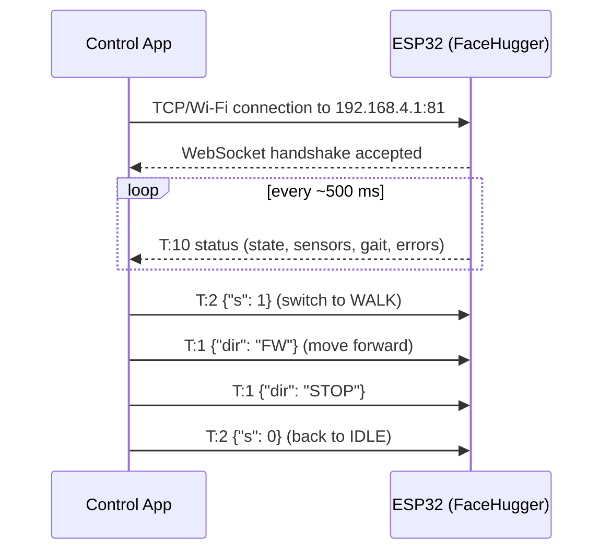

# WebSocket API

FaceHugger does not connect to your home router. Instead, the ESP32 acts as a **Wi-Fi access point**: it broadcasts its own network, and the phone running the control app connects directly to it — no internet, no router required.

## Connecting

1. **Join the robot's Wi-Fi network** — look for `FaceHugger_Net` in your Wi-Fi settings and connect using the password `12345678`.
2. **Open the app** — the app connects to `ws://192.168.4.1:81` automatically on startup.
3. **Wait for the heartbeat** — once the WebSocket is open, the robot begins sending a status packet every ~500 ms. The app shows the robot as connected when this arrives.

That's it. There's no pairing step, no account, and no cloud relay.

## How communication works

The link is **bidirectional JSON**. Messages in both directions are minified JSON objects, one per WebSocket frame, identified by a `T` field (the message type).

- **Commands (app → robot):** `T:1` through `T:7`. The app sends these when the user taps a button or moves a joystick.
- **Telemetry (robot → app):** `T:10`. The robot sends this every ~500 ms as a heartbeat; the app uses it to display the current state, sensor readings, and any errors.

## Safety behaviours

Two automatic safety behaviours are worth knowing:

- **Movement timeout:** if no `T:1` direction command arrives within 2 seconds while the robot is walking, it automatically returns to the idle pose. You do not need to send a stop command — the timeout handles it.
- **Angle clamp:** every servo write, regardless of source, is clamped to 0–180 degrees. Out-of-range values are silently clamped rather than rejected, and a warning is printed to the serial monitor.

## Full protocol reference

For the complete list of message types, field definitions, FSM states, gait IDs, clip IDs, and telemetry fields, see [Reference → WebSocket API](../api.md).
