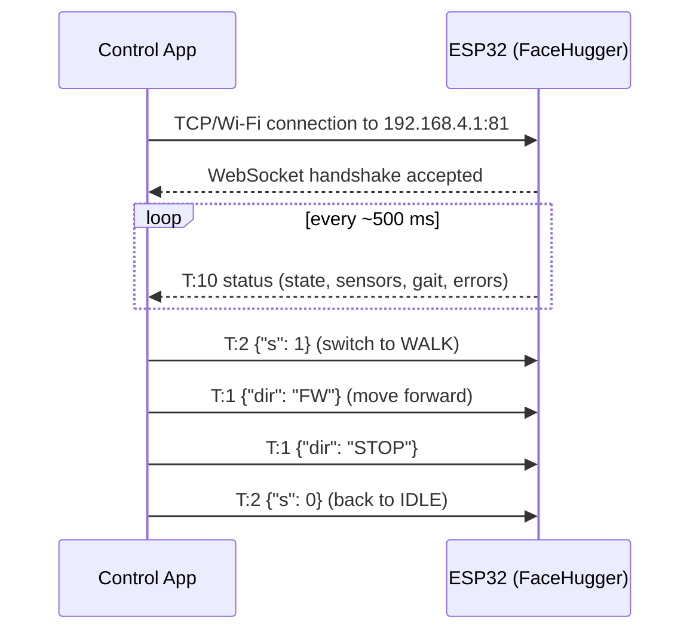

# WebSocket API

FaceHugger does not connect to your home router. Instead, the ESP32 acts as a **Wi-Fi access point**: it broadcasts its own network, and the phone running the control app connects directly to it - no internet, no router required.

## Connecting

1. **Join the robot's Wi-Fi network** - look for `FaceHugger_Net` in your Wi-Fi settings and connect using the password `12345678`.
2. **Open the app** - the app connects to `ws://192.168.4.1:81` automatically on startup.
3. **Wait for the heartbeat** - once the WebSocket is open, the robot begins sending a status packet every ~500 ms. The app shows the robot as connected when this arrives.

That's it. There's no pairing step, no account, and no cloud relay.

## How communication works

The link is **bidirectional JSON**. Messages in both directions are minified JSON objects, one per WebSocket frame, identified by a `T` field (the message type).

- **Commands (app → robot):** `T:1` through `T:7`. The app sends these when the user taps a button or moves a joystick.
- **Telemetry (robot → app):** `T:10`. The robot sends this every ~500 ms as a heartbeat; the app uses it to display the current state, sensor readings, and any errors.

## Safety behaviours

Two automatic safety behaviours are worth knowing:

- **Movement timeout:** if no `T:1` direction command arrives within 2 seconds while the robot is walking, it automatically returns to the idle pose. You do not need to send a stop command - the timeout handles it.
- **Angle clamp:** every servo write, regardless of source, is clamped to 0-180 degrees. Out-of-range values are silently clamped rather than rejected, and a warning is printed to the serial monitor.
- **Stop on tab switch:** when you swipe away from the Actions tab, the app sends `T:2 {"s": 0}` (STATE_IDLE) so any in-flight firmware clip (`T:7`) stops instead of running invisibly under another screen. The robot holds its last commanded pose; tap Neutral stance to reset. See [Remote control app → Stop-on-blur](index.md#stop-on-blur).

## Orientation, auto-flip, and pose easing

Two more wire-level details are worth calling out, both newer than `api.md`:

- **T:6 is now `CMD_SET_AUTO_INVERT`.** The packet shape is `{"T": 6, "enabled": <bool>}` and it toggles whether the firmware's IMU-driven auto-flip gate (`SpinalCord::tickAutoInvert`) is allowed to push the upside-down latch into `setInverted()`. Disabling freezes the gate at the *current* `isInverted` value - useful for explicit-only control via `T:9`. A missing or non-`bool` `enabled` key is a no-op (warns on the serial monitor); use this to probe the toggle without changing it. The old "play the invert clip" semantics of T:6 are gone - the live mirror-in-place is what T:6 now controls. See [Firmware → Orientation and auto-flip](../firmware/orientation.md).
- **T:2 accepts an optional `dur_ms`.** When you send `{"T": 2, "s": 1, "dur_ms": 800}` (STAND) or `{"T": 2, "s": 4, "dur_ms": 600}` (REST), the firmware eases the pose over that many milliseconds instead of snapping. The value is clamped to `[0, 5000]`; non-pose states ignore the field. Lets the caller tune transitions to the surrounding motion rather than always taking a hard cut. See [Motion engine → Eased pose transitions](../firmware/motion-engine.md#eased-pose-transitions-t2-dur_ms).

The T:10 telemetry frame has four new fields piggybacking on the existing payload at the firmware's 10 Hz broadcast cadence:

- `pitch_deg` - accel-only pitch, nose-up positive.
- `roll_deg` - accel-only roll, right-side-down positive.
- `upside_down` - the latched `isInverted` boolean, after the 150°/30° hysteresis.
- `auto_invert_enabled` - current value of the T:6 toggle, mirrored back so the app's switch stays in sync across reconnects.

The fields are emitted whether or not an MPU6050 is wired up; when `imuReady()` is false they report the last-known (zero on boot) values rather than vanishing from the packet, so consumers can assume a stable schema.

## Full protocol reference

For the complete list of message types, field definitions, FSM states, gait IDs, clip IDs, and telemetry fields, see [Reference → WebSocket API](../api.md).
