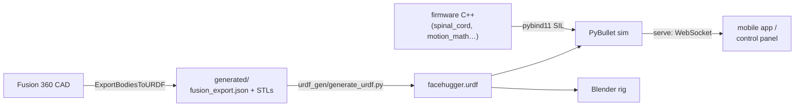

# Simulation

FaceHugger has a PyBullet simulation that runs the robot from the **same URDF the CAD pipeline generates** and, for motion, from the **exact firmware C++ compiled to the host**. That means a clip or gait you validate in the sim issues the same servo commands the real robot would — the sim is a faithful stand-in, not a separate re-implementation.

Everything lives in `code/simulation/` and is driven through one entry point, `facehugger.py`. There are three ways to read this section:

- **[FaceHugger CLI](cli.md)** — every `facehugger.py` subcommand (`urdf`, `sim`, `blender`, `serve`, `all`) and flag, and how to run them.
- **[Controlling the simulation](pybullet-control.md)** — how the simulator actually drives the robot: the firmware software-in-the-loop (SIL) path vs the Python re-port, clips vs gaits vs stand, the WebSocket server that lets the real app drive the sim, and the torque/telemetry instrumentation.
- **[Torque analysis](torque-analysis.md)** / **[Torque heatmap](torque-heatmap.md)** — the static torque budget and the per-joint load study.

## How the simulator relates to the rest of the system

The URDF is the kinematic source of truth (see [Conventions](../conventions.md) for the angle spaces and per-leg servo mapping that the sim, firmware, and exporter all share). The simulation consumes that URDF for geometry and the compiled firmware for behaviour.

## Requirements

Run everything from `code/simulation/` with **Python 3.12**. On macOS, PyBullet has no PyPI wheel — install it from conda-forge (`conda install -c conda-forge pybullet`) before `pip install -r requirements.txt`; Linux/CI can `pip install` directly. The firmware SIL additionally needs **CMake ≥ 3.15 + a C++17 compiler + pybind11** (it auto-builds on first use); without a C++ toolchain, pass `--python` to fall back to the pure-Python re-port.
