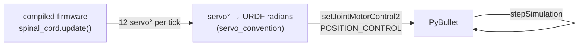

# Controlling the simulation

This page explains how the simulator actually *drives* the robot: where the joint angles come from, how clips and gaits differ, how the real app can drive the sim, and the torque/telemetry instrumentation. For the command surface and flags, see the [CLI](cli.md).

## The control model: firmware in the loop

Every motion mode follows the same per-step loop at 240 Hz. The novel part is *where the target angles come from*: by default, **the exact firmware C++ computes them**, compiled to the host as a Python module (`fh_sim`) via pybind11 — software-in-the-loop (SIL).



Each tick the bridge advances the firmware's clock, runs one `update()`, reads back the 12 servo angles the firmware computed (post-`translateToServo`, post-clamp — the same values the PCA9685 would receive), converts servo degrees to URDF joint radians using the **same per-leg convention the firmware uses** (see [Conventions](../conventions.md)), and commands each joint with `setJointMotorControl2(POSITION_CONTROL)` capped at the servo's effort (2.94 N·m) and velocity. Because the firmware itself is in the loop, a clip or gait that looks right in the sim issues byte-identical servo commands on the robot.

### Default (firmware SIL) vs `--python`

| | Default — firmware SIL | `--python` |
|--|--|--|
| Source of motion | the exact compiled firmware (`fh_sim`) | a Python re-port of the firmware (`firmware_port/`) |
| Needs | CMake + C++17 + pybind11 (auto-builds) | nothing beyond PyBullet |
| Use when | you want true parity with the robot | you have no C++ toolchain, or want the reference re-port |

The `fh_sim` module **auto-rebuilds** whenever the firmware/HAL/binding sources change, so `--sim` never silently runs stale firmware. A parity test suite asserts each clip's full servo-angle trace is bit-identical to a committed golden, so any firmware change that shifts an angle fails CI.

## Stand, gaits, and clips

- **Stand** (no mode flag): the robot holds the `NEUTRAL[]` pose. Quasi-static; the per-joint hold torque is small (peak ≈ 0.24 N·m, ~8 % of stall).
- **Gaits** (`--walk` / `--trot`): the firmware's `tickGait` / `tickTrot` run continuously. The sim sets the gait once and **re-issues the move command every tick** so the firmware's 500 ms deadman never trips and the gait keeps running — literally the app's command stream at 240 Hz. The robot spawns at the neutral-stance body height (stable, since the gait oscillates around `NEUTRAL[]`).
- **Clips** (`--clip NAME`): the firmware's clip player samples a baked, EMA-smoothed math-space frame timeline, converts, and writes. At the end it eases back to the (invert-aware) neutral. Clips are authored in Blender — see [Blender → robot clips](../animation/clip-panel.md).

`--float` pins the body weightless with no floor, so you see the pure joint geometry of a clip or gait without balance/collapse confounds — the best way to compare the sim's joint motion against the real robot.

## `serve` — drive the sim like the robot

`facehugger.py serve` exposes the [WebSocket robot API](../remote-control/websocket-api.md) (the `T:` protocol) on port **8081**, with the command dispatch handled by the **compiled firmware's own** `network.cpp::handleParsedMessage`. So any change to the firmware's API handling reflects automatically — there is no Python mirror to drift.

```bash
python facehugger.py serve --host 0.0.0.0 --gui
```

Two clients can drive it:

- **`tools/robot_control_panel.html`** — a single-file, no-build panel. Set the target to `ws://localhost:8081`, then use one button per command (list/play clips, set gait, move, invert, calibrate). Direction buttons auto-repeat while held (to beat the deadman), and a sticky rail shows all-leg telemetry.
- **The real mobile app** (`code/remote-control-app/MyApp`) — set `webSocketPort = 8081` and `webSocketIP` to the dev machine's LAN IP in `config/config.ts`, run `serve --host 0.0.0.0`, and the app drives the sim exactly as it drives the robot. Revert the port to `81` to target hardware again.

!!! note "The deadman is real"
    A single move command stops after ~500 ms (the firmware deadman), and a gait does nothing until a gait is *also* selected. This is faithful firmware behaviour, not a sim quirk — the panel/app must re-issue a held direction, and you must set a gait (`T:5`) before moving.

### Live telemetry (SSE :8082)

Alongside the WebSocket API, `serve` streams a per-joint telemetry frame over Server-Sent Events on **:8082** (`/telemetry`) at ~20 Hz. Each joint reports both the **servo-space** command (what the robot's servos receive) and that command in **URDF-joint degrees** (comparable to the measured angle), plus the tracking delta, torque, estimated current, and any firmware pre-clamp `[OOR]` request. The control panel renders this as a table; with `--gui` the PyBullet links are also torque-tinted. (SSE is best-effort: the WebSocket API still runs if `sse-starlette`/`uvicorn` aren't installed.)

## Torque instrumentation

PyBullet reports the torque the position controller applied at each joint (`getJointState()[3]`). From that the sim estimates per-servo current and flags overload. The coloring and the `--monitor` flags share one band function, referenced to two torque levels:

| Band | Range | Meaning |
|------|-------|---------|
| **green** | < ~0.98 N·m (continuous) | safe to hold continuously |
| **amber** | continuous … stall | burst-only — fine for brief transients, not sustained |
| **red** | ≥ 2.94 N·m (stall) | saturated — the motor can't supply more / can't track its target |

The continuous reference is ≈ ⅓ of stall (a rule of thumb for hobby metal-gear servos — the DSS-230MG datasheet lists stall only). So **standing is solidly green**; brief fast-clip frames read amber (honest "burst"); and red is reserved for true saturation at the effort cap. If a fast clip latches red, the sim is telling you that motion genuinely demands more than the servo can deliver at that speed — slowing the clip (or capping joint velocity) is the fix, not a threshold tweak.

- `--monitor` prints a periodic line: per-leg angles, peak torque, total estimated current (`[WARN >10A]` over budget), and `[CONT]` / `[STALL]` joint lists.
- `--log` additionally records every step and, on exit, writes `sim_log.csv` + a `sim_log.png` plot.

## Where the code lives

| Concern | File (`code/simulation/`) |
|---------|---------------------------|
| CLI dispatch | `facehugger.py` |
| Sim modes, spawn, settle, monitor hook | `pybullet_sim/gaits.py`, `pybullet_sim/simulate.py` |
| Torque/current model + bands | `pybullet_sim/sim_monitor.py` |
| Firmware SIL bridge (clips, gaits, telemetry) | `firmware_sil/sil_bridge.py` |
| Compiled-firmware module + build | `firmware_sil/` (`bindings.cpp`, `CMakeLists.txt`, `hal/`) |
| WebSocket robot API | `firmware_sil/ws_sim.py` |
| Python re-port (`--python`) | `firmware_port/` |
