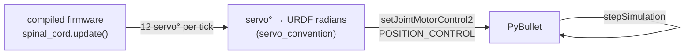

# Controlling the simulation

This page explains how the simulator actually *drives* the robot: where the joint angles come from, how clips and gaits differ, how the real app can drive the sim, and the torque/telemetry instrumentation. For the command surface and flags, see the [CLI](cli.md).

The simulation is built from two halves. Its **geometry** (the links, joints, masses, and limits) comes from the generated URDF, the same file the [3D model to URDF](../animation/urdf-pipeline.md) stage produces, so the robot you simulate is the robot the CAD describes. Its **control** (what angle each joint should hold) comes from the compiled firmware. This page is about the control half; the URDF page covers the geometry half.

## The control model: firmware in the loop

Every motion mode follows the same per-step loop at 240 Hz. The novel part is *where the target angles come from*: by default, **the exact firmware C++ computes them**, compiled to the host as a Python module (`fh_sim`) via pybind11. This is software-in-the-loop (SIL).



Each tick the bridge advances the firmware's clock, runs one `update()`, reads back the 12 servo angles the firmware computed (post-`translateToServo`, post-clamp, the same values the PCA9685 would receive), converts servo degrees to URDF joint radians using the **same per-leg convention the firmware uses** (see [Conventions](../conventions.md)), and commands each joint with `setJointMotorControl2(POSITION_CONTROL)` capped at the servo's effort (2.94 N·m) and velocity. Because the firmware itself is in the loop, a clip or gait that looks right in the sim issues byte-identical servo commands on the robot.

### Default (firmware SIL) vs `--python`

| | Default (firmware SIL) | `--python` |
|--|--|--|
| Source of motion | the exact compiled firmware (`fh_sim`) | a Python re-port of the firmware (`firmware_port/`) |
| Needs | CMake + C++17 + pybind11 (auto-builds) | nothing beyond PyBullet |
| Use when | you want true parity with the robot | you have no C++ toolchain, or want the reference re-port |

The `fh_sim` module **auto-rebuilds** whenever the firmware/HAL/binding sources change, so a fresh `sim` never silently runs stale firmware. The staleness check scans the whole firmware `src/` tree, and `clips_all.h` lives there, so re-exporting clips (which rewrites the firmware copy) marks the module stale and the next launch recompiles it. A parity test suite asserts each clip's full servo-angle trace is bit-identical to a committed golden, so any firmware change that shifts an angle fails CI.

Because the SIL compiles `shared/config.h` directly, it picks up the same per-servo `CALIB_*_THIGH` / `CALIB_*_KNEE` values the robot is flashed with. Both `translateToServo` and the upside-down `applyInvert` mirror (`2 * CALIB - angle`) therefore evaluate identically in the sim and on hardware - editing a CALIB value and relaunching `sim` shifts the simulated robot's stand and mirror in the same way it shifts the real one, with no separate sim-side calibration to keep in sync. See [Invert mirror and CALIB](../conventions.md#invert-mirror-and-calib).

The rebuild happens **at launch**: a long-running process loads `fh_sim` once and a compiled extension is not hot-reloaded. So after re-exporting or re-flashing clips you must **restart** a running `sim` for the new clips to appear; otherwise the old in-memory module keeps serving the previous clip set.

### IMU emulation in PyBullet

The host has no MPU6050, but the firmware's auto-flip path is part of what we want to verify in the sim. So the bridge synthesises an IMU sample from PyBullet's body orientation each step. `update_imu_from_pybullet` (`firmware_sil/sil_bridge.py`) reads the base quaternion, derives the body-frame gravity vector, applies the same 150°/30° hysteresis the firmware uses (`imu_hysteresis_step` mirrors `imu_hysteresis.h` exactly, including the strict inequalities), computes pitch and roll with the firmware's accel-only formula (`pitch = atan2(ay, sqrt(ax² + az²))`, `roll = atan2(-ax, az)`), and pushes all three through `fc.set_imu_upside_down` / `set_imu_pitch_deg` / `set_imu_roll_deg` so `imuIsInverted()`, `imuPitchDeg()`, and `imuRollDeg()` return the same values the chip would have read on hardware. The latched state is threaded across ticks by the caller (`ws_sim.py::step` and the gait/clip drivers in `sil_bridge.py`).

With `--gui` you can grab the chassis and roll it past 150° to see the auto-flip latch fire (Ctrl-drag rotates the selected body in PyBullet's window). The robot's pose mirrors in place, just like on hardware.

The crucial sequencing detail lives in `bindings.cpp::tick`: it calls `spinalCord.tickAutoInvert(imuIsInverted())` *before* `spinalCord.update()`, mirroring the order `main.cpp::loop()` runs on the ESP32. Earlier the gate lived inline in `main.cpp::loop()` and the SIL `tick` skipped it entirely, so the simulator saw the IMU but never auto-flipped from it; moving the gate onto `SpinalCord` and calling it from both entry points fixed that and is what makes the two paths behave identically. See [Firmware → Orientation and auto-flip](../firmware/orientation.md).

## Stand, gaits, and clips

- **Stand** (no mode flag): the robot holds the `NEUTRAL[]` pose. Quasi-static; the per-joint hold torque is small (peak ≈ 0.24 N·m, ~8 % of stall).
- **Gaits** (`--walk` / `--trot`): the firmware's `tickGait` / `tickTrot` run continuously. The sim sets the gait once and **re-issues the move command every tick** so the firmware's 500 ms deadman never trips and the gait keeps running, literally the app's command stream at 240 Hz. The robot spawns at the neutral-stance body height (stable, since the gait oscillates around `NEUTRAL[]`).
- **Clips** (`--clip NAME`): the firmware's clip player samples a baked, EMA-smoothed math-space frame timeline, converts, and writes. At the end it eases back to the (invert-aware) neutral. Clips are authored in Blender, see [Blender → robot clips](../animation/clip-panel.md).

`--float` pins the body weightless with no floor, so you see the pure joint geometry of a clip or gait without balance/collapse confounds. It is the best way to compare the sim's joint motion against the real robot.

## `sim --serve`: drive the sim like the robot

`facehugger.py sim --serve` exposes the [WebSocket robot API](../remote-control/websocket-api.md) (the `T:` protocol) on port **8081**, with the command dispatch handled by the **compiled firmware's own** `network.cpp::handleParsedMessage`. So any change to the firmware's API handling reflects automatically; there is no Python mirror to drift. (`facehugger.py serve` is a deprecated alias for `sim --serve` and still works.)

```bash
python code/facehugger.py sim --serve --host 0.0.0.0
```

Two clients can drive it:

- **The browser [control panel](../remote-control/control-panel.md)** (`code/remote-control-app/control-panel/robot_control_panel.html`): a single-file, no-build debug client. The quickest way to open it is `sim --panel`, which hosts it over HTTP at `http://localhost:8082/panel` and points it at the sim for you; otherwise open the file directly and set the target to `ws://localhost:8081`. Use one button per command (list/play clips, set gait, move, invert, calibrate). Direction buttons auto-repeat while held (to beat the deadman), and a sticky rail shows all-leg telemetry.
- **The real mobile app** (`code/remote-control-app/MyApp`): run `sim --serve --host 0.0.0.0` (or `sim --app`, which launches the app for you), then in the app's **Settings** screen tap the **Simulator** preset (or enter the dev machine's LAN IP and port `8081`) and the app drives the sim exactly as it drives the robot. Tap the **Robot** preset to target hardware again. The startup default lives in `config/config.ts` (`DEFAULT_IP` / `DEFAULT_PORT`). The app is the primary client; the control panel is a debug tool.

!!! note "The deadman is real"
    A single move command stops after ~500 ms (the firmware deadman), and a gait does nothing until a gait is *also* selected. This is faithful firmware behaviour, not a sim quirk. The panel/app must re-issue a held direction, and you must set a gait (`T:5`) before moving.

!!! tip "Just exported a clip and `T:8` doesn't show it?"
    Restart the `sim` session. It loads the compiled `fh_sim` once at startup, so a session you launched *before* the re-export keeps serving the old clip set even after the bundle is rebuilt. A fresh `sim` recompiles `fh_sim` from the updated `clips_all.h` and lists the new clip. (The control panel and app also fetch the clip list once on connect, so reconnect them too.) To check the compiled set without launching anything: `python3 -c "import sys; sys.path.insert(0,'.'); sys.path.insert(0,'firmware_sil/build'); import fh_sim; print(fh_sim.FirmwareControl().clip_names())"` from `code/simulation/`, or run `python code/facehugger.py sim --list-clips`.

### Live telemetry (SSE :8082)

Alongside the WebSocket API, `sim --serve` streams a per-joint telemetry frame over Server-Sent Events on **:8082** (`/telemetry`) at ~20 Hz. Each joint reports both the **servo-space** command (what the robot's servos receive) and that command in **URDF-joint degrees** (comparable to the measured angle), plus the tracking delta, torque, estimated current, and any firmware pre-clamp `[OOR]` request. The control panel renders this as a table; with `--gui` the PyBullet links are also torque-tinted. (SSE is best-effort: the WebSocket API still runs if `sse-starlette`/`uvicorn` aren't installed.)

## Torque instrumentation

PyBullet reports the torque the position controller applied at each joint (`getJointState()[3]`). From that the sim estimates per-servo current and flags overload. The coloring and the `--monitor` flags share one band function, referenced to two torque levels:

| Band | Range | Meaning |
|------|-------|---------|
| **green** | < ~0.98 N·m (continuous) | safe to hold continuously |
| **amber** | continuous … stall | burst-only, fine for brief transients, not sustained |
| **red** | ≥ 2.94 N·m (stall) | saturated; the motor can't supply more / can't track its target |

The continuous reference is ≈ ⅓ of stall (a rule of thumb for hobby metal-gear servos; the DSS-230MG datasheet lists stall only). So **standing is solidly green**; brief fast-clip frames read amber (honest "burst"); and red is reserved for true saturation at the effort cap. If a fast clip latches red, the sim is telling you that motion genuinely demands more than the servo can deliver at that speed. Slowing the clip (or capping joint velocity) is the fix, not a threshold tweak.

- `--monitor` prints a periodic line: per-leg angles, peak torque, total estimated current (`[WARN >10A]` over budget), and `[CONT]` / `[STALL]` joint lists.
- `--log` additionally records every step and, on exit, writes `sim_log.csv` + a `sim_log.png` plot.

## Where the code lives

| Concern | File (`code/simulation/`) |
|---------|---------------------------|
| CLI dispatch | `facehugger.py` |
| Sim modes, spawn, settle, monitor hook | `pybullet_sim/gaits.py`, `pybullet_sim/simulate.py` |
| Torque/current model + bands | `pybullet_sim/sim_monitor.py` |
| Firmware SIL bridge (clips, gaits, telemetry) | `firmware_sil/sil_bridge.py` |
| Compiled-firmware module + build | `firmware_sil/` (`bindings.cpp`, `CMakeLists.txt`, `hal/`) |
| WebSocket robot API | `firmware_sil/ws_sim.py` |
| Python re-port (`--python`) | `firmware_port/` |
