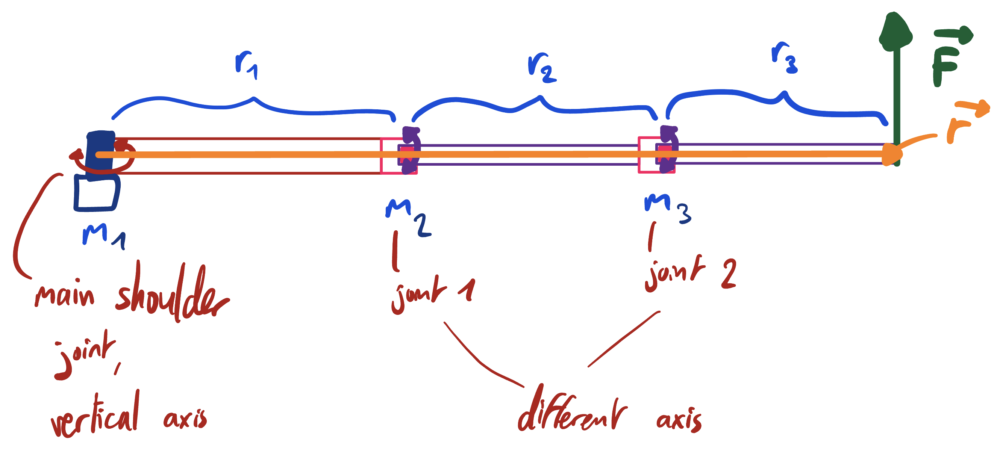
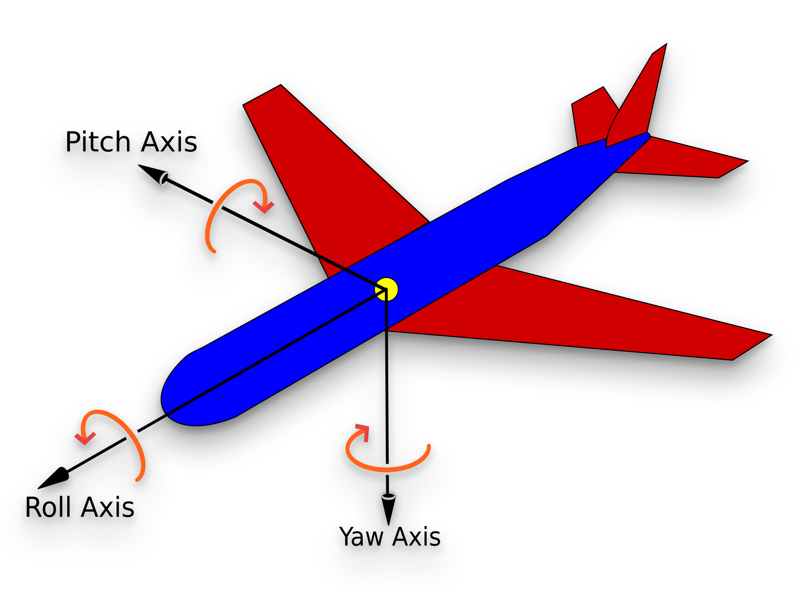

# Torque analysis

This page describes the static and dynamic torque model used to determine the maximum body weight FaceHugger can support.

## Model overview

Each leg is a 3-link serial chain. Links are rigid uniform-density rods printed in PLA (density 1.24 g/cm³, +15% mass margin). Three DSS-M15S servos (72 g each, 15 kg·cm rated at 7.2 V) drive the joints. The foot contact point (`tip`) is not yet modelled in Fusion; its mass is set to 0.0 kg in the current configuration.

### Link dimensions (from `doc/torque-analysis/config.yaml`)

| Link | Length (cm) | Cross-section (cm) | Role |
|------|-------------|---------------------|------|
| \( L_1 \) | 8.0 | 2.0 x 1.5 | Shoulder to hip (fixed, horizontal) |
| \( L_2 \) | 8.0 | 2.0 x 1.5 | Hip to knee (pitch, driven by \( s_{L2} \)) |
| \( L_3 \) | 6.0 | 1.5 x 1.2 | Knee to tip (pitch, driven by \( s_{L3} \)) |

The shoulder joint \( s_{L1} \) rotates on the **yaw** axis (vertical, parallel to gravity) and bears zero static torque. Hip and knee joints rotate in the **sagittal (pitch) plane** and carry the full static gravity load.

## Static torque: pitch axes

Angles \( \theta_\text{hip} \) and \( \theta_\text{knee} \) are measured from horizontal; 0° is worst case (fully extended). The hip and knee angles are **independent** - an earlier formulation incorrectly shared a single angle, which is only valid for collinear links.

### Knee motor \( s_{L3} \)

The knee supports \( L_3 \) and the tip load. All masses lie along \( L_3 \), so a single angle governs the lever-arm projection:

\[
\tau_\text{knee} = \left( m_{L3} \cdot \frac{r_3}{2} + m_\text{tip} \cdot r_3 \right) \cos\theta_\text{knee}
\]

In the simplified form used in the notebook (with tip mass = 0):

\[
\tau_\text{knee} = F_\text{tip} \cdot L_3 \cdot \cos\theta_\text{knee}
\]

### Hip motor \( s_{L2} \)

The hip supports \( L_2 \), the knee servo, \( L_3 \), and the tip. Masses on \( L_2 \) are projected by \( \cos\theta_\text{hip} \); masses on \( L_3 \) use \( \cos\theta_\text{knee} \):

\[
\tau_\text{hip} = \left(\frac{m_{L2} L_2}{2} + m_\text{servo} L_2 + m_{L3}\!\left(L_2 + \frac{L_3}{2}\right) + F_\text{tip}(L_2 + L_3)\right)\cos\theta_\text{hip}
\]

The full expression separating the two projection angles is:

\[
\tau_{L2} = m_{L2} \cdot \frac{r_2}{2} \cos\theta_\text{hip}
           + m_\text{servo,knee} \cdot r_2 \cos\theta_\text{hip}
           + m_{L3}\!\left( r_2 \cos\theta_\text{hip} + \frac{r_3}{2} \cos\theta_\text{knee} \right)
           + m_\text{tip}\!\left( r_2 \cos\theta_\text{hip} + r_3 \cos\theta_\text{knee} \right)
\]

## Dynamic torque: yaw axis

The shoulder yaw load is inertial (swing phase, no gravity component). Each link contributes to the leg's moment of inertia via the parallel axis theorem:

\[
I_\text{link} = \frac{1}{12} m L^2 + m d^2
\]

where \( d \) is the distance from the link's centre of mass to the shoulder yaw axis. Straight-leg geometry is used as a conservative worst-case upper bound (Path B). Dynamic torque is then:

\[
\tau_\text{yaw} = I_\text{leg} \cdot \alpha
\]

where \( \alpha = \Delta\omega / \Delta t \) is the angular acceleration in rad/s².

## Capacity calculation

The inverse solver sets each motor to its rated torque and solves for the maximum allowable tip load. The binding constraint is the smaller of the two:

\[
m_\text{tip,max} = \min\!\left( m_\text{tip,max}^\text{knee},\; m_\text{tip,max}^\text{hip} \right)
\]

Body weight capacity follows from multiplying by the number of legs in stance:

\[
m_\text{body} = m_\text{tip,max} \times n_\text{stance}
\]

**Guards:** when \( \cos\theta \leq 0 \) (angle \(\geq\) 90°), gravity assists the motor and the constraint is reported as unlimited. The forward torque path uses unclamped cosines; the inverse solver clamps to \( \max(\cos\theta, 0) \) to avoid division by zero.

## Units

All config values use cm and kg. Servo ratings are in kg·cm (hobby convention). Conversion: \( 1\;\text{kg·cm} = 0.0981\;\text{N·m} \).

## Code references

All implementations are in `doc/torque-analysis/torque_calculations.py`:

| Formula | Function |
|---------|----------|
| Knee torque | `torque_knee()` |
| Hip torque | `torque_hip()` |
| Moment of inertia | `moment_of_inertia_leg()` |
| Yaw dynamic torque | `torque_yaw()` |
| Inverse solver | `build_widget()` / `update()` |

!!! note
    An interactive version with sliders is available as the rendered Jupyter notebook on the [torque notebook page](torque_calculations.ipynb). The sliders require a live Python kernel; the static site has none. Run `doc/torque-analysis/torque_calculations.ipynb` locally for live interaction.
